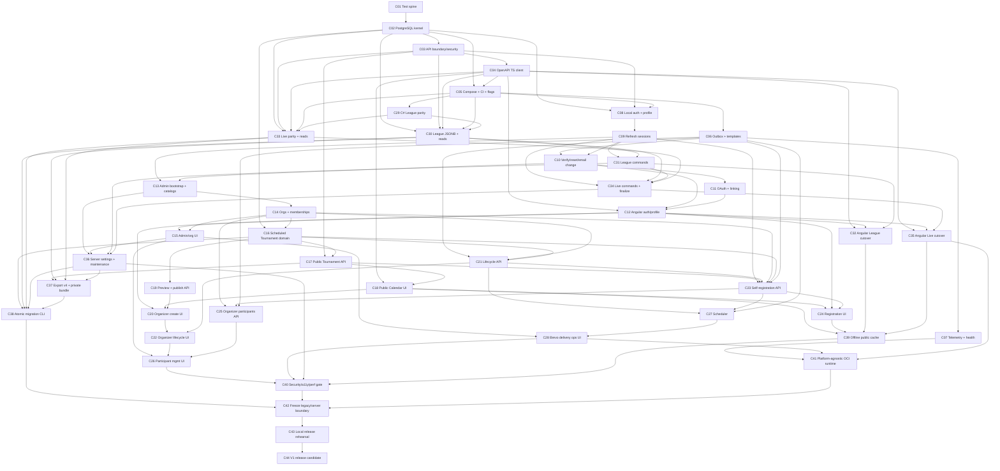

# Gones Calendar V1 — Full Implementation Plan

Status: implementation plan only. No feature code changed.

Following commits in dependency order yields backend-backed, locally verified, platform-agnostic Gones Calendar V1 release candidate while preserving League, Result Tournament, Live Tournament contracts. Live hosting + public cutover remain deferred.

## 1. Locked scope + assumptions

All questionnaire recommendations are accepted, except earlier explicit overrides remain authoritative:

- Product name: **Gones Calendar**. No MTG Winds branding.
- Monorepo backend: `backend/`, ASP.NET Core .NET 10, EF Core, PostgreSQL, modular vertical slices.
- PostgreSQL canonical for Scheduled Tournament, League, Live Tournament, auth, orgs, registrations, server config.
- Existing League/Result/Live data shapes stay exact. Scheduled, Result, Live Tournaments stay independent; no V1 links.
- Scheduled Tournament requires start time. No all-day mode.
- UTC instant + IANA zone storage. Venue-local date/time primary; viewer-local secondary.
- Auth: ASP.NET Core Identity with `Guid` IDs, separate profile, Google/Facebook adapters, explicit provider linking. Automated tests use local fake OAuth/OIDC providers; real-provider validation is deferred.
- Session: 15m memory access JWT; rotating HttpOnly refresh cookie; 7d inactivity; 30d absolute expiry; token-family reuse revokes family.
- Public reads + PII-free exports. Global Organizer/Admin writes League/Live. Org membership controls Calendar writes. Admin bypasses both axes.
- Exactly one org Owner; many Organizers. Admin creates orgs + grants global Organizer role.
- Calendar/list URL query is canonical; browser stores last view/filter. Upcoming/ongoing first; past toggle; page size 20.
- Public profile defaults private except Username. Store optional birth year, not full DOB/current-age integer.
- Username display preserved; Unicode normalization + case-folded unique key; 3–30 chars.
- Preview is server-normalized + hash-bound. Publish accepts unchanged hash only.
- Registration retry creates new immutable attempt row. One active attempt enforced by partial unique DB index.
- Organizer manual registration: existing verified User only. Participant display uses current profile.
- Notifications: provider-neutral transport with Brevo HTTP adapter; source-controlled HTML/text templates; recipient profile locale, French fallback. Automated tests use fake HTTP/webhook servers; live sender validation is deferred.
- Reminder instant: 10:00 venue time. >1 month = event day-of-month; final month = Saturdays; final J-2/J-1; past instants never sent.
- Worker: separate `Gones.Worker`, min replica 1; outbox + scheduler; PostgreSQL advisory-lock leader.
- Brevo transient retry: 1m, 5m, 30m, 2h, 12h; permanent failures dead-letter immediately; webhook replay deduped.
- Public Export v4: League/Result source + public Scheduled Tournament data only. No PII, auth, registration, block, audit, token, notification, Live draft, private config.
- Private migration bundle: League/Result, old Calendar, Live drafts, Deck Archetype catalog. Browser language remains local.
- Migration CLI: dry-run first; missing required mapping blocks whole import; override map required; final import is atomic.
- Offline: cached public reads with stale marker. All writes require online API. No queued writes.
- Hosting, domain, DNS, CDN, managed DB, object storage, IaC vendor remain deferred. Backend ships vendor-neutral OCI images for API, Worker, Migrator, backup/restore.
- Runtime contract: Linux container, standard env/file secret injection, PostgreSQL connection string, HTTP forwarded-header config, OTLP endpoint, stdout/stderr structured logs. No cloud SDK/runtime dependency.
- Backup now: portable encrypted `pg_dump` artifact to mounted storage + tested restore container. Managed PITR, remote retention, RPO/RTO evidence remain deferred.
- Hidden slices use build/runtime flags. Local release rehearsal proves server authority; public cutover + irreversible first-server-write barrier remain deferred.
- Relational entities use UUID PKs. Legacy League/Live aggregate envelopes use UUID surrogate PK + unique string `DocumentId`, preserving exact IDs such as `placeholder-league`.

Final-policy defaults accepted by “all decisions and future”:

- Rich content: plain summary ≤50 chars + optional server-sanitized HTML body. Allow `p`, `br`, `strong`, `em`, `ul`, `ol`, `li`, `h2`, `h3`, HTTPS `a`; reject images, style, script, event attrs, non-HTTPS URLs. CSP forbids inline script/object/frame.
- Audit: append-only, no delete endpoint, indefinite security/admin retention per architecture docs; store IDs/action/redacted field diff, never tokens/password/email bodies/raw rich HTML. App emits retention-ready structured logs; host retention policy remains deferred. Notification delivery metadata: 1y. Email bodies: never persisted.
- Account closure: Admin-assisted disable + PII anonymization. Preserve opaque User ID, non-PII audit, registration status, unrelated Player Names/results. Revoke sessions/external identities. Self-service closure deferred.
- Rate limits: auth register/login/resend/reset 5/15m per IP + account; refresh 30/15m/session; public reads 120/min/IP; authenticated writes 30/min/User; registration 10/min/User; export 10/hour/User/IP; Admin 60/min/User. ASP.NET limits are mandatory; deployment-edge/global limits remain deferred.
- Recovery now: deterministic dump/restore scripts + local restore rehearsal. Live RPO/RTO, managed PITR, region-loss exercises remain deferred.

### Explicitly deferred live infrastructure

- Domain purchase/registrar, public DNS, CDN/static host.
- Backend runtime vendor, managed PostgreSQL, managed secrets, registry, remote backup storage, IaC.
- Real Google/Facebook callback registration + provider smoke tests.
- Real Brevo sender/domain DNS, API key, webhook endpoint + deliverability tests.
- Public Staging/Production envs, live migration, public cutover, soak, rollback exercise.

Deferred items do not block code-level V1. Fake providers, Testcontainers, Compose, security tests, migration rehearsal remain mandatory.

## 2. TDD + commit contract

Every `Cxx` section below equals one commit.

Within each commit:

1. Add smallest failing test/contract first (**RED**).
2. Run targeted test; record expected failure reason.
3. Implement minimum production code (**GREEN**).
4. Add boundary/integration/E2E coverage. Any route/DTO change regenerates OpenAPI + TS client in same commit after rebase.
5. Refactor only changed slice while tests stay green.
6. Run full gate.
7. Start full app; run smoke path.
8. Commit only green tree.

Tests + impl land in same commit. Intermediate RED state is not committed.

### Standard gates

`G-FE`:

```bash
npm run lint
npm run typecheck
npm run test
npm run build
```

`G-BE` after C02:

```bash
dotnet test backend/Gones.sln --configuration Release
```

`G-CONTRACT` after C04:

```bash
npm run api:generate
npm run api:check
```

`G-FULL` after C05:

```bash
npm run lint
npm run typecheck
npm run test
dotnet test backend/Gones.sln --configuration Release
npm run api:check
npm run build
npm run e2e:ci
```

`G-RUN` after C05:

```bash
docker compose up -d --build
npm run smoke
# Manually open app + API health/Swagger during local implementation.
docker compose down -v
```

Each commit checklist ends with `G-FULL` + `G-RUN`. Before gate exists, run all available predecessor gates + equivalent manual smoke.

### Test layers

- C# unit: pure domain, validators, schedule math, auth policy helpers, serializers.
- C# integration: `WebApplicationFactory` + real PostgreSQL Testcontainer; no EF InMemory provider.
- Contract: generated OpenAPI snapshot/client drift check.
- Angular unit: services, guards, interceptors, URL state, adapters, date presentation.
- Cypress: browser role/CRUD/failure workflows at 375×812 + desktop.
- Ops: OCI/container contract, container health, migration/restore scripts, SBOM/signature/scans, secret scans.

## 3. Commit dependency graph



## 4. Parallel-agent lanes

| Lane | Primary ownership | Commits | May run parallel with |
|---|---|---|---|
| A — Platform | solution, DB kernel, API boundaries, email, telemetry | C01–C07 | After C05: B, C, D |
| B — Identity/Admin | auth, sessions, OAuth, orgs, Admin | C08–C15 | D parity; C Calendar after C14 |
| C — Calendar | Scheduled Tournament, registration, notification domain | C16–C28 | D existing-domain lane |
| D — Existing domains | parity, League, Live, server settings | C29–C36 | B + C |
| E — Migration/Offline | exports, CLI, service worker | C37–C39 | F packaging after stable contracts |
| F — Quality/Ops | hardening, OCI packaging, local rehearsal, RC | C40–C44 | C41 can begin after C07, then rebase final image refs |

Parallel rules:

- One agent owns each worktree/commit. Never share dirty tree.
- PostgreSQL migration files form serialized lane. Parallel schema agent rebases, deletes its generated migration, regenerates after latest migration merge.
- Generated TS client is serialized output. Every API-producing commit regenerates OpenAPI/client after rebasing; one named agent owns generated-file conflict resolution per merge batch.
- `src/app/app.routes.ts`, `src/app/app.component.ts`, `src/app/i18n/messages.ts`, `backend/.../Program.cs` are merge hotspots. Foundation must use feature registration/extensions; UI agents rebase before touching hotspots.
- Every parallel branch starts from all declared deps. Commit graph, not commit number, controls readiness.
- Merge only after branch `G-FULL`; rerun `G-FULL` after each merge batch.

---

## C01 — `chore: establish backend test spine`

**Deps:** none. **Lane:** A. **Runnable:** current Angular app unchanged; API/Worker/CLI skeletons compile.

- [x] RED: add architecture/smoke tests expecting `Gones.Api`, `Gones.Worker`, `Gones.Migrator` entrypoints + `/health/live` 200.
- [x] Add `backend/Gones.sln`, projects: `Gones.Api`, `Gones.Application`, `Gones.Domain`, `Gones.Infrastructure`, `Gones.Worker`, `Gones.Migrator`.
- [x] Add test projects: `Gones.UnitTests`, `Gones.IntegrationTests`, `Gones.ArchitectureTests`.
- [x] Install/configure Angular ESLint; make `lint` real lint, add separate `typecheck`; fail on generated/source lint errors.
- [x] Pin .NET SDK via `global.json`; centralize nullable, warnings-as-errors, analyzers, package versions.
- [x] Enforce dependency direction: Domain → none; Application → Domain; Infrastructure → Application/Domain; hosts → Application/Infrastructure.
- [x] Implement liveness endpoint with no DB dependency; Worker/CLI `--help` exit 0.
- [x] Add `npm` wrappers for backend build/test without changing current FE runtime.
- [x] GREEN: run architecture/smoke tests, then `G-FE`; start Angular + API and verify both respond.

## C02 — `feat: add PostgreSQL persistence kernel`

**Deps:** C01. **Lane:** A. **Runnable:** Angular local mode; DB tests use PostgreSQL Testcontainers; API runs against one-off local PostgreSQL.

- [x] RED: Testcontainer tests for migration-from-empty, UUID key, UTC clock, transaction rollback, optimistic version increment.
- [x] Add Npgsql/EF Core + NodaTime packages after license/advisory review; record decision in dependency ledger.
- [x] Implement `GonesDbContext`, snake_case naming, `IClock`, UTC/NodaTime mappings, assembly-scanned entity configs.
- [x] Add shared persistence records: schema version, idempotency record, audit record, outbox record; feature entities arrive later.
- [x] Add bigint `Version` concurrency convention + strong ETag encode/decode helper. Use UUID PKs except legacy aggregate envelopes, which use UUID surrogate PK + unique string Document ID.
- [x] Create initial EF migration; verify migrate, rollback, migrate cycle against PostgreSQL.
- [x] Add `/health/ready` DB check while `/health/live` stays DB-independent.
- [x] GREEN: targeted integration tests; `G-FE` + `G-BE`; run API against local PostgreSQL.

## C03 — `feat: standardize API validation authorization and failures`

**Deps:** C02. **Lane:** A. **Runnable:** API exposes documented failure/security behavior; no feature routes yet.

- [x] RED: API tests for malformed JSON, validation failure, missing auth 401, wrong role 403, missing resource 404, stale ETag 412, conflict 409, correlation ID.
- [x] Implement RFC 7807 Problem Details with stable `code`, safe `message`, validation field map, trace ID; never leak exception/SQL.
- [x] Add endpoint-filter validation, cancellation propagation, request-size caps, JSON limits, UTC serialization.
- [x] Add auth policy names for User, global Organizer, Admin, org member, org Owner; handlers initially deny without claims.
- [x] Add exact-origin credentialed CORS config; reject wildcard+credentials.
- [x] Add secure headers/API cache defaults; protect Swagger outside Development via Admin policy/config.
- [x] Add structured boundary logging with PII redaction tests.
- [x] Enforce append-only audit twice: EF change guard + PostgreSQL app-role/trigger denial for `UPDATE`/`DELETE`; migration role alone owns schema. Add raw-SQL rejection tests.
- [x] GREEN: API contract tests; `G-FE` + `G-BE`; smoke `/health/live`, Problem Details, Swagger Development path.

## C04 — `chore: generate Angular REST client from OpenAPI`

**Deps:** C03. **Lane:** A. **Runnable:** Angular remains local adapter; generated client compiles unused.

- [x] RED: add CI test failing when generated client differs from committed OpenAPI artifact.
- [x] Pin OpenAPI/NSwag tools; generate deterministic `backend/openapi/gones.json` from API.
- [x] Generate Angular HttpClient DTO/client under `src/app/api/generated/`; mark generated code read-only.
- [x] Add `npm run api:generate` + `api:check`; normalize timestamps/newlines for stable output.
- [x] Add hand-written API boundary layer for base URL, credentials, access token, ETag, Idempotency-Key, Problem Details mapping.
- [x] Add unit tests for URL join, cookie credentials, JWT header omission/presence, ETag forwarding, generated-client compile.
- [x] Document producer-first contract workflow: endpoint test → OpenAPI → generated client → adapter test.
- [x] GREEN: `G-CONTRACT`, `G-FE`, `G-BE`; Angular starts unchanged.

## C05 — `chore: add full-stack Compose feature flags and CI`

**Deps:** C02, C04. **Lane:** A. **Runnable:** one command starts FE/API/Worker/PostgreSQL; server feature flags off by default.

- [x] RED: smoke script expects FE, API liveness/readiness, Worker heartbeat, PostgreSQL migration completion.
- [x] Add multi-stage API/Worker/Migrator Dockerfiles, non-root users, read-only runtime FS where possible, health checks.
- [x] Add `compose.yaml` with PostgreSQL, one-shot Migrator, API, Worker, Angular development/release profiles; no committed secrets.
- [x] Add typed vendor-neutral config validation. Missing required runtime secret/provider/origin fails startup; safe local fake-provider defaults only.
- [x] Add build + runtime flags: `apiBackend`, `calendarV1`, `authV1`, `leagueServer`, `liveServer`, `adminV1`; all false in legacy static mode.
- [x] Rename future `NestApiBackend` intent to ASP.NET adapter without activating it; preserve local adapter.
- [x] Add `e2e:ci`, `smoke`, deterministic seed/reset scripts; CI services + backend/contract/Cypress jobs.
- [x] GREEN: `G-FULL`, `G-RUN`; verify current public app behavior unchanged with flags off.

## C06 — `feat: add transactional outbox and source-controlled email templates`

**Deps:** C02, C03, C05. **Lane:** A. **Runnable:** Worker drains fake/local outbox; API does not send email inline.

- [x] RED: unit tests for template locale fallback/HTML encoding; integration tests for same-transaction outbox, lease, retry, dedupe, crash recovery.
- [x] Implement `NotificationOutbox` state machine: Pending, Sending lease, Sent, DeadLetter; unique dedupe key; attempt timestamps.
- [x] Add typed `.html` + `.txt` templates for verify, reset, registration, unregistration, major update, cancellation, reminder, organizer notices in `fr` + `en`.
- [x] Implement template renderer with strict typed models, HTML encoding, HTTPS links, subject length limits; never persist rendered body.
- [x] Add `IEmailTransport`; Development file/sink transport with token-safe preview; no recipient/content logs.
- [x] Implement Worker poll loop with bounded batch, `SKIP LOCKED`, cancellation, lease recovery, exponential retry policy hooks.
- [x] Scrub recipient, token, template model, rendered payload after terminal delivery/dead-letter retention handoff; keep User/Tournament IDs + safe status only. Add clock-driven scrub tests.
- [x] Add outbox health/lag metrics + readiness behavior; email provider outage must not fail API write transaction after commit.
- [x] GREEN: targeted Worker/API tests; `G-FULL`, `G-RUN`; enqueue test mail, observe fake delivery once.

## C07 — `feat: add OpenTelemetry observability and operational health`

**Deps:** C05, C06. **Lane:** A. **Runnable:** local traces/metrics/logs visible; health endpoints distinguish live/ready/degraded.

- [x] RED: tests assert trace/correlation propagation API→DB→outbox→Worker; log sink rejects token/email/body fields.
- [x] Add OpenTelemetry ASP.NET/HttpClient/Npgsql/runtime instrumentation + vendor-neutral OTLP exporter/console config.
- [x] Define currently implementable spans/metrics: req latency/error, DB latency/failure, outbox lag/dead letters, Worker heartbeat. C08 adds auth signals; C27 adds scheduler signals; C28 adds Brevo signals; C38 adds migration signals.
- [x] Add health checks: PostgreSQL, Worker heartbeat, outbox backlog. Provider/scheduler checks land with their owning slices.
- [x] Add redaction processor + structured event IDs; hash rate-limit keys, never log raw IP/email/token/content.
- [x] Add local OTLP/console profile + sample dashboard/alert query docs.
- [x] GREEN: telemetry tests; `G-FULL`, `G-RUN`; inspect one correlated request + outbox delivery.

## C08 — `feat: implement local identity and private-by-default profile`

**Deps:** C02, C03, C05. **Lane:** B. **Runnable:** hidden auth API supports register/login/profile; current FE remains anonymous.

- [x] RED: domain tests for Username normalization/collision, profile defaults, birth-year range, password policy, lockout; API tests for register/login/profile authz.
- [x] Configure ASP.NET Core Identity with `Guid`; minimum 12/max 128, no composition; 5 failures → 15m lock; common-password service boundary.
- [x] Add `UserProfile`: display Username + normalized key, first/last name, optional location/birth year, five public flags false, PreferredLanguage default `fr`, timestamps.
- [x] Enforce normalized Username + normalized email unique DB indexes; test concurrent duplicate registration.
- [x] Implement `POST /api/auth/register`, `POST /api/auth/login`, `GET/PATCH /api/users/me`; access JWT contains immutable ID/global role/security stamp only.
- [x] Require current password for sensitive local-profile changes where applicable; generic login failure prevents enumeration.
- [x] Audit register/login success/failure/profile changes with redacted diffs; add auth success/rejection/lockout metrics without email/IP labels.
- [x] GREEN: auth unit/integration tests; `G-FULL`, `G-RUN`; register/login/profile via Swagger.

## C09 — `feat: implement rotating refresh sessions and revocation`

**Deps:** C08. **Lane:** B. **Runnable:** hidden auth flow survives access-token expiry securely.

- [x] RED: tests for 15m access, 7d idle, 30d absolute, rotation, parallel refresh race, replay-family revocation, logout, logout-all, password/security-stamp revocation.
- [x] Add hashed refresh-token/session-family records with device label, created/last-used/idle/absolute expiry, revoked/replaced IDs.
- [x] Implement `POST /api/auth/refresh`, `/logout`, `/logout-all`; rotate atomically under transaction.
- [x] Set refresh cookie `Secure`, `HttpOnly`, `SameSite=Lax`, narrow Path, explicit host/domain strategy; clear exact cookie on logout.
- [x] Bind refresh to session/user/security stamp; never store/return plaintext token except cookie issuance.
- [x] Add `GET /api/users/me/sessions`, `DELETE /api/users/me/sessions/{id}` without raw token/IP disclosure.
- [x] Audit session creation/revocation/replay; emit abuse metric.
- [x] GREEN: concurrency/integration tests; `G-FULL`, `G-RUN`; expire test JWT, refresh once, replay old token → family revoked.

## C10 — `feat: implement email verification recovery and email change`

**Deps:** C06, C09. **Lane:** B. **Runnable:** local account lifecycle complete behind flags.

- [x] RED: tests for 24h verification expiry, newest-token behavior, rate-limited resend, generic forgot response, single-use reset, email-change re-verification, session revocation.
- [x] Implement register→verification outbox transaction; verification tokens contain purpose/security stamp and expire 24h.
- [x] Add verify/resend endpoints; resend invalidates superseded token generation without account enumeration.
- [x] Add forgot/reset password endpoints; generic response; single-use expiring token; revoke all refresh families after reset.
- [x] Implement email change request/confirm; normalized uniqueness checked before commit; `EmailVerified=false` until confirmation.
- [x] Add `UserEmailHistory` with protected access, 2y address retention then redaction job; audit stores only changed-field names/User ID.
- [x] Add auth endpoint rate policies + tests for IP/account keying and `Retry-After`.
- [x] GREEN: auth/email tests; `G-FULL`, `G-RUN`; complete verify/reset/change using local sink links.

## C11 — `feat: implement Google Facebook OAuth and explicit linking`

**Deps:** C09, C10. **Lane:** B. **Runnable:** OAuth callbacks work in local fake-provider tests; local auth unaffected.

- [x] RED: callback tests for state/correlation failure, new provider account, incomplete profile, existing-email refusal, authenticated link/unlink, last-login-method guard.
- [x] Configure Google/Facebook handlers through env/file-mounted secrets only; exact callback origins remain runtime config.
- [x] Add external identity records/provider unique index; persist provider ID + provider email metadata, never provider tokens unless required.
- [x] Implement OAuth start/callback with short one-time completion ticket for mandatory email/Username/first/last fields. Accept provider email as verified only when provider supplies a verified claim; otherwise collect email + complete Gones verification before registration.
- [x] Refuse auto-link when email exists; return safe instruction to sign in then link. Test missing, unverified, colliding, changed provider email.
- [x] Implement authenticated link/unlink endpoints; re-auth required; prevent unlinking final login method.
- [x] Revoke sessions when security-sensitive identity linkage changes; audit provider only, no provider token/email.
- [x] GREEN: local fake-provider integration tests; `G-FULL`, `G-RUN`; run OAuth completion/link flows without external network. Real providers deferred.

## C12 — `feat: add Angular auth session and profile UX`

**Deps:** C04, C05, C10, C11. **Lane:** B/E. **Runnable:** `authV1` enables complete login/register/profile UI; disabled path unchanged.

- [x] RED: Angular tests for in-memory token, one-flight refresh, failed refresh logout, route guards, verified-email registration gate, Problem Details mapping.
- [x] Implement `AuthService`, app bootstrap refresh, access-token interceptor, 401 single refresh+single replay, no local/session-storage token.
- [x] Add `/login`, `/register`, `/auth/complete-profile`, `/verify-email`, `/forgot-password`, `/reset-password`, `/profile`, `/profile/sessions`.
- [x] Add Google/Facebook buttons, explicit-link account settings, logout/logout-all/session revoke.
- [x] Add permanent unverified-email banner + resend state. Forms expose field errors, pending lock, retry, generic auth failures.
- [x] Add profile/privacy/birth-year/language controls; all optional-public toggles default off; email change explains re-verification.
- [x] Add User/Organizer/Admin guards as UX only; server remains authority. Add EN/FR strings + mobile/a11y assertions.
- [x] GREEN: service tests + Cypress local auth/profile/session flows; `G-FULL`, `G-RUN` with `authV1=true`.

## C13 — `feat: add Admin bootstrap global roles and reference catalogs`

**Deps:** C09, C10. **Lane:** B. **Runnable:** one-time CLI creates first Admin; public Format query works.

- [x] RED: tests for bootstrap idempotency/wrong config, last Admin protection, role escalation denial, Format uniqueness/order/soft delete.
- [x] Add global roles User/Organizer/Admin; role policy stays independent from org membership.
- [x] Implement `Gones.Migrator admin bootstrap --email` requiring existing verified account + configured matching bootstrap email; consume one-time marker.
- [x] Add Admin user list/search/page + grant/revoke global Organizer/Admin commands; prevent self/last-Admin lockout. Role change rotates security version, revokes refresh families, rejects stale privileged JWTs; test revoke during active session.
- [x] Add Tournament Format catalog seeded Legacy; Admin CRUD supports Vintage/Pauper/Modern/Premodern later; slug unique/soft delete.
- [x] Add public active Format endpoint; Scheduled Tournament may reference many Formats; V1 creation validator requires Legacy.
- [x] Audit all role/catalog/bootstrap actions with redacted diffs.
- [x] GREEN: unit/integration/CLI tests; `G-FULL`, `G-RUN`; bootstrap Admin twice → one success, one safe no-op.

## C14 — `feat: add organizations ownership and notification settings`

**Deps:** C13. **Lane:** B. **Runnable:** Admin/org membership API complete behind `adminV1`.

- [x] RED: tests for unique org name, exactly one Owner, owner transfer transaction, org-scoped Organizer authz, Admin bypass, soft delete, block-scope prerequisites.
- [x] Add Organization, OrganizationMember, OrganizationNotificationSettings entities/config/indexes; one Owner enforced by transaction + DB constraint strategy.
- [x] Implement public paged org list/detail + authorized `/api/users/me/organizations`; expose no private membership/email data.
- [x] Implement Admin org create/update/delete/restore; creation requires verified Owner User. Delete returns 409 while dependency blockers exist; C21/C23 add Tournament/registration blockers as those schemas arrive.
- [x] Implement Owner/Admin member add/remove/role/transfer commands; cannot remove/demote sole Owner without atomic transfer.
- [x] Add Organizer notification flags `NotifyOnRegistration`/`NotifyOnUnregistration` per org.
- [x] Add org auth resource loader that returns indistinguishable 404/403 per policy, preventing IDOR.
- [x] GREEN: authz/concurrency/API tests; `G-FULL`, `G-RUN`; create org, add Organizer, transfer Owner, reject cross-org write.

## C15 — `feat: add Admin organization user audit and closure UI`

**Deps:** C12, C14. **Lane:** B/E. **Runnable:** `adminV1` enables complete Admin/org UI.

- [x] RED: Cypress role matrix for Admin pages, org Owner pages, cross-org URL tamper, last-owner guard, account-disable impact.
- [x] Add `/organizations`, `/organizations/:id`, `/organizer/organizations`, `/admin`, `/admin/users`, `/admin/organizations`, `/admin/audit`.
- [x] Implement paged/filter states in URL; loading/empty/error/retry; confirmation dialogs for role/org destructive changes.
- [x] Add Admin audit query with action/entity/actor/date filters; show redacted diffs only; no audit mutation UI/API.
- [x] Implement Admin-assisted account disable/anonymize command: require atomic Owner-transfer map for every solely owned org, revoke sessions, unlink providers, replace PII/Username with opaque values, retain immutable ID/relations.
- [x] Add UI confirmation requiring typed Username + impact/ownership-transfer summary; exclude current/last Admin unless replacement exists. Test multi-org + concurrent Owner change.
- [x] Add EN/FR strings, keyboard/focus/mobile tests; hide controls by role without treating hiding as authz.
- [x] GREEN: Angular/Cypress/Admin API tests; `G-FULL`, `G-RUN` under User/Organizer/Owner/Admin personas.

## C16 — `feat: model Scheduled Tournament lifecycle and safe content`

**Deps:** C02, C14. **Lane:** C. **Runnable:** no routes yet; domain/schema fully tested.

- [x] RED: domain tests for required title/address/start/zone/Legacy format, end≥start, DST gap/overlap, lifecycle transitions, edit/delete/restore deadlines, major-change classification, sanitizer.
- [x] Add ScheduledTournament relational entity + formats join: org, slug, summary, sanitized body, address fields, starts/ends UTC, IANA zone, capacity, status, creator, deleted metadata, Version.
- [x] Define status transitions Published→InProgress→Completed or Cancelled; derive missing end as venue-local end-of-day, converted safely through DST.
- [x] Enforce no all-day/no external registration URL/no cross-links to Result/Live.
- [x] Implement allowlist sanitizer; reject unsupported markup/URL instead of trusting Angular; store canonical sanitized HTML.
- [x] Add indexes for venue-local start projection, UTC start, status, city/country/org/formats, normalized search; no unbounded list query.
- [x] Add EF migration + existing-data-safe defaults only for empty new table.
- [x] GREEN: domain + PostgreSQL constraint tests; `G-FULL`, `G-RUN`.

## C17 — `feat: expose public Tournament organization and participant-safe reads`

**Deps:** C03, C16. **Lane:** C. **Runnable:** public API works; old Calendar still visible until flag.

- [x] RED: API tests for combined filters, pagination 20, upcoming default, past toggle, cancelled/completed visibility, deleted invisibility, venue date boundaries, public DTO privacy.
- [x] Implement `GET /api/tournaments` with `from/to/city/country/organization/format/status/search/page/pageSize`; cap page size; stable start+ID sort.
- [x] Implement `GET /api/tournaments/{slug}` and public organizations/formats composition; ETag/cache headers.
- [x] Project venue-local date/time + IANA zone; return UTC instants for viewer conversion; never use server local zone.
- [x] Add public participant projection endpoint shell: current Username + opted-in profile fields only; active registrations only once C23 exists.
- [x] Add ICS endpoint/file builder from canonical UTC/zone; cancelled status represented; HTML body excluded/safely textified.
- [x] Update OpenAPI + regenerate generated client; add query-plan/index regression tests for representative filters.
- [x] GREEN: public API/contract tests; `G-FULL`, `G-RUN`; curl public list/detail/ICS anonymously.

## C18 — `feat: replace public Calendar list and detail UI`

**Deps:** C04, C17. **Lane:** C/E. **Runnable:** `calendarV1` switches public routes; old Calendar remains fallback.

- [x] RED: Angular tests for venue-date grouping, viewer secondary date, URL filters, local view preference, past toggle, cancelled badge, stale ETag cache response.
- [x] Replace flag-on `/calendar` with month calendar default + list tab; route query owns month/filter/page/view.
- [x] Add `/calendar/tournaments/:slug`; remove flag-on use of `/events/:slug`; preserve temporary redirect mapping during cutover.
- [x] Render venue-local primary with explicit IANA/short zone; viewer-local secondary only when different; group by venue date.
- [x] Add upcoming/ongoing default, past filter, status/city/country/org/format/search filters, backend paging, deep-link restoration.
- [x] Add loading skeleton, empty state, retryable error, cached-stale/offline banner, cancelled/completed status text, ICS actions.
- [x] Render sanitized body in isolated component with safe external-link attrs; no client sanitizer as server substitute.
- [x] GREEN: Angular + Cypress public Calendar/list/detail/mobile tests; `G-FULL`, `G-RUN` with flag off/on.

## C19 — `feat: implement server preview and hash-bound publication`

**Deps:** C16. **Lane:** C. **Runnable:** Organizer can preview/publish through API; no UI yet.

- [x] RED: API tests for org authz, server normalization, invalid zone/DST, changed-payload hash mismatch, expiry/replay, idempotent publish, concurrent duplicate slug.
- [x] Implement `POST /api/tournaments/preview`; validate/sanitize/normalize; return render DTO + opaque short-lived hash ticket bound to User/org/payload.
- [x] Keep preview stateless or store only ticket hash/expiry; never create Tournament/draft row.
- [x] Implement `POST /api/tournaments` requiring preview ticket + identical canonical payload + Idempotency-Key.
- [x] In one transaction create Published Tournament, audit event, idempotency result; return 201 + Location + ETag.
- [x] Generate deterministic unique slug under DB constraint/retry.
- [x] Update OpenAPI/generated client; add authz + replay threat tests.
- [x] GREEN: preview/publish integration tests; `G-FULL`, `G-RUN`; preview, mutate payload → reject; publish original once.

## C20 — `feat: add Organizer Tournament create preview publish UX`

**Deps:** C12, C18, C19. **Lane:** C/E. **Runnable:** flag-on Organizer can publish Scheduled Tournament end-to-end.

- [x] RED: Cypress tests for role guard, org picker scope, required start/zone, server errors, preview parity, back-edit invalidating ticket, double-submit idempotency.
- [x] Add `/organizer/tournaments/new` reactive form; 44px controls; address, summary/body, start/end, IANA zone, capacity, formats.
- [x] Default zone from browser only as editable suggestion; never infer persisted zone silently.
- [x] Call preview API; render same detail component/DTO as public page.
- [x] Back preserves form but discards ticket after any edit; Publish disabled/pending; Idempotency-Key stable per submit attempt.
- [x] On success route to public detail; on 401/403/409/validation/network show actionable recovery without duplicate create.
- [x] Add EN/FR copy, keyboard path, initial focus, error associations, mobile tests.
- [x] GREEN: Angular/Cypress create-preview-publish tests; `G-FULL`, `G-RUN` as Organizer + cross-org attacker.

## C21 — `feat: implement Tournament edit cancel delete restore lifecycle`

**Deps:** C06, C14, C16. **Lane:** C. **Runnable:** lifecycle API complete.

- [x] RED: tests for If-Match required/stale 412, pre/post-start edit/delete rules, Admin restore deadline, cancel anytime, major/minor diff, lifecycle event atomicity, concurrent actions.
- [x] Implement intent endpoints: authorized paged Organizer Tournament list, Admin deleted list, update details, cancel, soft delete, Admin restore. No generic entity PUT.
- [x] Require If-Match on mutations; increment Version; include fresh ETag. Idempotency-Key on cancel/delete retries.
- [x] Limit Organizer to member org; Admin bypass; only Admin restores; hide soft-deleted public rows. Update DTO excludes immutable OrganizationId/creator/status/slug; mass-assignment/cross-org reassignment tests must fail.
- [x] Classify date/address as major. Persist recipient-independent lifecycle event marker atomically; C23 wires active-registration recipient mail after registration schema exists. Minor title/summary edit creates no notification marker.
- [x] Date change recalculates future reminder plan marker; past reminder history remains immutable. Extend org-delete blocker: 409 while any nonterminal Tournament depends on org.
- [x] Audit before/after allowed field diff; rich body diff records changed marker only.
- [x] GREEN: lifecycle/domain/API concurrency tests; `G-FULL`, `G-RUN`; exercise each state + stale client.

## C22 — `feat: add Organizer Tournament management UX`

**Deps:** C20, C21. **Lane:** C/E. **Runnable:** Organizer/Admin Calendar management complete except participants.

- [x] RED: Cypress tests for my-org list, edit cutoff, ETag stale recovery, major-change confirmation, cancel/delete confirmations, Admin restore.
- [x] Add `/organizer/tournaments`, `/organizer/tournaments/:id/edit`, Admin deleted-Tournaments view.
- [x] Reuse create form + public detail renderer; hydrate canonical DTO; send If-Match.
- [x] Add explicit major-change confirmation listing date/address changes; cancel/delete confirmations explain participant mail and reminder stop.
- [x] On 412 preserve local draft, fetch latest, show compare/reload path; never silently last-write-win.
- [x] Hide forbidden actions by lifecycle/role; keep server rejection handling.
- [x] Add loading/empty/error/success, pending submit locks, focus return, EN/FR/mobile tests.
- [x] GREEN: Angular/Cypress lifecycle tests; `G-FULL`, `G-RUN` Organizer/Admin/stale-tab flows.

## C23 — `feat: implement race-safe self-registration`

**Deps:** C06, C09, C14, C16, C17, C21. **Lane:** C. **Runnable:** verified User can register/unregister via API.

- [x] RED: domain/API tests for unverified, blocked, full, duplicate, cancelled, deleted, started, cross-race final slot, unregister cutoff, retry-after-cancel new row.
- [x] Add registration attempt entity/status/history actors/timestamps; partial unique index on active `(TournamentId, UserId)`.
- [x] Implement register command with Idempotency-Key; serializable transaction/row lock guards capacity under concurrent requests.
- [x] Validate Published/not deleted/not started/verified/not org-blocked/capacity; map errors to stable codes/statuses.
- [x] Implement self-unregister before start; mutate active attempt to CancelledByUser; future reminders stop by query semantics. Add paged `GET /api/users/me/registrations` with current + immutable attempt history.
- [x] Re-register creates new row; old attempt immutable. Public participant projection uses current profile, not snapshots. Extend org-delete blocker: 409 while any active registration exists.
- [x] Enqueue participant confirmation/unregistration + optional Organizer notice atomically; audit actions.
- [x] Extend C21 date/address/cancel/delete lifecycle txns to enqueue active-participant update/cancellation messages; test zero registrations, many registrations, rollback, dedupe.
- [x] GREEN: high-concurrency PostgreSQL tests + API tests; `G-FULL`, `G-RUN`; race two Users for final slot → one success.

## C24 — `feat: add public participants registration and My Registrations UX`

**Deps:** C12, C18, C23. **Lane:** C/E. **Runnable:** User registration journey complete.

- [x] RED: Angular/Cypress tests for Visitor login prompt, unverified banner, full/blocked/started errors, double click, unregister confirmation, re-register, public privacy.
- [x] Add register/cancel action to Tournament detail with server-derived capability/reason DTO.
- [x] Add public participant list: Username always; optional fields only when current privacy permits; no public email by default.
- [x] Add `/registrations` showing upcoming/history attempts, statuses, event venue times, retryable loading errors.
- [x] Keep Idempotency-Key stable through network retry; disable pending controls; refresh capacity/participant state after success.
- [x] Add offline write rejection copy; no queued mutation/optimistic capacity decrement.
- [x] Add EN/FR, screen-reader status, focus, 375px tests.
- [x] GREEN: service/unit/Cypress flows; `G-FULL`, `G-RUN` Visitor/unverified/verified/blocked/full personas.

## C25 — `feat: add Organizer participant blocking and CSV APIs`

**Deps:** C06, C14, C23. **Lane:** C. **Runnable:** Organizer participant operations complete through API.

- [x] RED: authz tests for cross-org IDOR; verified-existing-User lookup; manual add/remove deadlines; block expiry; CSV formula injection; export audit.
- [x] Add org-scoped blocked-user entity with reason/actor/expiry + active unique constraint; block/unblock/list commands.
- [x] Add privacy-limited User lookup for exact Username/email available only to authorized org Organizer/Admin.
- [x] Implement manual register existing verified User; same capacity/block/duplicate txn rules; actor fields identify Organizer.
- [x] Implement remove before start → RemovedByOrganizer + participant email; block does not silently remove existing registration unless explicit combined action.
- [x] Add paged participant private DTO/query with current Username/first/last/email/registeredAt for authorized org only.
- [x] Add streaming UTF-8 CSV export with fixed cols, RFC 4180 quoting, spreadsheet-formula neutralization, bounded row count; audit export metadata only.
- [x] GREEN: authz/concurrency/CSV tests; `G-FULL`, `G-RUN`; verify public/private DTO separation.

## C26 — `feat: add Organizer participant management UX`

**Deps:** C15, C22, C25. **Lane:** C/E. **Runnable:** complete participant mgmt UI.

- [x] RED: Cypress tests for lookup/manual add, capacity race error, remove, block/unblock/expiry, CSV, private-field access, cross-org URL.
- [x] Add `/organizer/tournaments/:id/participants` paged table/cards with Username/legal name/email/date/status.
- [x] Add verified-User search/selection; no free-form PII/manual guest creation.
- [x] Add remove/block/unblock dialogs; show scope + expiry; separate “remove and block” composed action executes explicit commands.
- [x] Add CSV download via authenticated response; preserve filename/content type; display audit-confirmed success only after response.
- [x] Add org notification preference UI for registration/unregistration notices.
- [x] Add loading/empty/error/pending locks, EN/FR, mobile card layout, keyboard/focus tests.
- [x] GREEN: Angular/Cypress Organizer flows; `G-FULL`, `G-RUN` own-org + cross-org tests.

## C27 — `feat: schedule reminders and automatic Tournament statuses`

**Deps:** C06, C21, C23. **Lane:** C. **Runnable:** Worker handles reminders/status exactly once.

- [ ] RED: clock-driven tests for monthly anchor/day truncation, last-month Saturdays, J-2/J-1, DST gap/overlap, schedule overlap, late registration, changed date, cancel/delete/unregister, downtime, worker restart, multi-zone 10:00 precision.
- [ ] Implement pure NodaTime planner using venue zone and 10:00 local; materialize future UTC ScheduledNotification rows with deterministic type/instant/dedupe key.
- [ ] Daily planner acquires PostgreSQL advisory lock and refreshes future rows; frequent dispatcher polls due rows at ≤1m cadence. Extra replicas remain horizontally safe.
- [ ] Query active registrations + eligible Tournaments; dispatch only still-eligible due rows. Planner never creates past reminders; dispatcher marks reminders missed during downtime instead of sending late.
- [ ] Poll lifecycle transitions at ≤1m cadence: Published→InProgress at start; →Completed at explicit end or venue-local end-of-day; Cancelled/Deleted unchanged.
- [ ] Major date update cancels only unsent future schedule rows, then replans; sent/missed history immutable; new future instants enqueue once.
- [ ] Add NotificationHistory only on successful delivery; unique DB dedupe key prevents duplicate app intent under planner/dispatcher retry.
- [ ] GREEN: unit + multi-worker PostgreSQL tests; `G-FULL`, `G-RUN`; advance fake clock across complete lifecycle.

## C28 — `feat: integrate Brevo delivery webhooks and dead-letter operations`

**Deps:** C15, C27. **Lane:** A/C. **Runnable:** real transport configurable; Admin can inspect safe delivery metadata.

- [ ] RED: Brevo HTTP fixture tests for success/transient/permanent/lost-response crashes; webhook malformed/auth/replay tests; retry clock/dead-letter tests.
- [ ] Implement Brevo REST transport via typed `HttpClient`; send stable provider idempotency key/custom correlation on every retry; store provider message ID + status only; timeout/circuit/bounded concurrency. If provider idempotency window expires with uncertain outcome, hold for webhook/operator reconciliation instead of blind resend.
- [ ] Apply retries 1m/5m/30m/2h/12h; hard bounce/invalid/blocked permanent; max attempts dead-letter.
- [ ] Implement HTTPS webhook endpoint using rotated random path token redacted from logs, strict schema/size/rate checks, replay key uniqueness.
- [ ] Map sent/delivered/deferred/soft/hard bounce/spam/invalid/blocked/error events without trusting recipient/content fields.
- [ ] Add Admin notification-history/dead-letter pages; retry action creates audited new attempt only for transient/operator-approved case. Test crash after provider acceptance before DB commit → no second accepted message.
- [ ] Add 1y delivery-metadata cleanup + terminal payload scrub verification; configure safe aggregate metrics before deletion.
- [ ] Emit vendor-neutral metrics/health signals for dead letter, bounce spike, scheduler lag, provider latency; document future sender/domain verification.
- [ ] GREEN: provider/Worker/webhook/Cypress Admin tests; `G-FULL`, `G-RUN` using local fake server only. Live Brevo deferred.

## C29 — `feat: port League domain rules with golden parity fixtures`

**Deps:** C05. **Lane:** D. **Runnable:** no cutover; C# parity lib tested against current TS.

- [ ] RED: export language-neutral JSON fixtures from TS for normalization, import, invalid entries, warnings, Tournament/League results, tiebreakers, player stats, rename, placeholder rules.
- [ ] Freeze fixture provenance/version; test TS regenerates same expected outputs before port.
- [ ] Port exact League/Tournament/Round/Entry/PlayerArchetype DTO shape + normalization to C#; preserve order/case/trim semantics.
- [ ] Port Round CSV adapter, invalid-row preservation, warnings, scoring, byes, provisional results, OMW/GW/OGW precision/floors.
- [ ] Port Player Statistics/nemesis/rival/filters + Player Name rename semantics.
- [ ] Run C# fixture consumer against every TS expected output; prohibit C#-specific JSON drift.
- [ ] Add property tests for score/result invariants + serializer round-trip.
- [ ] GREEN: TS + C# parity tests; `G-FULL`, `G-RUN`; no runtime flag changes.

## C30 — `feat: persist and expose versioned League aggregates`

**Deps:** C02, C03, C04, C05, C29. **Lane:** D. **Runnable:** hidden public League API reads PostgreSQL; old FE local mode remains.

- [ ] RED: PostgreSQL tests for exact JSONB round-trip, indexed metadata, placeholder uniqueness, soft tombstone, version/ETag, public PII-free export.
- [ ] Add LeagueAggregate envelope: UUID surrogate PK + unique string `DocumentId`, name/status/updated/version/deleted metadata + canonical JSONB document; preserve fixed `placeholder-league` DocumentId exactly.
- [ ] Seed single fixed placeholder aggregate server-side; no translated duplicate creation.
- [ ] Implement public paged `GET /api/leagues`, `GET /api/leagues/{id}`, nested Result Tournament/result/player-stat queries using official C# calc.
- [ ] Implement public League Export + full existing-source projection; derived results/warnings never persisted/exported.
- [ ] Add bounded JSON/document/request sizes + query indexes; reject malformed aggregate at boundary.
- [ ] Return ETag from Version; cache public reads safely.
- [ ] GREEN: parity/persistence/public API tests; regenerate client; `G-FULL`, `G-RUN` seeded League reads.

## C31 — `feat: replace whole-League PUT with intent command endpoints`

**Deps:** C09, C30. **Lane:** D. **Runnable:** Organizer/Admin can mutate League API; local FE still default.

- [ ] RED: role tests + one test per current CRUD surface: create/rename/status/delete, Result Tournament create/edit/delete/move, Round add/delete/import/replace, entry add/edit/delete, archetype update, rename Player Name, restore.
- [ ] Define intent routes/DTOs from current UI actions; every mutation requires If-Match except create/import with Idempotency-Key.
- [ ] Load aggregate, execute C# command rules, validate, save JSONB with `WHERE Version=expected`, return 412 on stale.
- [ ] Make cross-League move atomic in one DB tx; C34 owns Live finalization + Result insertion after Live persistence exists.
- [ ] Keep League Restore Organizer/Admin; Full Restore Admin only; create new IDs/names; tombstoned IDs never silently reused.
- [ ] Add audit action metadata without full aggregate/Player Name payload; public reads/exports remain anonymous.
- [ ] Add command-level OpenAPI + regenerate generated client; delete/restore storage envelope preserves current visible semantics.
- [ ] GREEN: command/authz/concurrency/parity tests; `G-FULL`, `G-RUN`; replay/stale/cross-role smoke.

## C32 — `feat: cut Angular League and Result flows to server commands`

**Deps:** C04, C12, C31. **Lane:** D/E. **Runnable:** `leagueServer` switches all League/Result CRUD; local fallback remains flag-off.

- [ ] RED: adapter tests map each existing UI action to exact generated command + If-Match; Cypress preserves every current League/Result workflow.
- [ ] Expand `ApplicationBackend` into intent-specific ports; implement ASP.NET adapter; stop flag-on whole-document `saveLeague`.
- [ ] Refactor League/detail/Tournament/Settings rename/import UI to call command methods; server response replaces local aggregate.
- [ ] Preserve current routes, output, placeholder, export, warnings, imports, stale-save UX, EN/FR strings.
- [ ] Add access UX: public read/export; User sees read-only; Organizer/Admin controls; 401 refresh; 403 explicit.
- [ ] Add command pending locks/idempotency; 412 compare/reload; no optimistic source mutation before response.
- [ ] Update Cypress matrix for create→round import→edit→result→player stats→export/restore→delete.
- [ ] GREEN: all old/new tests; `G-FULL`, `G-RUN` flag off/on with API DB.

## C33 — `feat: persist Live Tournament aggregates with C# parity reads`

**Deps:** C02, C03, C04, C05, C29. **Lane:** D. **Runnable:** hidden Live read API uses PostgreSQL; local Live remains default.

- [ ] RED: golden fixtures for registration, rounds, pairing seed/order, scores, standings, checkpoints, restore, completion; JSONB round-trip/version/tombstone tests.
- [ ] Port exact Live document/normalizers/calculations to C#; consume TS golden fixtures.
- [ ] Add LiveAggregate envelope: UUID surrogate PK + unique string `DocumentId`, indexed name/date/stage/updated/version/deleted + canonical JSONB; preserve existing string IDs exactly.
- [ ] Implement public/authorized list/get DTO policy: public if current app exposes; mutation details restricted as decided by existing UX/security review.
- [ ] Return ETag; enforce bounded player/round/checkpoint/document sizes; preserve max 80 checkpoints.
- [ ] Add Organizer/Admin auth policy for shared Live writes; User/Visitor read policy matches locked public-read decision.
- [ ] Regenerate OpenAPI/client + add DTO parity tests.
- [ ] GREEN: TS/C# parity + persistence/API tests; `G-FULL`, `G-RUN` seeded Live read.

## C34 — `feat: implement Live intent commands and atomic finalization`

**Deps:** C09, C30, C31, C33. **Lane:** D. **Runnable:** complete Live API behind flag.

- [ ] RED: command tests for create/settings/player add/edit/drop/paid, start/cancel round, score, validate, checkpoint/restore, standings, finalize, delete, stale/retry.
- [ ] Implement intent endpoints requiring If-Match; create/finalize use Idempotency-Key.
- [ ] Execute exact C# Live rules; persist one JSONB aggregate version per accepted command.
- [ ] Finalize in one DB tx: mark Live completed/finalized ID, insert Result Tournament in target League aggregate, tombstone active Live view; retries return same result.
- [ ] Serialize concurrent score/round actions with version predicate; return 412 + latest ETag metadata.
- [ ] Audit action/IDs only; never duplicate full players/scores in audit JSON.
- [ ] Regenerate command OpenAPI/client; stress same-round concurrent score writes.
- [ ] GREEN: parity/command/concurrency tests; `G-FULL`, `G-RUN`; full Live lifecycle via API.

## C35 — `feat: cut Angular Live Tournament flows to server commands`

**Deps:** C04, C12, C34. **Lane:** D/E. **Runnable:** `liveServer` switches Live workflows; local fallback flag-off.

- [ ] RED: adapter mapping tests + existing running-tournament Cypress lifecycle under API mode.
- [ ] Replace flag-on `LiveTournamentRepository` local writes with generated command adapter + ETag state.
- [ ] Refactor autosave into explicit debounced intent commands; abort stale requests; latest response guard prevents older response overwrite.
- [ ] Replace client compensating finalization with atomic server finalize result/navigation.
- [ ] Preserve current pairing/checkpoint/advanced settings/standings UX + route shape.
- [ ] Add online-required errors, pending lock, 412 reload/reapply UX; no queued writes.
- [ ] Run existing Live lifecycle at phone/desktop; add User read-only + Organizer/Admin mutation role tests.
- [ ] GREEN: all Live/unit/Cypress tests; `G-FULL`, `G-RUN` flag off/on.

## C36 — `feat: move catalogs and Player Name maintenance to server settings`

**Deps:** C13, C15, C31, C34. **Lane:** D/E. **Runnable:** language local; profile/org/admin settings separated.

- [ ] RED: tests for Admin-only global Deck Archetype CRUD, case/space uniqueness, Organizer Player Name correction, cross-doc atomicity, org notification prefs.
- [ ] Add global DeckArchetype catalog seeded bundled Legacy presets; soft delete prevents new selection but preserves historical labels.
- [ ] Implement Admin catalog CRUD/import; no Organizer global catalog mutation.
- [ ] Implement Organizer/Admin Player Name search + rename command over authorized shared League source; exact case-sensitive source semantics; preview affected count before commit.
- [ ] Keep browser language local; optionally sync PreferredLanguage only on profile mutation. Never overwrite browser choice during anonymous use.
- [ ] Refactor Settings page into Browser Language, Profile link, Admin Catalog, Organizer Maintenance, Org Notification sections by capability.
- [ ] Remove flag-on local Deck Archetype mutation authority; keep local read only for migration exporter until future public cutover + soak.
- [ ] GREEN: API/Angular/Cypress settings tests; `G-FULL`, `G-RUN` each role/language.

## C37 — `feat: define public Export v4 and private migration bundle`

**Deps:** C17, C30, C33, C36. **Lane:** E. **Runnable:** pre-cutover app can download migration bundle; public v4 remains safe.

- [ ] RED: schema/snapshot tests for v4 allowlist + explicit secret/PII denylist; v1–v3 compatibility tests; private bundle round-trip fixtures.
- [ ] Increment `GONES_DATA_VERSION` to 4; define versioned JSON Schemas + max sizes/counts/checksums.
- [ ] Public League/Full Export v4 includes League/Result source + public Scheduled fields; excludes Live drafts, Users, PII, memberships, registrations, blocks, audit, tokens, outbox/history.
- [ ] Private migration bundle reads legacy browser stores: `gones.frontend.backend.v1`, `gones.live-tournaments.v1`, `gones.settings*`; includes Live drafts + Deck Archetypes, excludes language/auth. Include stable per-browser `sourceInstanceId`, store hashes, export time.
- [ ] Add migration-bundle download UI with warning, file hash, source-instance ID, counts, app/data versions; no browser→server upload. Test origin-scoped `localStorage` behavior locally; future cutover runbook must deploy exporter on every legacy origin + inventory every known device/browser.
- [ ] Preserve v1–v3 League Restore parser; v4 restore uses server endpoints/auth rules; malformed/unsupported rejects before mutation.
- [ ] Add automated grep/fixture assertion proving fake email/token/password never appears in either exported artifact.
- [ ] GREEN: export/restore/schema/Cypress download tests; `G-FULL`, `G-RUN`; inspect v4 + private fixture.

## C38 — `feat: add dry-run-first atomic migration CLI`

**Deps:** C16, C30, C33, C36, C37. **Lane:** E. **Runnable:** CLI can safely migrate fixture DB; app unchanged until flags.

- [ ] RED: CLI tests for bad checksum/schema, missing time/address/org/zone/Format map, duplicate/conflicting source-instance data, unsupported version, dry-run no-write, all-or-none rollback, rerun idempotency.
- [ ] Implement `Gones.Migrator import --bundle <file>... --mapping --manifest --dry-run` parsing one/many private bundles with bounded streaming JSON + schema validation.
- [ ] Manifest inventories source-instance IDs/hashes + authoritative-device/reconciliation decisions. Block unknown duplicates/conflicts until operator resolves by explicit map.
- [ ] Mapping file supplies org/Owner, mandatory start time, IANA zone, address/country, Format IDs (Legacy default only when explicitly mapped), status policy for each legacy Calendar event; no silent global default.
- [ ] Produce human + JSON review report: input counts, source instances, mappings, sanitation changes, collisions, hashes, target DB identity, dropped/converted `externalLink`, removed image/unsafe HTML details.
- [ ] Block import on every error/unmapped required field. Warnings require explicit `--accept-report-hash` from unchanged dry run.
- [ ] Final import runs serializable single tx: League/Result JSONB, Scheduled Tournament, Live drafts, Deck catalog; audit migration batch; no auth/profile fabrication except configured Owner reference.
- [ ] Store migration batch hash/idempotency record; rerun returns existing result; changed bundle requires new dry run. Add migration duration/result/count metrics with bundle hash truncated/redacted.
- [ ] Add post-import verifier comparing source/target counts, canonical hashes, sampled derived result parity.
- [ ] GREEN: CLI/Testcontainer/property tests; `G-FULL`, `G-RUN`; migrate fixture, force failure, prove zero partial rows.

## C39 — `feat: cache public reads and reject offline writes`

**Deps:** C18, C24, C32, C35. **Lane:** E. **Runnable:** installable PWA gives explicit stale public data, never local mutations.

- [ ] RED: service-worker tests for public GET allowlist, private/auth exclusion, stale indicator, mutation network failure, cache-user separation.
- [ ] Configure Angular SW data groups only for anonymous public Calendar/org/League/result GETs with bounded freshness/max entries.
- [ ] Never cache auth/profile/Admin/private participant responses, refresh responses, mutation responses, or Authorization-keyed requests.
- [ ] Add online/offline service + stale timestamp/banner; cached page labels itself stale and disables every write.
- [ ] Fail writes immediately with stable online-required UI; no Background Sync, local queue, optimistic source authority.
- [ ] Ensure logout clears any user-scoped app memory; service-worker update cannot expose previous private response.
- [ ] Add Cypress offline public-read + registration/edit rejection tests.
- [ ] GREEN: SW/unit/Cypress tests; `G-FULL`, release-mode `G-RUN`; load public page, disconnect, reload stale, verify writes blocked.

## C40 — `fix: close security accessibility performance and resilience gates`

**Deps:** C26, C28, C36, C39. **Lane:** F. **Runnable:** complete V1 passes local release-candidate quality gates.

- [ ] RED: add abuse/E2E suites for IDOR, mass assignment, stale writes, duplicate submits, XSS payloads, CSV injection, open redirects, OAuth CSRF, refresh replay, webhook replay, oversized input.
- [ ] Apply exact ASP.NET endpoint rate policies from locked defaults; test 429 + `Retry-After`; hash limiter keys. Document future ingress/global limiter requirement without vendor config.
- [ ] Add CSP/Permissions-Policy/referrer/HSTS/header tests; sanitizer migration report; external links `noopener noreferrer`; no remote images.
- [ ] Add DB query-count/time budgets, pagination caps, indexes, bounded Worker batches; eliminate N+1/unbounded lists/request waterfalls.
- [ ] Add `axe-core` Cypress scans + keyboard/focus tests for dialogs/forms/calendar/nav; fix labels, names, contrast, live regions, 375px overflow.
- [ ] Add route error boundaries, retries, loading/empty/error consistency, pending locks, stale-response guards.
- [ ] Run dependency advisory/license/install-script audit + secret literal/env-client-bundle scan; pin accepted deps.
- [ ] GREEN: all abuse/a11y/perf/resilience suites; `G-FULL`, `G-RUN`; retain reports as CI artifacts.

## C41 — `ops: harden platform-agnostic OCI runtime artifacts`

**Deps:** C07, C28, C35. **Lane:** F. **Runnable:** release-mode API/Worker/Migrator/backup containers run locally with no cloud dependency.

- [ ] RED: image contract tests expect Linux OCI images, non-root UID, read-only-compatible FS, health endpoints, graceful SIGTERM, env/file secret injection, zero cloud SDK requirement.
- [ ] Harden multi-stage API/Worker/Migrator Dockerfiles; add separate backup/restore image with pinned PostgreSQL client.
- [ ] Define vendor-neutral runtime config: PostgreSQL DSN, allowed origins, forwarded proxies, secret file paths, OTLP endpoint, stdout JSON, Worker replica/lease settings.
- [ ] Add release-test Compose profile proving API/Worker/Migrator/PostgreSQL startup ordering, migration idempotency, health, restart, graceful shutdown. Include fake OAuth/OIDC, fake Brevo/webhook fixture, local TLS reverse proxy/test cert, readiness, blocked external egress.
- [ ] Add encrypted `pg_dump`/restore commands writing only to mounted paths; verify wrong key/corrupt dump fails safely; remote storage/retention deferred.
- [ ] Add registry-neutral CI build: amd64 image build, immutable digests, SBOM, checksums, Trivy/Gitleaks scans, Cosign signing hook for future OIDC registry.
- [ ] Document generic host requirements: TLS reverse proxy, persistent PostgreSQL, secret injection, singleton/advisory-lock Worker, migration job, backup scheduler, OTLP collector, log retention.
- [ ] GREEN: image contract + backup/restore tests, `G-FULL`, release-mode `G-RUN`; scan all local images with zero unresolved critical finding.

## C42 — `chore: enforce explicit legacy versus server data authority`

**Deps:** C38, C40, C41. **Lane:** F/E. **Runnable:** server mode has one DB authority; existing static deployment can remain explicit legacy mode until future hosting/cutover.

- [ ] RED: tests assert server mode never reads/writes canonical `localStorage`; missing API config fails closed; legacy mode cannot call server mutation routes.
- [ ] Replace implicit fallback with typed `dataMode: legacy-browser | server`; no automatic mode switching after startup.
- [ ] In server mode remove old CalendarEvent/whole-document League/Live mutation paths from dependency injection + route exposure; retain browser language/view/filter/cache only.
- [ ] Keep legacy mode frozen for current static deployment + migration-bundle export; prohibit new Calendar V1/auth/admin capabilities there.
- [ ] Keep cutover bundle UI/runtime reader, schemas, offline Migrator CLI until future public cutover + soak explicitly authorizes removal.
- [ ] Set local release Compose to mandatory server mode; missing API URL/flags fails startup instead of falling back.
- [ ] Update ADRs/README/DEPLOYMENT/CONTEXT with platform-neutral authority boundary + deferred domain/CDN/provider/live-cutover work.
- [ ] GREEN: `G-FULL`, release-mode `G-RUN`, clean server-profile E2E, upgraded legacy-profile export E2E.

## C43 — `test: run local migration restore and release rehearsal`

**Deps:** C42. **Lane:** F. **Runnable:** clean isolated Compose env proves every code-level V1 journey without live infra.

- [ ] RED: acceptance matrix initially marks each docs 00–09 capability unproved; create executable local test reference for every non-deferred row.
- [ ] Start clean isolated release-test Compose project with PostgreSQL, fake OAuth/OIDC, fake Brevo/webhook, local TLS proxy, blocked external egress; run migrations.
- [ ] Register configured bootstrap User, verify through local email sink, then run Admin bootstrap CLI; prove second bootstrap is safe no-op.
- [ ] Seed multiple browser-origin fixtures, export bundle set, dry-run, approve report hash, import, verify counts/canonical hashes/C#↔TS parity.
- [ ] Run role E2E: Visitor; local User; fake-OAuth User; Organizer; Owner; Admin. No external OAuth request.
- [ ] Run reminder clock simulation + fake Brevo HTTP/webhook retry/dead-letter; prove cancellation/date change/unregister stop/replan. No external email.
- [ ] Create encrypted dump, destroy DB volume, restore into clean DB, rerun smoke/parity. Record local duration only; no live RPO/RTO claim.
- [ ] Write/update README, OpenAPI use, local env, generic container deployment contract, rollback principles, secret rotation, webhook, backup/restore, migration operator docs; mark live steps deferred.
- [ ] GREEN: non-deferred acceptance matrix 100%, `G-FULL`, local release smoke/DAST/a11y; retain rehearsal reports.

## C44 — `release: assemble platform-agnostic Gones Calendar V1 candidate`

**Deps:** C43. **Lane:** F. **Runnable:** terminal immutable local release candidate runs from artifacts on clean machine/Compose env.

- [ ] RED/probe: release preflight fails on image digest, migration, OpenAPI, config schema, health, backup, fake-provider, authority-mode, or feature-flag mismatch; it requires no public domain/cloud credentials.
- [ ] Build final API/Worker/Migrator/backup OCI images once; record immutable digests, SBOM, checksums, scan reports, final source SHA.
- [ ] Build final Angular release artifact with runtime API/data-mode config injection; do not bind artifact to one CDN/domain.
- [ ] Start clean env from final artifacts, migrate DB, register+verify bootstrap User through local sink, bootstrap Admin, enable every server feature flag.
- [ ] Run exact private-bundle migration rehearsal + verifier against clean DB; keep legacy origin simulation local.
- [ ] Run complete synthetic role journeys using local auth, fake OAuth, fake Brevo, local TLS webhook, Worker leader, logs/metrics.
- [ ] Produce release notes + deferred-live-infra checklist; never claim real OAuth/email/deliverability/public cutover validation.
- [ ] GREEN: `G-FULL`, final release `G-RUN`, restore smoke, digest verification on exact terminal candidate SHA.

---

## 5. Final V1 acceptance checklist

### Product

- [ ] Public Calendar default, list, filters, past/cancelled/completed visibility, venue/viewer zones, ICS.
- [ ] Local auth complete. Google/Facebook adapters, callback/linking/security contracts pass local fake-provider tests; live-provider smoke deferred.
- [ ] Organizer create→preview→publish→edit/cancel/delete; Admin restore.
- [ ] Verified User register/unregister/re-register; capacity/block/concurrency correct.
- [ ] Organizer manual registration, removal, block, private participant view, CSV.
- [ ] Monthly/Saturday/J-2/J-1 reminders, major-update/cancel/registration messages, retry/dead letter/history pass fake transport/webhook tests; live delivery deferred.
- [ ] Admin Users/roles/orgs/formats/archetypes/audit/account closure.
- [ ] Existing League/Result/Live behavior matches TS golden fixtures under PostgreSQL/API.
- [ ] Public Export v4 safe; private migration bundle + atomic CLI verified.
- [ ] Offline public stale reads work; all writes reject offline.

### Engineering

- [ ] Every mutation validated/authenticated/authorized server-side.
- [ ] ETag/If-Match + Idempotency-Key cover stale/retry paths.
- [ ] DB constraints cover uniqueness, active registration, ownership, FK, capacity transaction logic.
- [ ] No PII/secrets in public DTO/export/log/audit/email-body storage.
- [ ] OpenAPI generated client drift check green.
- [ ] Unit/integration/contract/Cypress/a11y/security/perf suites green.
- [ ] Angular release artifact + API/Worker/Migrator/backup OCI images build reproducibly; full app healthy from clean clone.

### Portable operations

- [ ] API/Worker/Migrator/backup OCI images require no cloud SDK/runtime.
- [ ] Runtime config uses env/file secrets, PostgreSQL DSN, forwarded-header config, OTLP, stdout JSON.
- [ ] Encrypted dump→destroy→restore rehearsal succeeds from mounted artifacts.
- [ ] OTel correlation trace spans API→DB→Worker→fake provider through local collector.
- [ ] Container health, restart, graceful shutdown, migration idempotency, backup failure paths tested.
- [ ] Generic deploy/rollback/secret rotation/webhook/migration/backup docs complete; live-host checklist explicitly deferred.
- [ ] Server mode has no browser canonical-data fallback; legacy mode remains explicit until future public cutover.

**Definition of done:** C01–C44 merged in DAG order; every commit green+runnable; non-deferred acceptance checklist complete; clean local release rehearsal green; immutable platform-agnostic release artifacts produced. Domain/CDN/live providers/public deployment remain separate future work.
