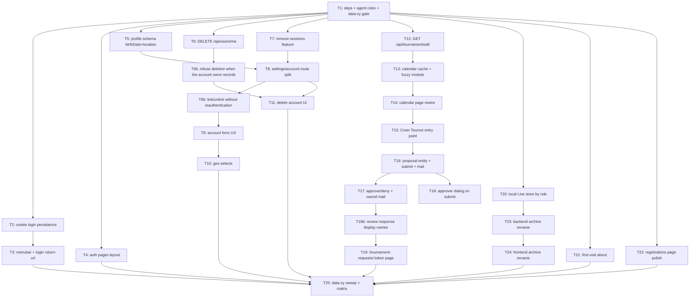

# Plan: Feedback Calendar V1

## Goal

Land whole `feedback.md` list on Gones Calendar V1: header/menubar polish, cookie-backed login persistence,
merged Settings+Profile surface, structured geo profile fields, hard account deletion, calendar full-fetch +
fuzzy single-input filter, open tournament-creation with signed-token approval flow, role-scoped local Live
store, full-stack `leagues-archive` rename, repo-wide `data-cy` coverage.
Success = every feedback line shipped, `npm run test && npm run lint && npm run typecheck && npm run build &&
npm run backend:test && npm run cy:run` green, `npm run acceptance:matrix` still proved.

## Scope

- In: `src/**`, `backend/**`, `cypress/e2e/**`, `docs/**`, `ops/acceptance-matrix.json`, `scripts/**`, `package.json`.
- In: 6 new ADRs (`docs/adr/0021`..`0026`), 3 new architecture HTML docs in `docs/`.
- Out: deployment topology, Docker/compose changes, Brevo provider config, new OAuth providers.
- Out: any new private migration bundle producer (one-way door, ADR 0020 stands).
- Out: retiring the Leagues archive feature itself — it is renamed, not removed.

## Assumptions

- **A1 — attribute name is `data-cy`.** Feedback says "cy-data"; the repo, Cypress specs and every existing
  template use `data-cy`. Rule and retrofit use `data-cy`. No rename of 300+ existing selectors.
- **A2 — Live authority split by role** (user answer Q1). Anonymous + `User` role get a browser-local
  IndexedDB Live store with **no** server sync; `Organizer` + `Admin` keep the ASP.NET adapter. This
  reintroduces a scoped browser store and therefore **partially supersedes ADR 0020** → ADR 0021.
- **A3 — Settings split** (user answer Q2). `/settings` stays anonymous (language, deck archetypes, players,
  org notifications, import/export). Merged account surface lives at `/settings/account` behind `userGuard`.
  `/profile` and `/profile/sessions` redirect to `/settings/account`.
- **A4 — geo data bundled offline** (user answer Q3) generated at build time from
  `country-region-data` + `@etalab/decoupage-administratif` into `src/assets/geo/*.json`. Country list is
  worldwide; Region/City selects are populated for `FR` only — any other country leaves Region/City as free
  text inputs. Communes file is lazy-loaded.
- **A5 — structured location columns.** Splitting "Lieu" into 3 selects requires server columns. `location`
  is replaced by `location_country` / `location_region` / `location_city` in the same migration as the birth
  date change (one EF migration, one client regeneration). Old `location` backfills into `location_city`.
- **A6 — birth date** (user answer): `birth_year int` → `birth_date date`, backfilled to `YYYY-01-01`;
  `IsBirthYearPublic` → `IsBirthDatePublic`; public participant views expose the **year only**.
- **A7 — account deletion is a hard delete** (user answer). `audit_records.actor_id` becomes `ON DELETE SET NULL`.
- **A8 — approval link is a signed single-use token** (user answer), 7-day expiry, no login required.
- **A9 — archive rename is full stack** (user answer Q4) including API paths and EF table renames. Export
  bundle schema keeps its existing `kind` values so ADR 0020's import one-way door is not broken.
- **A10 — new deps allowed** (user answer): `fuse.js` runtime; `country-region-data` +
  `@etalab/decoupage-administratif` dev-only (build-time data generation).
- **A11 — plan artifacts live in `ai-artifacts/`**, not `ai_artefacts/`: repo `AGENT.md` mandates
  `ai-artifacts/`. ADRs go to `docs/adr/` lowercase for the same reason (tests point there).
- **A12 — "Registration page"** in feedback = `/registrations` (My Registrations), not `/register`.
- **A13 — `data-cy` retrofit is staged.** T1 adds the coverage test with a `PENDING_DATA_CY_RETROFIT`
  allowlist holding every existing template file. Feature tickets remove their own file from the allowlist.
  T25 empties it. The test therefore never blocks an intermediate commit.
- **A14 — validated account** = `profile().emailVerified === true`. "Créer Tournoi" and proposal submission
  require it.

## Decision records written with this plan

Read the one that covers your ticket **before** coding. They are the specification, not a summary.

| ADR | Covers | Tickets |
| --- | --- | --- |
| [0021 Role-Scoped Browser Live Store](../docs/adr/0021-role-scoped-browser-live-store.md) | Live authority split by role; narrows ADR 0020 | T20 |
| [0022 Rename the Archived League Feature](../docs/adr/0022-rename-the-archived-league-feature.md) | Full-stack rename, frozen export format, no API aliases | T23, T24 |
| [0023 Full-Catalog Calendar Cache](../docs/adr/0023-full-catalog-calendar-cache.md) | Bulk endpoint, 24h cache, client-side fuzzy filter | T12, T13, T14 |
| [0024 Tournament Proposals with Signed-Token Approval](../docs/adr/0024-tournament-proposal-signed-token-approval.md) | Proposal entity, token review, single decision | T16, T17, T18, T19 |
| [0025 Hard Account Deletion](../docs/adr/0025-hard-account-deletion.md) | `DELETE /api/users/me` semantics and cascades | T6, T11 |
| [0026 Structured Profile Location and Birth Date](../docs/adr/0026-structured-profile-location-and-birth-date.md) | Three location columns, `birth_date`, bundled geo assets | T5, T10 |

Architecture documents: `docs/live-tournament-authority.html`, `docs/tournament-proposal-flow.html`,
`docs/calendar-data-flow.html`.

## Ticket flowchart

## Ticket order

| ID | Title | Depends | Commit outcome | File |
| --- | --- | --- | --- | --- |
| T1 | Deps, frontend agent contract, data-cy gate | — | New deps installed; `src/AGENT.md` + design rules exist; data-cy coverage test green with allowlist | `PLAN_2026_08_08_feedback-calendar-v1/T1_deps-agent-contract-data-cy-gate.md` |
| T2 | Cookie login persistence + auto-connect | T1 | Reload keeps the user signed in; refresh cookie proved by integration + e2e test | `PLAN_2026_08_08_feedback-calendar-v1/T2_cookie-login-persistence.md` |
| T3 | Menubar polish + login return-url | T2 | Header shows plain profile link + red logout, no sign-in button; login returns to previous page | `PLAN_2026_08_08_feedback-calendar-v1/T3_menubar-and-login-return-url.md` |
| T4 | Login/register page layout | T1 | No kicker, spaced rows, brand logos, confirm password, centred verification banner | `PLAN_2026_08_08_feedback-calendar-v1/T4_auth-pages-layout.md` |
| T5 | Profile schema: birth date + structured location | T1 | `birth_date` and `location_country/region/city` live end to end | `PLAN_2026_08_08_feedback-calendar-v1/T5_profile-schema-birthdate-location.md` |
| T6 | `DELETE /api/users/me` hard delete | T1 | Password-confirmed self-deletion removes the account | `PLAN_2026_08_08_feedback-calendar-v1/T6_delete-account-endpoint.md` |
| T6b | Refuse self-deletion when the account owns records *(parent-added)* | T6 | `409 account_owns_records` instead of a raw FK 500 | `PLAN_2026_08_08_feedback-calendar-v1/T6b_delete-account-restricted-rows.md` |
| T7 | Remove sessions feature | T1 | Sessions page and its two endpoints are gone | `PLAN_2026_08_08_feedback-calendar-v1/T7_remove-sessions-feature.md` |
| T8 | Settings/account route split | T5, T7 | `/settings` public, `/settings/account` gated and merged; `/profile` redirects | `PLAN_2026_08_08_feedback-calendar-v1/T8_settings-account-route-split.md` |
| T9b | Link/unlink without reauthentication *(parent-added)* | T8 | Provider linking needs only a valid access token; request bodies and password field gone | `PLAN_2026_08_08_feedback-calendar-v1/T9b_drop-link-reauthentication.md` |
| T9 | Account form UX | T8, T9b | Pseudo label, dirty-gated warning-coloured submit with confirm dialog, saves persist | `PLAN_2026_08_08_feedback-calendar-v1/T9_account-form-ux.md` |
| T10 | Geo dataset + country/region/city selects | T9 | Location picked from bundled selects | `PLAN_2026_08_08_feedback-calendar-v1/T10_geo-dataset-and-selects.md` |
| T11 | Delete account UI | T6b, T8 | "Supprimer Compte" with password dialog works from the account page | `PLAN_2026_08_08_feedback-calendar-v1/T11_delete-account-ui.md` |
| T12 | `GET /api/tournaments/all` | T1 | One request returns every present/future published tournament | `PLAN_2026_08_08_feedback-calendar-v1/T12_all-tournaments-endpoint.md` |
| T13 | Calendar cache + fuzzy search module | T12 | 24h-cached full dataset and a tested fuzzy filter function | `PLAN_2026_08_08_feedback-calendar-v1/T13_calendar-cache-and-fuzzy-module.md` |
| T14 | Calendar page rewire | T13 | Single full-width fuzzy input, Synchroniser button, calendar always rendered | `PLAN_2026_08_08_feedback-calendar-v1/T14_calendar-page-rewire.md` |
| T15 | "Créer Tournoi" entry point | T14 | Every verified user reaches the creation page from the calendar | `PLAN_2026_08_08_feedback-calendar-v1/T15_create-tournament-entry-point.md` |
| T16 | Proposal entity, submit endpoint, mail | T15 | Non-organizer submission stores a proposal and mails chosen approvers | `PLAN_2026_08_08_feedback-calendar-v1/T16_tournament-proposal-backend.md` |
| T17 | Proposal approve/deny + cancellation mail | T16 | Token approval publishes the tournament; denial mails the reason | `PLAN_2026_08_08_feedback-calendar-v1/T17_proposal-approval-endpoints.md` |
| T18 | Approver-selection dialog | T16 | Non-organizer submit opens the admin/organizer checkbox dialog | `PLAN_2026_08_08_feedback-calendar-v1/T18_approver-selection-dialog.md` |
| T19b | Proposal review display names *(parent-added)* | T17 | Review response names the organization and formats | `PLAN_2026_08_08_feedback-calendar-v1/T19b_review-response-display-names.md` |
| T19 | `/tournament-requests/:token` pages | T17, T19b | Approver validates or refuses from the mail link | `PLAN_2026_08_08_feedback-calendar-v1/T19_tournament-request-pages.md` |
| T20 | Role-scoped local Live store | T1 | Anonymous and plain users run Live tournaments fully offline | `PLAN_2026_08_08_feedback-calendar-v1/T20_local-live-store.md` |
| T21 | First-visit About redirect | T1 | First ever visit lands on `/about`, later visits on `/` | `PLAN_2026_08_08_feedback-calendar-v1/T21_first-visit-about.md` |
| T22 | Registrations page polish | T1 | Home card when logged in, top/bottom return buttons, no kicker | `PLAN_2026_08_08_feedback-calendar-v1/T22_registrations-page-polish.md` |
| T23 | Backend archive rename | T20 | API and DB speak `leagues-archive` / `tournaments-archive` | `PLAN_2026_08_08_feedback-calendar-v1/T23_backend-archive-rename.md` |
| T24 | Frontend archive rename | T23 | Routes, folders and copy renamed; old paths redirect | `PLAN_2026_08_08_feedback-calendar-v1/T24_frontend-archive-rename.md` |
| T25 | data-cy sweep + acceptance matrix | T3, T4, T10, T11, T19, T21, T22, T24 | Allowlist empty, coverage test enforces the rule repo-wide | `PLAN_2026_08_08_feedback-calendar-v1/T25_data-cy-sweep-and-matrix.md` |

## Tickets

- [T1: Deps, frontend agent contract, data-cy gate](PLAN_2026_08_08_feedback-calendar-v1/T1_deps-agent-contract-data-cy-gate.md) — depends: none
- [T2: Cookie login persistence + auto-connect](PLAN_2026_08_08_feedback-calendar-v1/T2_cookie-login-persistence.md) — depends: T1
- [T3: Menubar polish + login return-url](PLAN_2026_08_08_feedback-calendar-v1/T3_menubar-and-login-return-url.md) — depends: T2
- [T4: Login/register page layout](PLAN_2026_08_08_feedback-calendar-v1/T4_auth-pages-layout.md) — depends: T1
- [T5: Profile schema: birth date + structured location](PLAN_2026_08_08_feedback-calendar-v1/T5_profile-schema-birthdate-location.md) — depends: T1
- [T6: `DELETE /api/users/me` hard delete](PLAN_2026_08_08_feedback-calendar-v1/T6_delete-account-endpoint.md) — depends: T1
- [T6b: Refuse self-deletion when the account owns records](PLAN_2026_08_08_feedback-calendar-v1/T6b_delete-account-restricted-rows.md) — depends: T6 *(parent-added)*
- [T7: Remove sessions feature](PLAN_2026_08_08_feedback-calendar-v1/T7_remove-sessions-feature.md) — depends: T1
- [T8: Settings/account route split](PLAN_2026_08_08_feedback-calendar-v1/T8_settings-account-route-split.md) — depends: T5, T7
- [T9b: Link/unlink without reauthentication](PLAN_2026_08_08_feedback-calendar-v1/T9b_drop-link-reauthentication.md) — depends: T8 *(parent-added)*
- [T9: Account form UX](PLAN_2026_08_08_feedback-calendar-v1/T9_account-form-ux.md) — depends: T8, T9b
- [T10: Geo dataset + country/region/city selects](PLAN_2026_08_08_feedback-calendar-v1/T10_geo-dataset-and-selects.md) — depends: T9
- [T11: Delete account UI](PLAN_2026_08_08_feedback-calendar-v1/T11_delete-account-ui.md) — depends: T6, T8
- [T12: `GET /api/tournaments/all`](PLAN_2026_08_08_feedback-calendar-v1/T12_all-tournaments-endpoint.md) — depends: T1
- [T13: Calendar cache + fuzzy search module](PLAN_2026_08_08_feedback-calendar-v1/T13_calendar-cache-and-fuzzy-module.md) — depends: T12
- [T14: Calendar page rewire](PLAN_2026_08_08_feedback-calendar-v1/T14_calendar-page-rewire.md) — depends: T13
- [T15: "Créer Tournoi" entry point](PLAN_2026_08_08_feedback-calendar-v1/T15_create-tournament-entry-point.md) — depends: T14
- [T16: Proposal entity, submit endpoint, mail](PLAN_2026_08_08_feedback-calendar-v1/T16_tournament-proposal-backend.md) — depends: T15
- [T17: Proposal approve/deny + cancellation mail](PLAN_2026_08_08_feedback-calendar-v1/T17_proposal-approval-endpoints.md) — depends: T16
- [T18: Approver-selection dialog](PLAN_2026_08_08_feedback-calendar-v1/T18_approver-selection-dialog.md) — depends: T16
- [T19b: Proposal review display names](PLAN_2026_08_08_feedback-calendar-v1/T19b_review-response-display-names.md) — depends: T17 *(parent-added)*
- [T19: `/tournament-requests/:token` pages](PLAN_2026_08_08_feedback-calendar-v1/T19_tournament-request-pages.md) — depends: T17, T19b
- [T20: Role-scoped local Live store](PLAN_2026_08_08_feedback-calendar-v1/T20_local-live-store.md) — depends: T1
- [T21: First-visit About redirect](PLAN_2026_08_08_feedback-calendar-v1/T21_first-visit-about.md) — depends: T1
- [T22: Registrations page polish](PLAN_2026_08_08_feedback-calendar-v1/T22_registrations-page-polish.md) — depends: T1
- [T23: Backend archive rename](PLAN_2026_08_08_feedback-calendar-v1/T23_backend-archive-rename.md) — depends: T20
- [T24: Frontend archive rename](PLAN_2026_08_08_feedback-calendar-v1/T24_frontend-archive-rename.md) — depends: T23
- [T25: data-cy sweep + acceptance matrix](PLAN_2026_08_08_feedback-calendar-v1/T25_data-cy-sweep-and-matrix.md) — depends: T3, T4, T10, T11, T19, T21, T22, T24
