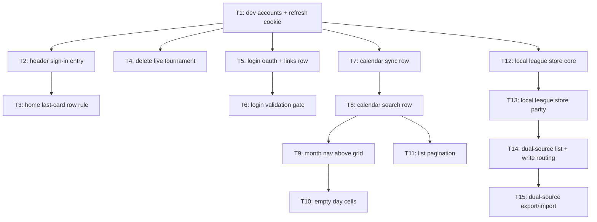

# Plan: Feedback Calendar V1 — Round 2

## Goal

Land the 13-line round-2 feedback on Gones: fix the local-dev 401 (no seeded accounts + `Secure`
refresh cookie over plain HTTP), move the sign-in entry point into the header, reshape the calendar
page (sync row, chrome-less search row, month nav above the grid, empty day cells, list pagination),
add a guarded Live Tournament delete, harden the login form, and give the League Archive a
browser-local store so anonymous visitors can create and manage leagues offline.
Success = every one of the 13 lines shipped, `npm run test && npm run lint && npm run typecheck &&
npm run build && npm run backend:test && npm run cy:run` green, `npm run acceptance:matrix` still proved.

## Scope

- In: `src/**`, `scripts/**`, `compose.yaml`, `package.json`, `cypress/e2e/**`, `ops/**`, `docs/**`, `AGENT.md`, `README.md`.
- In: 2 new ADRs (`docs/adr/0028`, `docs/adr/0029`), 1 new architecture HTML doc, 1 updated.
- Out: `backend/**` C# source. Every backend behaviour this plan needs already exists; only `compose.yaml`
  configuration and a dev-only seeding script change.
- Out: release/production compose files, deployment topology, Docker image contract.
- Out: pushing browser-local leagues to the server. There is no sync path in either direction (ADR 0028).
- Out: retiring or renaming any existing feature.

## Assumptions

- **A1 — artifacts live in `ai-artifacts/`**, ADRs in `docs/adr/` lowercase. Repo `AGENT.md` mandates it and
  `server-authority-boundary.test.ts` / cross-references point there. Overrides the skill's `ai_artefacts/`.
- **A2 — local League parity is total** (user answer). `LocalLeagueArchiveBackend` implements all 22
  `LeagueArchiveBackendPort` methods, not a subset. Anonymous visitors get the whole archive feature offline.
- **A3 — the two League stores are merged, not exclusive** (user answer). Unlike Live (ADR 0021, one adapter
  chosen by role), the League list is the **union** of the server list and the browser-local list. Local rows
  carry a "local only" badge. This is ADR 0028 and it deliberately diverges from ADR 0021.
- **A4 — origin is encoded in the id.** A browser-local league id is `local-<uuid>`; the local placeholder is
  `local-placeholder-league`. `isLocalLeagueId(id)` is the single routing rule for every read and write. No
  schema change to `PersistedLeague`, no extra column, no lookup table.
- **A5 — "the database always prevails"** is implemented as: every command returns the store's own persisted
  document and the caller replaces its in-memory state with that return value. No optimistic local mutation
  is kept when the store disagrees. This is already how both existing adapters behave; T12–T15 keep it.
- **A6 — calendar day cells become empty** (user answer, reconfirmed against the conflict with feedback #6).
  Feedback #9 wins over #6: the month grid renders day numbers only. The fuzzy filter therefore has no
  visible effect on the calendar tab beyond driving its empty state; it filters the list tab. This is a
  deliberate, user-confirmed trade — see T10.
- **A7 — About card width follows a generic rule, not a special case.** `.home-destinations > :last-child:nth-child(odd)`
  spans the row. With the login card removed (feedback #2) an anonymous visitor has 5 cards, so About spans
  the full row for them and is half-width for a signed-in visitor (6 cards). That is the rule as stated.
- **A8 — login password validator is 3 characters, client-side only.** Taken literally from feedback #13.
  The server still enforces its 12-character registration policy; this validator only gates the submit button
  on the **login** form, so a legacy short password is never locked out client-side.
- **A9 — dev accounts are fixed and hardcoded** (user answer): `admin@gones.test` / `test@gones.test`, both
  `Gones-dev-pass-123!`, both email-verified. Admin role is granted by direct SQL, **not** `migrator admin
  bootstrap` — that command consumes a one-shot marker and cannot be re-run for a second address.
- **A10 — the sync icon is inline SVG**, not `<mat-icon>sync</mat-icon>`. The Material Icons font is a remote
  stylesheet (`src/index.html`); the calendar's sync affordance must render for an offline PWA visitor.
- **A11 — list pagination is 20 tournaments per page**, 1-based `page` query parameter, emitted only when > 1,
  reset to 1 whenever the search text, month or view changes.
- **A12 — no new runtime dependency.** Everything is built from what `package.json` already ships.

## Decision records written with this plan

Read the one that covers your ticket **before** coding. They are the specification, not a summary.

| ADR | Covers | Tickets |
| --- | --- | --- |
| [0028 Dual-Source League Archive](../docs/adr/0028-dual-source-league-archive.md) | Server + browser-local League union, id-prefix routing, export merge | T12, T13, T14, T15 |
| [0029 Deterministic Local Development Accounts](../docs/adr/0029-deterministic-local-development-accounts.md) | Seeded dev accounts, refresh-cookie topology for plain HTTP | T1 |

Architecture documents:

| Doc | State | Tickets |
| --- | --- | --- |
| [League Archive Authority](../docs/league-archive-authority.html) | new | T12–T15 |
| [Calendar Data Flow](../docs/calendar-data-flow.html) | updated (page layout + pagination section) | T7–T11 |

## Ticket flowchart

## Ticket order

| ID | Title | Depends | Commit outcome | File |
| --- | --- | --- | --- | --- |
| T1 | Dev accounts and refresh-cookie topology | — | `npm run dev` yields a working `admin@gones.test` / `test@gones.test` login that survives a reload | `PLAN_2026_08_09_feedback-calendar-v1-round-2/T1_dev-accounts-and-refresh-cookie.md` |
| T2 | Header sign-in entry point | T1 | Signed-out visitors get a Sign in button in the toolbar; the home menu login card is gone | `PLAN_2026_08_09_feedback-calendar-v1-round-2/T2_header-sign-in-entry.md` |
| T3 | Home last-card row rule | T2 | The last home card spans the row only when it would sit alone on it | `PLAN_2026_08_09_feedback-calendar-v1-round-2/T3_home-last-card-row-rule.md` |
| T4 | Delete a running Live Tournament | T1 | Advanced settings ends with a red ghost Delete that asks for confirmation and works on both adapters | `PLAN_2026_08_09_feedback-calendar-v1-round-2/T4_delete-live-tournament.md` |
| T5 | Login OAuth buttons and links row | T1 | "Continue with" + logo, centred; Create account / Forgot password pushed to opposite edges | `PLAN_2026_08_09_feedback-calendar-v1-round-2/T5_login-oauth-and-links-row.md` |
| T6 | Login validation gate | T5 | Submit is grey and disabled until the email is valid and the password is ≥ 3 chars, then turns green | `PLAN_2026_08_09_feedback-calendar-v1-round-2/T6_login-validation-gate.md` |
| T7 | Calendar sync action row | T1 | Sync button with icon and its last-sync stamp sit on the back-to-menu row, top right | `PLAN_2026_08_09_feedback-calendar-v1-round-2/T7_calendar-sync-action-row.md` |
| T8 | Calendar search row | T7 | One chrome-less search input on its own row between the title and the view tabs | `PLAN_2026_08_09_feedback-calendar-v1-round-2/T8_calendar-search-row.md` |
| T9 | Month nav above the grid | T8 | Previous far left, month centred, Next far right, directly above the month grid | `PLAN_2026_08_09_feedback-calendar-v1-round-2/T9_month-nav-above-grid.md` |
| T10 | Empty calendar day cells | T9 | Calendar view renders day numbers only; no tournament entries inside the grid | `PLAN_2026_08_09_feedback-calendar-v1-round-2/T10_empty-calendar-day-cells.md` |
| T11 | List view pagination | T8 | The list tab pages at 20 tournaments and keeps the page in the URL | `PLAN_2026_08_09_feedback-calendar-v1-round-2/T11_list-view-pagination.md` |
| T12 | Local League store — core commands | T1 | `LocalLeagueArchiveBackend` persists leagues in IndexedDB with version-guarded commands | `PLAN_2026_08_09_feedback-calendar-v1-round-2/T12_local-league-store-core.md` |
| T13 | Local League store — full port parity | T12 | All 22 port methods implemented locally and proved against the server-parity fixtures | `PLAN_2026_08_09_feedback-calendar-v1-round-2/T13_local-league-store-parity.md` |
| T14 | Dual-source league list and write routing | T13 | Anonymous visitors create and manage leagues; signed-in users see server + local rows, badged | `PLAN_2026_08_09_feedback-calendar-v1-round-2/T14_dual-source-league-list.md` |
| T15 | Dual-source export and import | T14 | Full data export contains local leagues; import lands in the store the caller may write | `PLAN_2026_08_09_feedback-calendar-v1-round-2/T15_dual-source-export-import.md` |
| T16 | Reviewer correctness fixes | T15 | Local import can no longer destroy a league, a partial export can no longer pass as full, and the Live picker offers only server leagues | `PLAN_2026_08_09_feedback-calendar-v1-round-2/T16_reviewer-correctness-fixes.md` |
| T17 | e2e gate and test honesty | T16 | `npm run cy:run` and `npm run e2e:ci` are green, and four mutation-proven vacuous assertions now fail when their behaviour breaks | `PLAN_2026_08_09_feedback-calendar-v1-round-2/T17_e2e-gate-and-test-honesty.md` |

**T16 and T17 were added during execution**, not at plan time. They carry the in-scope blockers found by the
parent orchestrator's independent `deep` reviewer fanout (correctness / security / scope-drift / tests) over
the finished T1–T15 diff. See `## Findings that changed the plan` below.

## Tickets

- [T1: Dev accounts and refresh-cookie topology](PLAN_2026_08_09_feedback-calendar-v1-round-2/T1_dev-accounts-and-refresh-cookie.md) — depends: none
- [T2: Header sign-in entry point](PLAN_2026_08_09_feedback-calendar-v1-round-2/T2_header-sign-in-entry.md) — depends: T1
- [T3: Home last-card row rule](PLAN_2026_08_09_feedback-calendar-v1-round-2/T3_home-last-card-row-rule.md) — depends: T2
- [T4: Delete a running Live Tournament](PLAN_2026_08_09_feedback-calendar-v1-round-2/T4_delete-live-tournament.md) — depends: T1
- [T5: Login OAuth buttons and links row](PLAN_2026_08_09_feedback-calendar-v1-round-2/T5_login-oauth-and-links-row.md) — depends: T1
- [T6: Login validation gate](PLAN_2026_08_09_feedback-calendar-v1-round-2/T6_login-validation-gate.md) — depends: T5
- [T7: Calendar sync action row](PLAN_2026_08_09_feedback-calendar-v1-round-2/T7_calendar-sync-action-row.md) — depends: T1
- [T8: Calendar search row](PLAN_2026_08_09_feedback-calendar-v1-round-2/T8_calendar-search-row.md) — depends: T7
- [T9: Month nav above the grid](PLAN_2026_08_09_feedback-calendar-v1-round-2/T9_month-nav-above-grid.md) — depends: T8
- [T10: Empty calendar day cells](PLAN_2026_08_09_feedback-calendar-v1-round-2/T10_empty-calendar-day-cells.md) — depends: T9
- [T11: List view pagination](PLAN_2026_08_09_feedback-calendar-v1-round-2/T11_list-view-pagination.md) — depends: T8
- [T12: Local League store — core commands](PLAN_2026_08_09_feedback-calendar-v1-round-2/T12_local-league-store-core.md) — depends: T1
- [T13: Local League store — full port parity](PLAN_2026_08_09_feedback-calendar-v1-round-2/T13_local-league-store-parity.md) — depends: T12
- [T14: Dual-source league list and write routing](PLAN_2026_08_09_feedback-calendar-v1-round-2/T14_dual-source-league-list.md) — depends: T13
- [T15: Dual-source export and import](PLAN_2026_08_09_feedback-calendar-v1-round-2/T15_dual-source-export-import.md) — depends: T14
- [T16: Reviewer correctness fixes](PLAN_2026_08_09_feedback-calendar-v1-round-2/T16_reviewer-correctness-fixes.md) — depends: T15
- [T17: e2e gate and test honesty](PLAN_2026_08_09_feedback-calendar-v1-round-2/T17_e2e-gate-and-test-honesty.md) — depends: T16

## Findings that changed the plan

The reviewer fanout over `1aaba28..HEAD` found six in-scope blockers. All six are fixed in T16/T17.

| # | Finding | Ticket that introduced it | Fixed in |
| --- | --- | --- | --- |
| 1 | A local import overwrote an existing local league in place (`putRestored` upserted on a `local-` id, resetting `documentVersion` to 1). Self-inflicted via export → edit → re-import, and reachable by a hostile bundle naming a victim id. Found independently by the correctness and security reviewers. | T12 | T16 |
| 2 | `downloadFullExport` ignored the repository's `serverUnavailable` flag, so a signed-in user whose server read failed got a bundle containing only browser-local leagues, presented as a complete backup. | T14/T15 | T16 |
| 3 | The merged league list leaked browser-local leagues and the local placeholder into the server-only Live settings League picker, offering a cross-authority assignment the API always rejects. | T14 | T16 |
| 4 | `public-calendar.cy.js` replaced a deliberately locale-independent witness with the literal `August`; the release topology renders `août 2026`. The deleted comment had warned about exactly this. | T10 | T17 |
| 5 | `auth-session-persistence.cy.js` still asserted `menu-login-card`, which T2 deleted. | T2 | T17 |
| 6 | The new `live-local.cy.js` delete case depended on the previous test's IndexedDB actually being deleted, which the open live connection blocks. | T4 | T17 |

T15 recorded findings 4-6 as "pre-existing failures reproduced on a stashed baseline". That was wrong: the
stashed baseline still contained the commits that introduced them. Each was confirmed inside this plan's own
range, twice — once by diffing against a worktree at `1aaba28`, once by a live Cypress run.

The `tests` reviewer additionally mutation-tested the suite and found four assertions that stayed green while
their behaviour was broken (the login validation gate, the pagination guard, the local-row badge, and the
sort comparators). All four now fail when mutated — red/green pairs captured in T17.

## Plan-fact corrections found during execution

- `LeagueArchiveBackendPort` declares **21** methods, not the 22 asserted by assumption A2, the T13 title and
  ADR 0028. Parity is proved by `implements LeagueArchiveBackendPort` typechecking without a `Partial`, not by
  a count. The ADR was corrected in T16.
- The League archive API path is `/api/leagues-archive`, not `/api/league-archives` as the tickets wrote it.
- T16 step 5 as originally written would have refused a full export for **anonymous** visitors too — the very
  people who own browser-local leagues, and for whom ADR 0028 makes export the only backup. Corrected during
  execution to refuse only when the server read failed *and* the visitor is signed in.

## Feedback line → ticket map

| # | Feedback line | Ticket |
| --- | --- | --- |
| 1 | About card same width as the others, last-row rule | T3 |
| 2 | Sign-in in the header bar, remove the menu card | T2 |
| 3 | Delete the running Live Tournament from advanced settings | T4 |
| 4 | Leagues usable and stored locally when signed out | T12, T13, T14, T15 |
| 5 | Sync button top right with icon, last-sync text to its left | T7 |
| 6 | Fuzzy search on its own row, no label, no border/background | T8 |
| 7 | Pagination over 20 tournaments on the list tab | T11 |
| 8 | Month prev/next above the calendar, left and right | T9 |
| 9 | Remove the tournament list from the calendar view | T10 |
| 10 | 401 on `npm run dev` with the admin and test accounts | T1 |
| 11 | "Continue with" + platform logo, centred | T5 |
| 12 | Create account / Forgot password justified apart | T5 |
| 13 | Email and password validators gating a grey → green submit | T6 |
