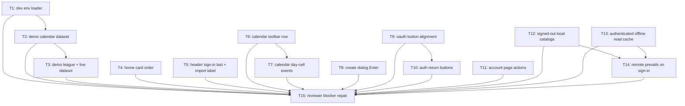

# Plan: Feedback Calendar V1 — Round 3

## Goal

Land 15-line round-3 feedback: seeded local dev environments driven by editable text files, menu /
header / calendar / auth / account layout fixes, create-dialog Enter-to-submit, signed-out local
Settings catalogs, and an authenticated offline read cache where remote data always erases local.
Success = every one of 15 lines shipped, `npm run test && npm run lint && npm run typecheck &&
npm run build && npm run backend:test && npm run cy:run` green, `npm run acceptance:matrix` still proved.

## Scope

- In: `src/**`, `scripts/**`, `fixtures/dev-environments/**`, `ops/**`, `package.json`, `cypress/e2e/**`, `docs/**`, `AGENT.md`, `README.md`.
- In: 3 new ADRs (`docs/adr/0030`, `0031`, `0032`), 2 new architecture HTML docs.
- Out: `backend/**` C# source. Every endpoint the seeder needs already exists; seeding drives the real HTTP API.
- Out: release / production compose files, deployment topology, Docker image contract.
- Out: pushing browser-local data to server. No sync path in either direction (ADR 0021, ADR 0028).
- Out: new runtime deps. Everything built from what `package.json` already ships.

## Assumptions

- **A1 — artifacts in `ai-artifacts/`**, ADRs in `docs/adr/` lowercase. Repo `AGENT.md` mandates it. Overrides skill's `ai_artefacts/` + `docs/ADR/`.
- **A2 — feedback #3 supersedes round-2 A6/T10.** Round 2 decided month-grid day cells render day numbers only. Feedback #3 says "the only events that should appear on the calendar view should be within the calendar itself" → day cells render their tournaments again. Calendar tab still shows **no** list section below the grid (it already does not; T7 locks that with a test).
- **A3 — DBGONDB.json absent; committed demo data must be synthetic.** Private donor export `/home/aron/gdrive-snapshot-2026-08-10/backup/gones-exports/gones-full-data.gones.json` may inform realistic fixture **shape only**. No donor-derived personal name or identifiable match history may be committed. T15 repairs the initial T3 privacy defect by replacing tracked names with explicit synthetic demo names.
- **A4 — dev environments = directories of JSON under `fixtures/dev-environments/<name>/`.** Three ship: `empty` (default, seeds nothing → `npm run dev` unchanged), `minimal` (accounts only, one per role), `demo` (accounts + orgs + calendar tournaments + registrations + league archives + running tournaments). Adding a fourth = copy a directory.
- **A5 — seeding drives the real HTTP API, not SQL inserts.** Only exception: `email_confirmed` + `global_role`, which have no endpoint and are already set by SQL in `scripts/seed-dev-accounts.mjs` (ADR 0029). No `backend/**` change.
- **A6 — a non-`empty` environment resets the database first** (`docker compose down --volumes` → `up --wait` → `scripts/seed-local.mjs`). Swapping environments must not stack two datasets. `empty` never resets, so plain `npm run dev` keeps today's behaviour exactly.
- **A7 — one shared dev password**, `Gones-dev-pass-123!`, already exported as `DEV_PASSWORD` from `scripts/dev-accounts.mjs`. A fixture account may override it; every password is checked against `meetsPasswordPolicy` at test time.
- **A8 — "all dialogues that create something"** = `TextPromptDialogComponent` (`src/app/shared/dialogs.ts`). It is the only create-a-thing prompt dialog in the app today. Fixing it fixes every current create dialog and every future one.
- **A9 — OAuth button label shape wins from login page.** Login renders `auth.continueWith` + brand logo image; register renders logo + `auth.continueGoogle`/`auth.continueFacebook`. Feedback #9 says register text must equal login text → register adopts login's `auth.continueWith` + logo, label first, logo second. `auth.continueGoogle` / `auth.continueFacebook` keys stay in `messages.ts` (used as image `alt` fallbacks and by tests) — they are not deleted.
- **A10 — return-button map.** `login` → `/`, `register` → `/`, `forgot-password` → `/login`, `reset-password` → `/login`, `verify-email` → `/login`. `complete-profile` gets **none**: it is mid-OAuth, a back link there strands a half-created account.
- **A11 — signed-out Settings catalogs are local-only and browser-wide.** Archetypes reuse the existing `DeckArchetypeSettingsService` (`localStorage` `gones.settings`). Players are derived from the browser-local League store (`gones-leagues`) and renamed through `LocalLeagueArchiveBackend.renameLeagueArchivePlayerName`. Neither ever reaches the network.
- **A12 — "remote always prevails" has exactly two surfaces.** (1) Deck archetype catalog: on sign-in as Admin, server catalog replaces local `gones.settings` archetypes. (2) The read cache: every successful server read overwrites its cache row; a cache row is never merged into a response and never written back to server.
- **A13 — the read cache is per-user and dies on logout.** `gones-cache` IndexedDB, rows keyed `<userId>:<resource>`. `SessionScopeService.clear()` already purges service-worker API caches on logout; the new store joins it. Keeping user A's private data readable by user B in the same browser would be a data leak, so cache survival is scoped to the session, not to the browser.
- **A14 — public data stays browser-wide.** `AllTournamentsCacheService` (`localStorage` `gones.calendar-v1.all-tournaments`) is anonymous public read cache and is *not* moved into the per-user store.
- **A15 — no `data-cy` regressions.** Every element this plan adds carries `data-cy`; `src/app/shared/data-cy-coverage.test.ts` enforces it. Every new user-facing string gets an `en` **and** `fr` entry in `src/app/i18n/messages.ts`.

## Decision records written with this plan

Read the one covering your ticket **before** coding. They are the spec, not a summary.

| ADR | Covers | Tickets |
| --- | --- | --- |
| `docs/adr/0030-file-driven-local-dev-environments.md` | env fixture format, loader, reset rule, API-not-SQL seeding | T1, T2, T3 |
| `docs/adr/0031-authenticated-offline-read-cache.md` | `gones-cache`, remote-prevails, purge on logout | T13, T14 |
| `docs/adr/0032-signed-out-local-settings-catalogs.md` | anonymous archetypes + players, local only | T12, T14 |

## Architecture documents

| Doc | State |
| --- | --- |
| `docs/local-dev-environments.html` | new (T1) |
| `docs/offline-read-cache.html` | new (T13) |

## Ticket flowchart

## Ticket order

| ID | Title | Depends | Commit outcome | File |
| --- | --- | --- | --- | --- |
| T1 | Dev environment loader | — | `npm run dev -- --env=minimal` resets DB + seeds one account per role; plain `npm run dev` unchanged | `PLAN_2026_08_10_feedback-calendar-v1-round-3/T1_dev-environment-loader.md` |
| T2 | Demo calendar dataset | T1 | `--env=demo` seeds orgs, formats, published tournaments (past/ongoing/upcoming) and registrations | `PLAN_2026_08_10_feedback-calendar-v1-round-3/T2_demo-calendar-dataset.md` |
| T3 | Demo league + live dataset | T2 | `--env=demo` also seeds 2 League Archives with real rounds and 2 running tournaments | `PLAN_2026_08_10_feedback-calendar-v1-round-3/T3_demo-league-and-live-dataset.md` |
| T4 | Home card order | — | Home menu ends About, then Settings | `PLAN_2026_08_10_feedback-calendar-v1-round-3/T4_home-card-order.md` |
| T5 | Header sign-in last + import label | — | Sign-in / logout sits right of every page's header actions; import button reads "Importer ligue(s)" | `PLAN_2026_08_10_feedback-calendar-v1-round-3/T5_header-sign-in-last-and-import-label.md` |
| T6 | Calendar toolbar row | — | Search input has a normal border; Create tournament sits on the view-tab row, right, green | `PLAN_2026_08_10_feedback-calendar-v1-round-3/T6_calendar-toolbar-row.md` |
| T7 | Calendar day-cell events | T6 | Month grid day cells render their tournaments; calendar tab lists nothing below the grid | `PLAN_2026_08_10_feedback-calendar-v1-round-3/T7_calendar-day-cell-events.md` |
| T8 | Create dialog Enter | — | New-League dialog opens focused; Enter creates | `PLAN_2026_08_10_feedback-calendar-v1-round-3/T8_create-dialog-enter-submit.md` |
| T9 | OAuth button alignment | — | Login and register social buttons share one label, one order, aligned, spaced | `PLAN_2026_08_10_feedback-calendar-v1-round-3/T9_oauth-button-alignment.md` |
| T10 | Auth return buttons | T9 | Every auth page has a return button to menu or to sign-in | `PLAN_2026_08_10_feedback-calendar-v1-round-3/T10_auth-return-buttons.md` |
| T11 | Account page actions | — | Update-account button full width and centred; bottom logout row gone | `PLAN_2026_08_10_feedback-calendar-v1-round-3/T11_account-page-actions.md` |
| T12 | Signed-out local catalogs | — | Signed-out visitor edits archetypes and renames players, stored in this browser only | `PLAN_2026_08_10_feedback-calendar-v1-round-3/T12_signed-out-local-catalogs.md` |
| T13 | Authenticated offline read cache | — | Signed-in league + live reads are cached and answered from cache when offline | `PLAN_2026_08_10_feedback-calendar-v1-round-3/T13_authenticated-offline-read-cache.md` |
| T14 | Remote prevails on sign-in | T12, T13 | Signing in replaces the local archetype catalog with the server one; local stores stay browser-wide | `PLAN_2026_08_10_feedback-calendar-v1-round-3/T14_remote-prevails-on-sign-in.md` |
| T15 | Reviewer blocker repair | T1–T14 | Close cache/session, fixture privacy, seeder safety and runtime-proof findings from final deep review | `PLAN_2026_08_10_feedback-calendar-v1-round-3/T15_reviewer-blocker-repair.md` |

## Feedback line → ticket

| # | Feedback | Ticket |
| --- | --- | --- |
| 1 | Settings last card, About second-last | T4 |
| 2 | Preloaded local environments, editable text files | T1, T2, T3 |
| 3 | Calendar view: no tournament list below the grid | T7 |
| 4 | Create dialogs autofocus + Enter validates | T8 |
| 5 | "Importer 1+ ligues" → "Importer ligue(s)" | T5 |
| 6 | Login button at absolute right of header | T5 |
| 7 | Calendar search input border back | T6 |
| 8 | Create tournament on view-tab row, right, green | T6 |
| 9 | OAuth button spacing / alignment / same text | T9 |
| 10 | Forgot-password return button → login | T10 |
| 11 | Login + register return button → menu | T10 |
| 12 | Signed-out archetypes + players, local only | T12 |
| 13 | Update-account button centred, full width, spaced | T11 |
| 14 | Local data browser-wide, remote prevails, offline cache | T13, T14 |
| 15 | Remove account-page bottom logout | T11 |

## Tickets

- [T1: Dev environment loader](PLAN_2026_08_10_feedback-calendar-v1-round-3/T1_dev-environment-loader.md) — depends: none
- [T2: Demo calendar dataset](PLAN_2026_08_10_feedback-calendar-v1-round-3/T2_demo-calendar-dataset.md) — depends: T1
- [T3: Demo league + live dataset](PLAN_2026_08_10_feedback-calendar-v1-round-3/T3_demo-league-and-live-dataset.md) — depends: T2
- [T4: Home card order](PLAN_2026_08_10_feedback-calendar-v1-round-3/T4_home-card-order.md) — depends: none
- [T5: Header sign-in last + import label](PLAN_2026_08_10_feedback-calendar-v1-round-3/T5_header-sign-in-last-and-import-label.md) — depends: none
- [T6: Calendar toolbar row](PLAN_2026_08_10_feedback-calendar-v1-round-3/T6_calendar-toolbar-row.md) — depends: none
- [T7: Calendar day-cell events](PLAN_2026_08_10_feedback-calendar-v1-round-3/T7_calendar-day-cell-events.md) — depends: T6
- [T8: Create dialog Enter](PLAN_2026_08_10_feedback-calendar-v1-round-3/T8_create-dialog-enter-submit.md) — depends: none
- [T9: OAuth button alignment](PLAN_2026_08_10_feedback-calendar-v1-round-3/T9_oauth-button-alignment.md) — depends: none
- [T10: Auth return buttons](PLAN_2026_08_10_feedback-calendar-v1-round-3/T10_auth-return-buttons.md) — depends: T9
- [T11: Account page actions](PLAN_2026_08_10_feedback-calendar-v1-round-3/T11_account-page-actions.md) — depends: none
- [T12: Signed-out local catalogs](PLAN_2026_08_10_feedback-calendar-v1-round-3/T12_signed-out-local-catalogs.md) — depends: none
- [T13: Authenticated offline read cache](PLAN_2026_08_10_feedback-calendar-v1-round-3/T13_authenticated-offline-read-cache.md) — depends: none
- [T14: Remote prevails on sign-in](PLAN_2026_08_10_feedback-calendar-v1-round-3/T14_remote-prevails-on-sign-in.md) — depends: T12, T13
- [T15: Reviewer blocker repair](PLAN_2026_08_10_feedback-calendar-v1-round-3/T15_reviewer-blocker-repair.md) — depends: T1–T14
