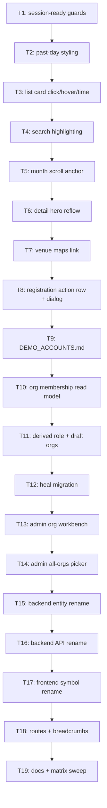

# Plan: Feedback Calendar V1 — Round 4

## Goal

Ship all 19 items of `feedback.md`: calendar + event-detail polish, one admin screen managing the many-to-many organization ↔ organizer graph with a derived Organizer role, a session-ready fix for guarded routes, generated demo-account docs, and a full Tournament → Event rename of the calendar domain (DB, API, frontend, routes). Success = every item done, `npm run test` + `npm run lint` + `npm run typecheck` + `npm run cy:run` + `dotnet test` green, app functional after each ticket.

## Scope

- In: calendar page (calendar + list views), event detail page, admin organization workbench, event-create org picker, auth guards, `DEMO_ACCOUNTS.md`, calendar-domain rename (`ScheduledTournament` → `Event` + satellites, `/api/events/*`, `/events/:slug`), ADRs + architecture docs + acceptance matrix updates.
- Out: Event-as-container-of-many-tournaments model. Server-side paginated user search (deferred until the 500-user cap trips). Cancellation/notification flows for events of deleted orgs. Renaming the shared `TournamentFormat` lookup, `leagues-archive`, or `live-tournaments`. Any change to the `/api/tournaments` ↔ archive domain boundary.

## Assumptions

- Grill answers (`ai-artifacts/GRILL_2026_08_12_feedback-calendar-v1-round-4/ANSWERS.md`) are binding.
- Draft org = zero members, derived from member count, not a stored column.
- Removing the last member of an org is allowed and returns it to Draft. No 409.
- Organizer role is derived from membership both ways; `Admin` never changes from membership.
- The API breaks hard at `/api/events/*` (ADR 0022 precedent: no API aliases). Frontend routes keep permanent redirects.
- Past calendar day = venue date strictly before today. Today is never dimmed.
- Highlighting marks literal substring matches inside fuzzy-matched cards; a fuzzy-only match highlights nothing.
- data-cy on every rendered element (`src/AGENT.md`), i18n keys added to BOTH `en` and `fr` maps in `src/app/i18n/messages.ts`.

## Ticket flowchart

## Ticket order

| ID  | Title | Depends | Commit outcome | File |
| --- | ----- | ------- | -------------- | ---- |
| T1  | Session-ready auth guards | — | Guarded routes decide only after session restore; guest hitting `/registrations` lands on `/login` | `PLAN_2026_08_12_feedback-calendar-v1-round-4/T1_session-ready-auth-guards.md` |
| T2  | Calendar past-day styling | T1 | Days before today render dimmed in the month grid | `PLAN_2026_08_12_feedback-calendar-v1-round-4/T2_calendar-past-day-styling.md` |
| T3  | List card click, hover, local time | T2 | Whole list card navigates, ICS button still works, card time shows no GMT suffix | `PLAN_2026_08_12_feedback-calendar-v1-round-4/T3_list-card-click-hover-time.md` |
| T4  | Search match highlighting | T3 | Search terms highlight in both calendar and list views | `PLAN_2026_08_12_feedback-calendar-v1-round-4/T4_search-match-highlighting.md` |
| T5  | Month navigation scroll anchor | T4 | Prev/next month keeps the scroll position | `PLAN_2026_08_12_feedback-calendar-v1-round-4/T5_month-navigation-scroll-anchor.md` |
| T6  | Event detail hero reflow | T5 | Title row `[format] Title (capacity)`, one date+location row, website bottom-right, org block gone | `PLAN_2026_08_12_feedback-calendar-v1-round-4/T6_detail-hero-reflow.md` |
| T7  | Venue maps link | T6 | Location is a Google Maps link with icon, opens in a new tab | `PLAN_2026_08_12_feedback-calendar-v1-round-4/T7_venue-maps-link.md` |
| T8  | Registration action row + success dialog | T7 | Green register beside add-to-calendar, confirm dialog links to my registrations, standalone button gone | `PLAN_2026_08_12_feedback-calendar-v1-round-4/T8_registration-action-row-and-dialog.md` |
| T9  | Generated DEMO_ACCOUNTS.md | T8 | `DEMO_ACCOUNTS.md` generated from fixtures and asserted by a test | `PLAN_2026_08_12_feedback-calendar-v1-round-4/T9_demo-accounts-doc.md` |
| T10 | Org membership read model | T9 | Admin can read any org's members with display names through one endpoint | `PLAN_2026_08_12_feedback-calendar-v1-round-4/T10_org-membership-read-model.md` |
| T11 | Derived Organizer role + draft orgs | T10 | Membership drives `globalRole`; member-less orgs are Draft and cannot publish | `PLAN_2026_08_12_feedback-calendar-v1-round-4/T11_derived-organizer-role-and-draft-orgs.md` |
| T12 | One-shot membership heal migration | T11 | Legacy violations healed once at deploy with an audit trail | `PLAN_2026_08_12_feedback-calendar-v1-round-4/T12_membership-heal-migration.md` |
| T13 | Admin organization workbench | T12 | Single two-pane screen creates orgs and edits their rosters | `PLAN_2026_08_12_feedback-calendar-v1-round-4/T13_admin-organization-workbench.md` |
| T14 | Admin all-organizations picker | T13 | Admin can create an event for any organization | `PLAN_2026_08_12_feedback-calendar-v1-round-4/T14_admin-all-organizations-picker.md` |
| T15 | Backend Event entity rename | T14 | Calendar tables/entities renamed to Event with a data-preserving migration | `PLAN_2026_08_12_feedback-calendar-v1-round-4/T15_backend-event-entity-rename.md` |
| T16 | Backend Event API rename | T15 | API serves `/api/events/*` only; OpenAPI regenerated | `PLAN_2026_08_12_feedback-calendar-v1-round-4/T16_backend-event-api-rename.md` |
| T17 | Frontend Event symbol rename | T16 | Frontend services/components/tests speak Event | `PLAN_2026_08_12_feedback-calendar-v1-round-4/T17_frontend-event-symbol-rename.md` |
| T18 | Event routes + breadcrumbs | T17 | `/events/:slug` and `/events/new` canonical, old paths redirect, breadcrumb reads Create Event | `PLAN_2026_08_12_feedback-calendar-v1-round-4/T18_event-routes-and-breadcrumbs.md` |
| T19 | Docs, ADR and matrix sweep | T18 | ADRs, architecture docs, acceptance matrix and AGENT.md match the shipped system | `PLAN_2026_08_12_feedback-calendar-v1-round-4/T19_docs-adr-and-matrix-sweep.md` |

## Tickets

- [T1: Session-ready auth guards](PLAN_2026_08_12_feedback-calendar-v1-round-4/T1_session-ready-auth-guards.md) — depends: none
- [T2: Calendar past-day styling](PLAN_2026_08_12_feedback-calendar-v1-round-4/T2_calendar-past-day-styling.md) — depends: T1
- [T3: List card click, hover, local time](PLAN_2026_08_12_feedback-calendar-v1-round-4/T3_list-card-click-hover-time.md) — depends: T2
- [T4: Search match highlighting](PLAN_2026_08_12_feedback-calendar-v1-round-4/T4_search-match-highlighting.md) — depends: T3
- [T5: Month navigation scroll anchor](PLAN_2026_08_12_feedback-calendar-v1-round-4/T5_month-navigation-scroll-anchor.md) — depends: T4
- [T6: Event detail hero reflow](PLAN_2026_08_12_feedback-calendar-v1-round-4/T6_detail-hero-reflow.md) — depends: T5
- [T7: Venue maps link](PLAN_2026_08_12_feedback-calendar-v1-round-4/T7_venue-maps-link.md) — depends: T6
- [T8: Registration action row + success dialog](PLAN_2026_08_12_feedback-calendar-v1-round-4/T8_registration-action-row-and-dialog.md) — depends: T7
- [T9: Generated DEMO_ACCOUNTS.md](PLAN_2026_08_12_feedback-calendar-v1-round-4/T9_demo-accounts-doc.md) — depends: T8
- [T10: Org membership read model](PLAN_2026_08_12_feedback-calendar-v1-round-4/T10_org-membership-read-model.md) — depends: T9
- [T11: Derived Organizer role + draft orgs](PLAN_2026_08_12_feedback-calendar-v1-round-4/T11_derived-organizer-role-and-draft-orgs.md) — depends: T10
- [T12: One-shot membership heal migration](PLAN_2026_08_12_feedback-calendar-v1-round-4/T12_membership-heal-migration.md) — depends: T11
- [T13: Admin organization workbench](PLAN_2026_08_12_feedback-calendar-v1-round-4/T13_admin-organization-workbench.md) — depends: T12
- [T14: Admin all-organizations picker](PLAN_2026_08_12_feedback-calendar-v1-round-4/T14_admin-all-organizations-picker.md) — depends: T13
- [T15: Backend Event entity rename](PLAN_2026_08_12_feedback-calendar-v1-round-4/T15_backend-event-entity-rename.md) — depends: T14
- [T16: Backend Event API rename](PLAN_2026_08_12_feedback-calendar-v1-round-4/T16_backend-event-api-rename.md) — depends: T15
- [T17: Frontend Event symbol rename](PLAN_2026_08_12_feedback-calendar-v1-round-4/T17_frontend-event-symbol-rename.md) — depends: T16
- [T18: Event routes + breadcrumbs](PLAN_2026_08_12_feedback-calendar-v1-round-4/T18_event-routes-and-breadcrumbs.md) — depends: T17
- [T19: Docs, ADR and matrix sweep](PLAN_2026_08_12_feedback-calendar-v1-round-4/T19_docs-adr-and-matrix-sweep.md) — depends: T18
