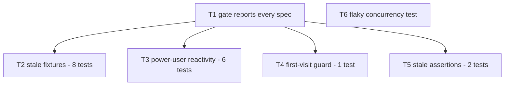

# PLAN 2026-08-21 — Repair the e2e suite and the gate that hides it

## Goal

`npm run e2e:ci` runs every spec and passes. Today it dies on spec #2, and behind that failure sit
17 more across 12 specs that the gate has never been able to report.

## Why now

Round 6 shipped, then a full cypress run against the **release stack** — the first anyone has done
past spec #2 — found 17 failures out of 164 cases. A control run against a release stack built at the
round-6 branch point (`2fff115`) fails them identically, so **none of them are round-6 regressions**.
They are long-standing, and every one of them is invisible to the gate.

Two facts make this worth fixing as one piece of work:

1. `scripts/full-stack-ci.mjs` is fail-fast by construction — each spec is a separate `runCypress`
   call guarded by `if (!process.exitCode)`. One red spec hides all the specs after it.
2. All 17 failures pass against a **dev server**. Every one is specific to the release build. So the
   suite has been giving false confidence to anyone who ran specs locally.

## Root causes (investigated, not guessed)

| RC | Cause | Tests | Fix kind |
| --- | --- | --- | --- |
| RC1 | Event fixtures omit `displayTitle`, which the card and detail templates now render exclusively; plus two selectors renamed/removed in a card redesign and one assertion for a timezone the template no longer prints | 8 | test-only |
| RC2 | The ngsw service worker serves the navigation from its own cache, so the document never passes through the Cypress proxy and **`onBeforeLoad` never runs**. The power-user key therefore never lands before bootstrap — and `PowerUserSettingsService` reads storage **once at construction** with no `storage` listener, so a later re-seed cannot recover | 6 | app + test |
| RC3 | `firstVisitHomeGuard` redirects `/` when `gones.first-visit.completed` is unset, and Cypress `testIsolation` clears it between tests | 1 | test-only |
| RC4 | Two assertions went stale when behaviour changed: logout now goes to `/login?returnUrl=…` not `/`; and a `gones-cache` IndexedDB wipe sits in an `onBeforeLoad` that RC2 shows never runs | 2 | test-only |
| RC5 | A backend concurrency test asserts two possible outcomes for the losing request, but a third is legitimate: if the delete commits first, the cancel correctly returns 404 | 1 (flaky) | test-only |

RC2 is the only one that warrants an application change, and it is a genuine improvement in its own
right (cross-tab sync), not a change made to satisfy a test. That distinction is called out in T2 and
must be respected: **do not change app behaviour merely to make a test pass.**

## Scope

**In scope**
- The 17 e2e failures listed in the tickets
- The flaky `EventLifecycleApiTests.Concurrent_mutations_…` backend test
- Making `full-stack-ci.mjs` report every spec instead of stopping at the first failure
- One app change: making `PowerUserSettingsService` react to `storage` events

**Out of scope**
- Seeding real events into the e2e database. No event seeder exists (confirmed: `seed-auth-e2e.mjs`
  seeds accounts only; no `events.json` in any `fixtures/dev-environments/*`). Every affected spec
  stubs its own data with `cy.intercept` and should keep doing so.
- The WCAG violations themselves — the accessibility failures here are fixture problems that produce
  `aria-label="undefined"`. If real violations remain once the fixtures are correct, that is a
  separate piece of work.
- Any rewrite of the specs beyond the named assertions.
- Adding retries, waits or sleeps to paper over timing. Explicitly forbidden in T5.

## Assumptions

1. The release stack is the gate. A dev server hides all 17 of these and must not be used to declare
   any of them fixed.
2. A dirty docker volume produces false results — this already misled the round-6 run once. Every
   verification starts from `docker compose --profile release down --volumes`.
3. Cypress needs the Nix `LD_LIBRARY_PATH` on this host; `scripts/full-stack-ci.mjs` shows how it is
   built.
4. `cy.intercept` stubs do reach the app: ngsw's `dataGroups` use `freshness` with a 5s timeout, so
   the network is tried first and the Cypress proxy sees it. The SW problem is confined to the
   **navigation document**, which is why it breaks `onBeforeLoad` and nothing else.
5. Fixing RC2's app service will not change behaviour for real users beyond enabling cross-tab
   sync of the Power User toggle, which is the behaviour a user would expect anyway.

## Ticket order

| ID | Title | Depends | File |
| --- | --- | --- | --- |
| T1 | Make the gate report every spec | none | `T1_e2e-gate-reports-every-spec.md` |
| T2 | Refresh the stale event fixtures and selectors | T1 | `T2_stale-event-fixtures.md` |
| T3 | Make Power User settings react to storage, and repair the six gated specs | T1 | `T3_power-user-storage-reactivity.md` |
| T4 | Seed the first-visit flag in the home-card test | T1 | `T4_first-visit-home-card.md` |
| T5 | Fix the two stale behaviour assertions | T1 | `T5_stale-behaviour-assertions.md` |
| T6 | Accept 404 as a legitimate loser in the concurrency race | none | `T6_concurrent-mutation-404.md` |

T1 goes first on purpose: until the gate reports every spec, there is no way to verify T2–T5 through
the sanctioned command, only through hand-run cypress invocations. The gate is already red, so making
it report more cannot make anything worse.

T6 is independent of the e2e work and can run at any time.

## Definition of done

- `npm run e2e:ci` exits 0 and reports all 27 specs
- `npm run backend:test` green across three consecutive full runs (T6 is a flake fix; one green run
  proves nothing)
- No spec passes because an assertion was deleted or weakened — every repaired test still fails when
  the behaviour it covers is broken
- `npm run test`, `npm run lint`, `npm run typecheck`, `npm run api:check`, `npm run acceptance:matrix`
  all still green
