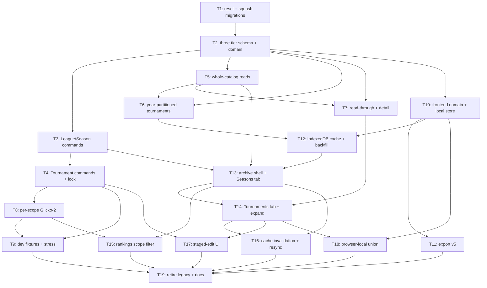

# Plan: Archive Rebuild

## Goal

Rebuild the Archive on three tiers — **League → LeagueSeason → Tournament**. Tournament becomes a
first-class top-level record that may stand alone (`seasonId: null`). Today's flat `League` becomes
`LeagueSeason`; a new `League` tier groups Seasons. Card grid → paginated, sortable, expandable table
across two tabs. Global Rankings gains a scope filter backed by **stored per-scope Glicko-2 ratings**.
`leagues-archive` → `archive` everywhere.

**Success** = every acceptance line below observable:

- `/archive/league-seasons` lists one row per Season, expands one level to its Tournaments.
- `/archive/tournaments` lists every Tournament, standalone ones included.
- A Tournament with `seasonId: null` is creatable, listable, editable, deletable.
- `/global-stats?league=<id>&season=<id>` serves ratings read from `player_statistics`, never replayed.
- Tournament older than 365d refuses non-Admin writes with `409 archiveTournamentLocked`.
- All public catalogs live in IndexedDB. `localStorage` holds language, view preference, filters only.
- `npm run test && npm run typecheck && npm run lint && npm run backend:test && npm run e2e:ci` green.

## Scope

**In**

- New C# aggregates `League`, `LeagueSeason`, `Tournament`; three tables; squashed EF migration history.
- New `/api/archive/**` read + command surface. Old `/api/leagues-archive/**` deleted at T17.
- `player_statistics` re-keyed `(scope_kind, scope_id, player_name)`; scopes `global | league | season`.
- Frontend rename `leagues-archive` → `archive`, `League` → `LeagueSeason` (symbols, routes, i18n, docs).
- IndexedDB catalog cache, year-partitioned Tournament cache, single-writer backfill queue.
- Variant B table (two-line rows) on both tabs. Read-through Season expansion.
- Export bundle **v5**, four flat collections. `SUPPORTED_IMPORT_DATA_VERSIONS = [5]`.
- Centralized cache invalidation + coverage test. Manual "Resynchronize everything" in Settings.
- Three-tier dev fixtures, seed + stress generator.
- ADRs, `docs/CONTEXT.md`, `docs/GLOSSARY.md`, architecture HTML docs.

**Out**

- Data migration. All archive data is deleted; no users exist. No upgrade path from v1–v4 bundles.
- A League detail page. Tab 1 lists Seasons; League is a column and a filter, never a route.
- Multi-select scope filter. League and Season are each **All or exactly one**.
- Series/season auto-detection from event-name strings. Free-string names only.
- Live Tournament, Calendar/Event, Organization, auth surfaces. Untouched.
- Any change to `/api/maintenance/player-names*`.

## Assumptions

- **A1. The `/api/leagues-archive/**` alias is dropped, not kept.** ADR 0022 set the precedent
  verbatim — "No API path aliases. The old routes return `404`. The only client is this repository's
  frontend" — and the situation is identical. Supersedes the grill's "kept as alias" line.
- **A2. Legacy frontend redirects are dropped too.** `/leagues`, `/leagues-archive/**` return the
  404 page. ADR 0022 kept redirects because "Bookmarks and old links are a real user's problem"; with
  zero users that rationale is void. Chaining `/leagues → /leagues-archive → /archive/league-seasons`
  would be dead weight.
- **A3. Expand → migrate → contract.** T2–T9 add the new surface beside the old one; the old
  aggregate, endpoints, components and specs are deleted only at T17, when nothing calls them. **No
  compatibility shim is written** — old code merely survives until unused, so every commit compiles
  and the app runs.
- **A4. Migration history lands at two files, not one.** T1 squashes 71 → `InitialCreate`; T2 adds
  `RebuildArchiveThreeTier`. Regenerating a single file at T2 would leave the tree migration-less
  between commits and break `dotnet ef database update`.
- **A5. `locked` is not on the wire for a Tournament row.** It is derived client-side from
  `tournamentDate`, because a row cached today as unlocked becomes locked without a refetch.
  `ArchiveYearsResponse.years[].locked` **is** on the wire — that endpoint is fetched every session.
- **A6. Catalog row ≠ detail document.** `ArchiveTournamentSummary` carries no `rounds` or
  `playerArchetypes`; the detail document does and is fetched read-through, never partitioned.
- **A7. The 🔒 lock marker is visible** on rows whose Tournaments are all older than 365 days, not
  only surfaced on a rejected edit.
- **A8. Per-year row cap = 25,000**, from the measured mtgtop8 peak of ~17,500 tournaments/year plus
  headroom. The ×2 whole-archive figure (180,000) predates year-partitioning and no longer applies.
- **A9. Variant B paired headers sort on their first value.** `Season / League` → `name`,
  `Last played / Updated` → `lastTournamentDate`, `Tourn. / Players` → `tournamentCount`. All six
  fields stay reachable through the explicit sort `<select>`.
- **A10. Two IndexedDB databases, not one.** `gones-archive-local` for browser-authored records
  (ADR 0028 authority), `gones-archive-cache` for public catalogs (ADR 0039 TTL). Mixing an authority
  with a cache in one database makes "purge the cache" unsafe.
- **A11. Calendar year is the default Season split and must be overridable.** Confirmed by research:
  mtgtop8's own generic buckets are `All 2026 Decks`, `All 2025 Decks`. Known-wrong cases exist —
  Pro Tour 1996–2012 ran Aug→Aug seasons named `1996–97`, Face to Face runs `2026-27`. `LeagueSeason.name`
  stays a free string; no integer-year column.
- **A12. Public archives expose no series/season field.** Verified on a real mtgtop8 event record:
  title, venue, format, star rating, player count, date, decklists — nothing else. The League tier is
  our own construct; fixtures carry `sourceSeriesId: null`.
- **A13. `~/.agents/skills/_shared/ADR.md` does not exist.** ADRs follow the repo convention
  `docs/adr/NNNN-kebab-title.md` observed across 44 files. Reported as a separate fix.

### Assumptions revised during the ticket-write pass

Nineteen ticket writers inspected the codebase and overturned six planning assumptions. Each was
verified against a file, not argued:

- **A14 supersedes A1's alias note.** The legacy table is **`league_archive_aggregates`**, not
  `league_aggregates` — renamed by `20260809122735_RenameLeagueArchiveTables`
  (`LeagueArchiveAggregateConfiguration.cs:12`).
- **A15 corrects "T1 empties the archive".** The `placeholder-league` row **cannot** be removed at
  T1: `InitialCreate` re-seeds it, `LeagueArchiveAggregate.Delete` refuses to delete it,
  `MigrationImportService` calls `SingleAsync` on it, and `scripts/seed-local.mjs` throws
  `Fixed placeholder League missing or duplicated.` without it — which would break `npm run db:reset`,
  the very command T1 mandates. It is retired at T19.
- **A16 corrects the error-code vocabulary.** The repo emits snake_case codes API-wide from
  `ApiExceptions.cs`: `stale_version`, `not_found`, `validation_failed`. New codes follow suit —
  `archive_tournament_locked`, `archive_league_not_empty`. The **browser-local** mirror keeps its
  camelCase `staleArchiveDocument`, because that is a local string, not a wire code.
- **A17 corrects "fixtures/league-domain/v1 is replaced".** It is a TypeScript↔C# **domain-parity**
  corpus read by `LeagueParityTests.cs:172` and `LeagueArchiveRouteTests.cs:183`, not a bundle
  sample. It is **re-pointed at the new shapes**, not deleted — losing cross-stack parity proof was
  not an acceptable trade.
- **A18 adds a cross-feature dependency nobody had listed.**
  `backend/src/Gones.Api/Live/LiveCommandEndpoints.cs:358-364` validates a live tournament's
  `leagueId` against `LeagueArchiveAggregates`. T19 re-points it at `archive_league_seasons` in the
  same commit that drops the table, or live seeding breaks.
- **A19 fixes an operation-name collision that would crash startup.** Two endpoints sharing a
  `.WithName()` throws at boot, and the legacy names survive to T19. Every new archive endpoint is
  therefore **noun-first**, `Archive{Tier}{Verb}` — e.g. `ArchiveTournamentApplyEditBatch`, never
  `ApplyArchiveTournamentEditBatch`, which `LeagueCommandEndpoints.cs:33` already owns.

### Two scope holes found and closed

A ticket writer caught two gaps that would have shipped broken. Both became tickets:

- **T17** — nothing rebuilt the ADR 0037 power-user **staged-edit UI** on `/archive/**`, so T19's
  deletion of the legacy editor would have left `cypress/e2e/archive-staged-edit.cy.js` without a
  subject.
- **T18** — nothing unioned the **browser-local** records T10 creates into either tab, silently
  breaking ADR 0028's dual-source rule.

Retiring the legacy surface moved from T17 to **T19** as a result.

## Ticket flowchart

## Ticket order

| ID  | Title | Depends | Commit outcome | File |
| --- | ----- | ------- | -------------- | ---- |
| T1  | Reset the archive and squash the migration history | — | Empty archive, one `InitialCreate`, `migration:smoke` green | `PLAN_2026_08_22_archive-rebuild/T1_reset-and-squash.md` |
| T2  | Three-tier archive schema and domain aggregates | T1 | Three tables + aggregates + derived lock rule exist; old surface still serving | `PLAN_2026_08_22_archive-rebuild/T2_three-tier-schema.md` |
| T3  | League and LeagueSeason command endpoints | T2 | Leagues and Seasons creatable, renamable, deletable over HTTP | `PLAN_2026_08_22_archive-rebuild/T3_league-season-commands.md` |
| T4  | Tournament command endpoints with derived locking | T3 | Standalone + attached Tournaments writable; `409 archiveTournamentLocked` enforced | `PLAN_2026_08_22_archive-rebuild/T4_tournament-commands-locking.md` |
| T5  | Whole-catalog read endpoints for Leagues and League Seasons | T2 | `GET /api/archive/leagues/all` + `/league-seasons/all` serve slim rows with ETag; **owns the shared read DTOs** | `PLAN_2026_08_22_archive-rebuild/T5_whole-catalog-reads.md` |
| T6  | Year-partitioned Tournament catalog and the years index | T2, T5 | `GET /api/archive/tournaments/all?year=` + `/api/archive/years` serve partitions | `PLAN_2026_08_22_archive-rebuild/T6_year-partitioned-tournaments.md` |
| T7  | Read-through Season tournaments and Tournament detail | T2, T5 | `GET /api/archive/league-seasons/{id}/tournaments` + `/tournaments/{id}` serve uncached reads | `PLAN_2026_08_22_archive-rebuild/T7_read-through-and-detail.md` |
| T8  | Per-scope Glicko-2 read model and scoped statistics endpoint | T4 | `player_statistics` re-keyed by scope; scoped rankings query works | `PLAN_2026_08_22_archive-rebuild/T8_scoped-player-statistics.md` |
| T9  | Three-tier dev fixtures, seeding and stress generator | T4, T8 | `npm run dev:env` and `dev:stress:generate` produce three-tier data | `PLAN_2026_08_22_archive-rebuild/T9_dev-fixtures.md` |
| T10 | Frontend three-tier domain and browser-local archive | T2 | `models.ts` carries three tiers; `gones-archive-local` stores them | `PLAN_2026_08_22_archive-rebuild/T10_frontend-domain-and-local.md` |
| T11 | Export bundle v5 and the import gate | T10 | Export writes four flat collections at `version: 5`; v1–v4 rejected | `PLAN_2026_08_22_archive-rebuild/T11_export-v5.md` |
| T12 | IndexedDB catalog cache, year partitions and backfill queue | T10, T6 | Public catalogs served from IndexedDB; one writer owns year partitions | `PLAN_2026_08_22_archive-rebuild/T12_indexeddb-catalog-cache.md` |
| T13 | Archive shell, routes and the League Seasons tab | T12, T5, T3 | `/archive/league-seasons` renders the Variant B table, sortable + paginated | `PLAN_2026_08_22_archive-rebuild/T13_archive-shell-league-seasons.md` |
| T14 | Tournaments tab and Season expansion | T13, T7 | `/archive/tournaments` lists all Tournaments; a Season row expands to its children | `PLAN_2026_08_22_archive-rebuild/T14_tournaments-tab-expansion.md` |
| T15 | Global Rankings scope filter | T8, T13 | League + Season selects drive scoped ratings; scope badge states the scope | `PLAN_2026_08_22_archive-rebuild/T15_rankings-scope-filter.md` |
| T16 | Centralized cache invalidation and manual resynchronize | T13, T14 | One invalidation method, coverage test, Settings resync button | `PLAN_2026_08_22_archive-rebuild/T16_cache-invalidation-resync.md` |
| T17 | Archive staged-edit UI on the new surface | T14, T4 | A power user can stage, review and apply archive edits on `/archive/**` with ADR 0037's guarantees | `PLAN_2026_08_22_archive-rebuild/T17_archive-staged-edit.md` |
| T18 | Browser-local archive records unioned into both tabs | T14, T10 | Records authored in this browser appear beside server records, as ADR 0028 requires | `PLAN_2026_08_22_archive-rebuild/T18_browser-local-union.md` |
| T19 | Retire the legacy archive surface and refresh the docs | T17, T18, T15, T16, T11, T9 | Old routes 404, old files gone, CONTEXT/GLOSSARY updated, e2e green | `PLAN_2026_08_22_archive-rebuild/T19_retire-legacy-surface.md` |

## Tickets

- [T1: Reset the archive and squash the migration history](PLAN_2026_08_22_archive-rebuild/T1_reset-and-squash.md) — depends: none
- [T2: Three-tier archive schema and domain aggregates](PLAN_2026_08_22_archive-rebuild/T2_three-tier-schema.md) — depends: T1
- [T3: League and LeagueSeason command endpoints](PLAN_2026_08_22_archive-rebuild/T3_league-season-commands.md) — depends: T2
- [T4: Tournament command endpoints with derived locking](PLAN_2026_08_22_archive-rebuild/T4_tournament-commands-locking.md) — depends: T3
- [T5: Whole-catalog read endpoints for Leagues and League Seasons](PLAN_2026_08_22_archive-rebuild/T5_whole-catalog-reads.md) — depends: T2
- [T6: Year-partitioned Tournament catalog and the years index](PLAN_2026_08_22_archive-rebuild/T6_year-partitioned-tournaments.md) — depends: T2, T5
- [T7: Read-through Season tournaments and Tournament detail](PLAN_2026_08_22_archive-rebuild/T7_read-through-and-detail.md) — depends: T2, T5
- [T8: Per-scope Glicko-2 read model and scoped statistics endpoint](PLAN_2026_08_22_archive-rebuild/T8_scoped-player-statistics.md) — depends: T4
- [T9: Three-tier dev fixtures, seeding and stress generator](PLAN_2026_08_22_archive-rebuild/T9_dev-fixtures.md) — depends: T4, T8
- [T10: Frontend three-tier domain and browser-local archive](PLAN_2026_08_22_archive-rebuild/T10_frontend-domain-and-local.md) — depends: T2
- [T11: Export bundle v5 and the import gate](PLAN_2026_08_22_archive-rebuild/T11_export-v5.md) — depends: T10
- [T12: IndexedDB catalog cache, year partitions and backfill queue](PLAN_2026_08_22_archive-rebuild/T12_indexeddb-catalog-cache.md) — depends: T10, T6
- [T13: Archive shell, routes and the League Seasons tab](PLAN_2026_08_22_archive-rebuild/T13_archive-shell-league-seasons.md) — depends: T12, T5, T3
- [T14: Tournaments tab and Season expansion](PLAN_2026_08_22_archive-rebuild/T14_tournaments-tab-expansion.md) — depends: T13, T7
- [T15: Global Rankings scope filter](PLAN_2026_08_22_archive-rebuild/T15_rankings-scope-filter.md) — depends: T8, T13
- [T16: Centralized cache invalidation and manual resynchronize](PLAN_2026_08_22_archive-rebuild/T16_cache-invalidation-resync.md) — depends: T13, T14
- [T17: Archive staged-edit UI on the new surface](PLAN_2026_08_22_archive-rebuild/T17_archive-staged-edit.md) — depends: T14, T4
- [T18: Browser-local archive records unioned into both tabs](PLAN_2026_08_22_archive-rebuild/T18_browser-local-union.md) — depends: T14, T10
- [T19: Retire the legacy archive surface and refresh the docs](PLAN_2026_08_22_archive-rebuild/T19_retire-legacy-surface.md) — depends: T17, T18, T15, T16, T11, T9
