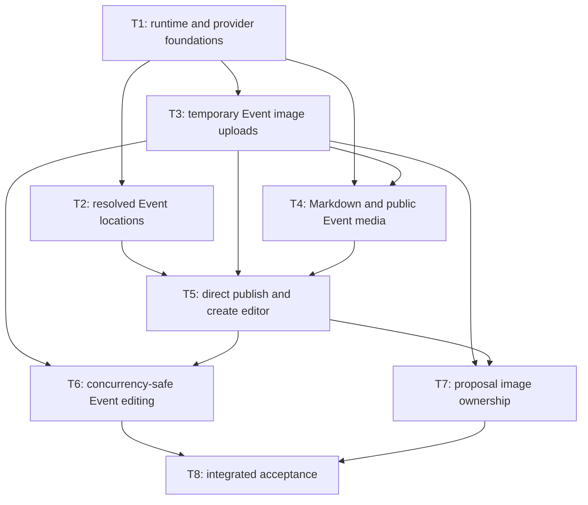

# Event Editor Images and Markdown

Redesign Event create/edit/proposal flows with resolved worldwide locations, Markdown source, ordered image media, direct publication, and responsive live preview.

## Tickets Flow

## Index

| Ticket ID | Goal | Owns | State | Link |
| --------- | ---- | ---- | ----- | ---- |
| T1 | Frontload Google/S3 user setup; pin deps; add MinIO bootstrap, secret-file config, provider fakes, readiness, shared RFC 7807 policy. | C14, C15 policy; D13, D14 private-store/config | NOT STARTED | [[PLAN_2026_08_31_event_editor_images_markdown/T1_runtime_provider_foundations|T1]] |
| T2 | Deliver signed Google location proxy plus editor autocomplete, debounce, canonical mapping, invalidation, provider failures. | C1-C2; D11, D20 | NOT STARTED | [[PLAN_2026_08_31_event_editor_images_markdown/T2_resolved_event_locations|T2]] |
| T3 | Deliver reusable temp-img uploader plus authz API, DB state, S3 transform/variants, progress/retry/reorder, 24h cleanup. | C3, C4 base route, C9, C13; D8, D9 temp lifecycle, D14 API streaming, D15, D17 temp routes, D22 upload UX | NOT STARTED | [[PLAN_2026_08_31_event_editor_images_markdown/T3_temporary_event_images|T3]] |
| T4 | Transition all existing writers to Markdown source; expose public ordered imgs through actual Event detail, alt fallback, hero/gallery, lightbox. | C8 public detail/list, C10-C12; D6, D10, D19, D21 | NOT STARTED | [[PLAN_2026_08_31_event_editor_images_markdown/T4_event_markdown_public_media|T4]] |
| T5 | Delete preview tickets; deliver direct idempotent create plus exact responsive rows/live preview; gate proposal img controls until T7. | C5; D1 create, D2-D4, D5 control removal, D7, D9/D17 atomic attach, D12 layout, D16, D22 collapse state | NOT STARTED | [[PLAN_2026_08_31_event_editor_images_markdown/T5_direct_publish_create_editor|T5]] |
| T6 | Deliver nested concurrency-safe editing, stale reorder/removal protection, post-commit object deletion, hidden URL preservation. | C6; D1 edit, D5 URL preservation, D22 ETag/delete | NOT STARTED | [[PLAN_2026_08_31_event_editor_images_markdown/T6_event_editing_media_concurrency|T6]] |
| T7 | Promote proposal imgs across submit/approve/reject/expiry; add token-scoped reads, cleanup retries, proposal uploader/review media. | C4 proposal route, C7, C8 proposal review; D1 proposal, D18 | NOT STARTED | [[PLAN_2026_08_31_event_editor_images_markdown/T7_proposal_image_ownership|T7]] |
| T8 | Add integration-only red tests, acceptance-matrix evidence, reset rehearsal, browser flows, full gates. | Cross-ticket verification only | NOT STARTED | [[PLAN_2026_08_31_event_editor_images_markdown/T8_integrated_event_editor_acceptance|T8]] |
