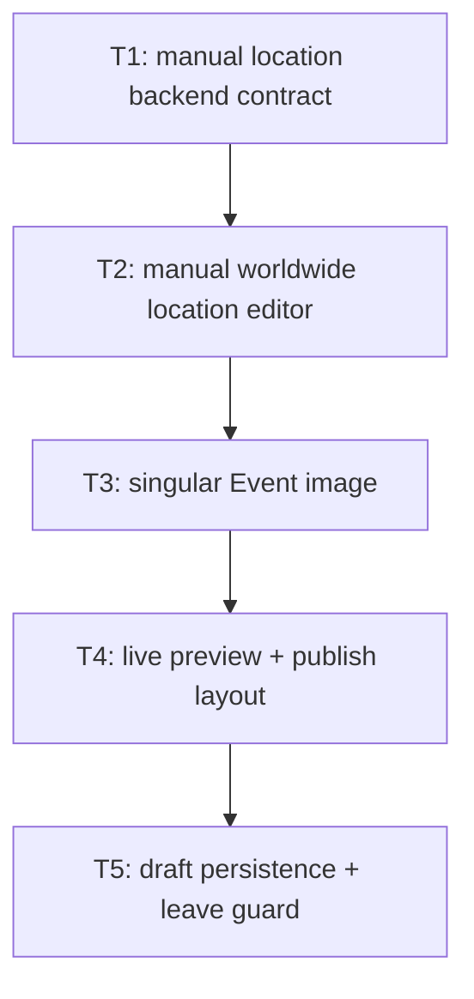

# Create/Edit Event Page Feedback

Amend Event create/edit into live, recoverable worldwide editor with manual location entry and singular media contract.

## Scope

- S1 In: all applicable items in `feedback.md`, manual worldwide address + IANA timezone, create-draft persistence, EN/FR copy, API/DB migration, tests.
- S2 Out: geocoding, address autocomplete, map-provider APIs, geographic address verification, public catalog images, deployment, push before explicit confirmation.

## Locked decisions

- D1 Location uses required manual street, postal code, city, region, country, and backend-sourced IANA timezone controls.
- D2 Google Places/Time Zone integration, signed location tokens, provider place IDs, and coordinates retire. Google OAuth remains unrelated.
- D3 Backend `DateTimeZoneProviders.Tzdb.Ids` is timezone catalog authority; writes validate against same source.
- D4 Create + edit protect dirty navigation. Create draft persists per account without age expiry; edit never persists locally.
- D5 Event carries zero or one image through singular nullable wire fields; `alt_text` + `sort_order` retire.

## Assumptions

- A1 Manual location deliberately cannot prove address/timezone geographic consistency.
- A2 All six location fields remain required.
- A3 Provider DB columns are dropped rather than populated with false sentinel data.
- A4 Browser controls native `beforeunload` copy; only in-app confirm dialog can use Gones translations.

## Tickets Flow

Shared Angular editor/test/i18n hotspots force serial impl in one worktree. No safe ticket-level parallel writers.

## Index

| Ticket ID | Goal | State | Link |
| --- | --- | --- | --- |
| T1 | Retire Google location authority; accept manual address + validated IANA timezone. | DONE | [[PLAN_2026_09_03_create_edit_event_page/T1_google-provider-cost-and-setup]] |
| T2 | Ship country + timezone selects with manual worldwide address fields. | DONE | [[PLAN_2026_09_03_create_edit_event_page/T2_worldwide-location-editor]] |
| T3 | Replace plural Event media with singular image end to end. | DONE | [[PLAN_2026_09_03_create_edit_event_page/T3_singular-event-image]] |
| T4 | Make preview + publish layout match feedback. | DONE | [[PLAN_2026_09_03_create_edit_event_page/T4_live-preview-and-publish-layout]] |
| T5 | Persist create draft + guard unsaved create/edit navigation. | DONE | [[PLAN_2026_09_03_create_edit_event_page/T5_event-draft-persistence-and-leave-guard]] |
