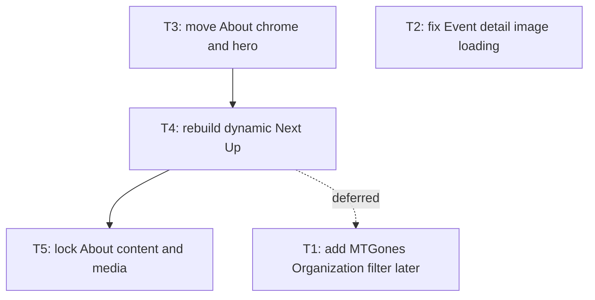

# About and Event Detail Feedback

Apply approved About page redesign/content updates plus Event detail image-origin fix and viewer-time removal.

## Tickets Flow

## Index

| Ticket ID | Goal | State | Link |
| --------- | ---- | ----- | ---- |
| T1 | Add exact MTGones Organization filter later | DEFERRED | [[PLAN_2026_09_04_about-and-event-detail-feedback/T1_capture-mtgones-organization-id]] |
| T2 | Fix Event image URL resolution and remove viewer-time row | IMPLEMENTED | [[PLAN_2026_09_04_about-and-event-detail-feedback/T2_fix-event-detail-image-and-viewer-time]] |
| T3 | Move About nav into shell and make hero full bleed | IMPLEMENTED | [[PLAN_2026_09_04_about-and-event-detail-feedback/T3_move-about-chrome-and-hero]] |
| T4 | Render dual live Next Up variants filtered to MTGones | IMPLEMENTED (all-org; T1 deferred) | [[PLAN_2026_09_04_about-and-event-detail-feedback/T4_rebuild-dynamic-next-up]] |
| T5 | Lock approved About copy, media, and section layout | IMPLEMENTED | [[PLAN_2026_09_04_about-and-event-detail-feedback/T5_lock-about-content-and-media]] |
