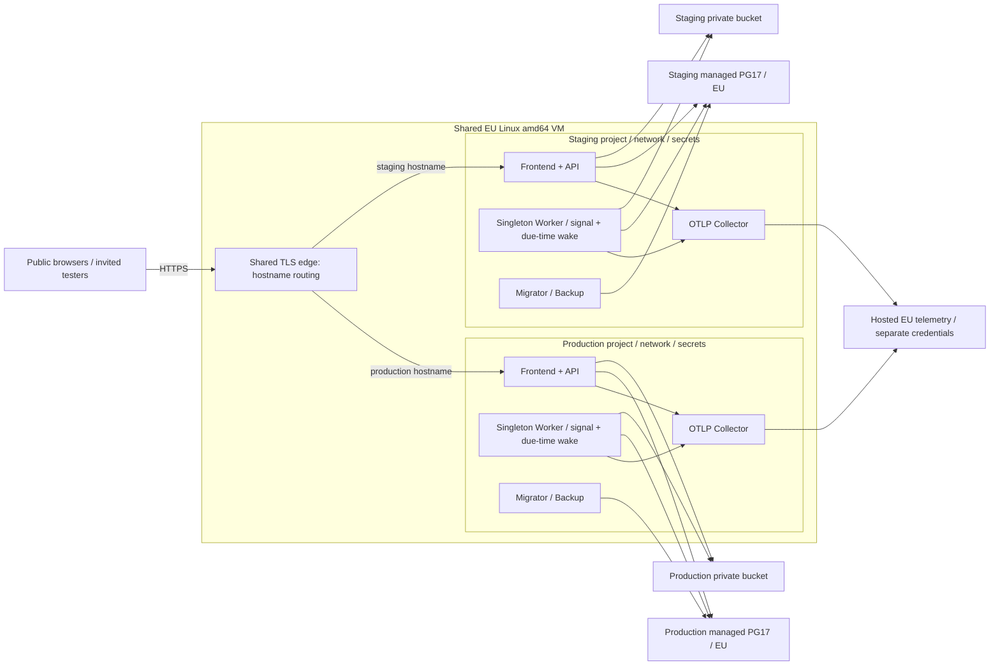

# Gones staging foundation — implementation plan

**State: partial implementation; current-ticket work stopped at user request. Local source/tests implemented; no infrastructure provisioning or system apply performed. Publication to main explicitly authorized by user.**

## Current implementation checkpoint

- [x] P1. W9/W10 and W11 repo-only scheduling/health implementation reviewed and merged through `b939447`. Verify: integrated backend1242/1242 and ops310/310 passed; physical DB suspension/cost/72h gates remain open.
- [x] P2. I3-A staging access/mail policy plus S6 owner setup implemented, independently reviewed and merged; S6 commit `7bf0666196dfdf65e53cf412ae64caa2b17b15be`. Verify: final backend1283/1283, frontend2294/2294, browser1/1; independent repair14/14; post-merge ops310/310. Fresh API recheck unavailable after protected-path denial; no waiver or fresh-pass claim.
- [x] P3. I7a deployment-boundary docs/tests merged as `af5fd4f816423fa51bfc36eaf525ad0fe35e6ab6`. Verify: reviewed commit and passing post-merge ops contracts; I7b remains open.
- [ ] P4. I2 repo-only implementation/review complete, integration blocked. Verify before closing: stage/commit all11 reviewed candidate paths and obtain required direct Compose validation through approved operator path. Current evidence: frontend2351/2351, independent71/71; guard denied both direct validation and staging `deploy/shared-host/config.fixture.env`. All11 files preserved uncommitted in `.tmp/staging-foundation/worktrees/i2`; no bypass.
- [ ] P5. Remaining I1, I3 telemetry, I4/I5/I6/I7b and W12/live-provider/host/cost gates deferred at user stop. Verify before closing: execute each original package's acceptance criteria; next-ticket scouts stopped without implementation.

Detailed evidence and residuals: `artifacts/staging-foundation-final-implementation-report.md`. This checkpoint updates execution state; original package checkboxes below remain open wherever broader acceptance is unproved.

Repo baseline: `384ef4901d8268cf66e9b8f12c546038c8c5f250`. User-approved promotion: **dev → staging → main**. Budget: **~€10/month target; €50/month hard ceiling**. Expected usage: fewer than 200 user requests/day, less than 100 MB application data. Provider prices below retrieved from official pages; checkout availability, taxes, account eligibility remain purchasing gates.

## 1. Recommendation

**User-approved starter topology: production + staging share one EU Linux VM.** Separate application stacks, managed DB projects, private buckets, secrets, networks, and deploy targets. Production stays running; **user-selected staging mode is on demand**, not a daily schedule. Successful staging candidate builds or an authorized manual action wake staging API + Worker for a bounded test window. Outside test windows, staging stops; edge serves maintenance for staging hostname only. DB data + private objects remain persistent; no delete/recreate cycle for test data.

This plan authorizes repo-only implementation and the user's explicit current-ticket main publication, not infrastructure provisioning or deployment. **User-requested redesign:** replace continuous DB polling with committed-job wake signals, durable due times, daily scheduling, and bounded recovery sweeps. Production API remains reachable; production DB may sleep between real work once correctness and idle-compute gates pass. Shared host saves one VM bill; DB cost depends on measured active time after redesign. No Kubernetes, managed queue, service mesh, or separate API VM initially. Separate-VM migration path is defined below.

**Security and availability boundary:** containers on one VM are not equivalent to separate VMs. A host compromise, Docker administrator credential, kernel failure, full disk, or resource exhaustion can affect both environments. Sharing the VM accepts that shared-host risk; it does not authorize staging access to production data or secrets.

**Current-code cost finding (redesign target, not future requirement):** `NotificationOptions.cs:35` defaults to a 5-second poll; `Worker.cs:38-41` writes heartbeats roughly every 15 seconds while active. DB receives work without visitors. Neon Free offers 100 CU-hours/project/month, suspends after five idle minutes. At fixed 0.25 CU, continuous operation consumes **180–186 CU-hours/month** → free tier is insufficient. Increasing current poll to its allowed one-minute maximum still prevents sleep. [S3, S4; repo refs below]

## 2. Architecture boundaries



| ID | Boundary | Planned contract |
|---|---|---|
| B1 | Public origin | User-selected free host-provided HTTPS hostname for now; no domain purchase. Require two stable, distinct hostnames for staging/prod; frontend + API same origin within each. Provider must support shared-VM routing and certificate issuance/renewal. Exact-origin CORS, host-only cookies, separate signing keys/audiences where supported; no parent-domain session sharing. Unknown hosts rejected. Specific provider/hostnames remain unverified. |
| B2 | VM | Small x86 Linux instance, initially ~2 vCPU/4 GB RAM pending dual-stack capacity validation. Separate Compose projects `gones-staging` / `gones-prod`; CI builds elsewhere. Exactly one Worker **per environment**. Explicit CPU/memory/PID limits, bounded logs/telemetry queues, production headroom. Upgrade capacity if measured overlap exceeds safe limits. |
| B3 | Network | Public 80/443 only; SSH key-only, restricted operator/deploy source. No public API container ports, Docker socket, Collector, or local DB. Forwarded headers trust only actual edge. |
| B4 | DB | Separate staging PostgreSQL 17 project; TLS hostname verification. Migration role vs least-privilege API/Worker role. Preserve append-only audit grants. Direct/session-safe connection for advisory locks; do not assume transaction pooler compatibility. |
| B5 | Objects | Dedicated private bucket; API mediates access. Separate bucket-scoped API/Worker keys. No public bucket or `r2.dev`. Explicit R2 EU jurisdiction, not merely location hint; S3 endpoint `<account>.eu.r2.cloudflarestorage.com`, signing region `auto`. Verify existing AWS SDK upload/checksum behavior against R2. |
| B6 | Secrets | Separate staging/prod credentials; mounted runtime secret files with container-readable least permissions. Secrets absent from image layers, repo, runtime-config JSON, logs, workflow artifacts. |
| B7 | Staging access | Anonymous public routes stay public; staging account creation/sign-in restricted to invited testers across local + OAuth paths. Production signup policy remains separate. This restriction needs implementation; do not infer it from email verification. |
| B8 | Indexing | Staging-only `X-Robots-Tag: noindex, nofollow, noarchive` + robots file. These are crawler instructions, not authentication. No production noindex leakage. |
| B9 | Cross-environment isolation | Separate managed PG projects/roles, object + backup buckets, keys, OAuth apps, senders, Collector credentials, host directories, Compose volumes/networks. API/Worker containers never mount Docker socket or other environment's files. Never clone prod data into staging. |
| B10 | Deploy authority | Staging CI may invoke only fixed staging deployment operation; no unrestricted Docker/root/SSH shell credential. Docker-group access grants control over both stacks, not isolation. Host-owned constrained deploy service validates fixed service/network/mount policy and artifact provenance; prod deployment needs separate approval. |
| B11 | Shared edge | One host-managed edge; per-host routing/config validated before graceful reload. Staging app deployments cannot alter prod route/TLS config or restart shared edge. Host/edge updates require shared maintenance planning. |

## 3. Providers + budget

| ID | Service | Recommendation / fetched evidence | Monthly planning allowance |
|---|---|---|---|
| C1 | EU VM | Hetzner CX23 candidate, Germany. Official price-adjustment table lists €5.49/month excluding VAT + IPv4; primary IPv4 €0.50/month excluding VAT. SKU capacity/availability must be confirmed before purchase. Free usable HTTPS hostnames are not verified for this VM proposal; host choice stays provisional until B1 is satisfied. [S1, S2] | €5.99 pre-tax; ~€7.19 at illustrative 20% VAT |
| C2 | Managed PG17 | Neon Free, Frankfurt `aws-eu-central-1`; PG17 supported. 100 CU-hours/month/project; 0.5 GB storage. [S3–S5] | €0 **only with bounded active compute** |
| C3 | Private S3 | Cloudflare R2 Standard, EU jurisdiction. Free: 10 GB-month, 1M Class A + 10M Class B operations/month; internet egress free. [S6, S7] | €0 within account allowance; paid overages possible |
| C4 | Telemetry | Grafana Cloud Free, EU Germany region. 10k active metric series, 50 GB/month allowances shown for logs/traces, 14-day retention. Account-wide usage must be checked before adding prod. [S8, S9] | €0 within free limits; no automatic paid-plan upgrade |
| C5 | Email | Brevo Free, dedicated staging sender/subdomain; up to 300 emails/day after sending approval. Existing account quotas may be shared. [S10] | €0 within allowance; recipient allowlist enforced by app |
| C6 | Registry / CI | GHCR candidate; official billing page allows free public packages. Keep visibility decision separate from infra plan. Private image/artifact/Actions allowances require account verification. [S13] | €0 target, not assumed unlimited |
| C7 | Hostname / TLS / backups | Free host-provided HTTPS hostnames required; no domain registration or renewal purchase. Validate hostname stability, TLS, and provider terms before choosing host. Reserve for FX/tax variance and backup operations only. | €0 hostname target; ~€1–3 contingency, not domain spend |

**Staging-only baseline:** approximately **€8–11/month** including one VM, conditional on free allowances + domain/account circumstances. This is **not** the combined prod + staging bill.

**Current-code fallback estimate:** one VM + polling production Worker/always-active DB + on-demand staging DB → approximately **€30–40/month combined**, conditional on assumptions below. This is fallback cost, not chosen redesigned behavior. If both DBs remain always-active, two small paid computes can reach/exceed €50 after VAT/FX/VM → recost before approval.

**Redesign target:** shared VM + two separate sleep-capable, free-eligible DB projects → approximately **€8–11/month combined** only if each stays inside compute/storage quotas, shared email/object/telemetry quotas fit, and a free HTTPS hostname solution is confirmed. No free-production guarantee. At 0.25 CU, 100 CU-hours permits 400 active hours/month per eligible project. Wake tail matters: 200 isolated DB requests/day × five idle minutes × 31 days × 0.25 CU ≈ **129 CU-hours**, before job work; clustered requests overlap instead. Hourly recovery sweeps alone could consume ~15.5 CU-hours/month with five-minute idle tails. Measure union of active periods, not request count or sum of overlapping tails. Keep ≥20 CU-hours reserve per free project. Treat €50 ceiling as combined budget pending checkout; never pause real production jobs to force quota compliance without explicit owner-approved outage policy.

**Always-on DB calculation:** Neon Launch lists $0.106/CU-hour + $0.35/GB-month. Fixed 0.25 CU for a 31-day month: `0.25 × 744 × $0.106 = $19.72` compute, before storage/history/network/tax. Plan approximately **€30–40/month total**, contingent on fixed-small compute sufficiency, exchange rate, taxes, actual plan minimums/checkout. Higher CU → higher bill. [S3]

**No fully managed always-active DB ~€10 promise.** Always-reachable production API is compatible with sleeping DB only after redesign; frequent users/jobs can still keep DB active. Self-hosting PostgreSQL violates selected managed-DB boundary; not proposed silently.

## 4. On-demand staging availability contract

| ID | Rule | Evidence required before enabling |
|---|---|---|
| U1 | No daily staging schedule. Authorized operator selects bounded test window; CI deployment opens a bounded validation window. Active compute budget **80 CU-hours/month**, reserve remaining free quota. | Example: three continuous days/month at fixed 0.25 CU = 72h × 0.25 = 18 CU-hours, within 100 CU-hour free allowance if project eligible. Include wake overhead, backups, retries, soak tests; actual usage governs. |
| U2 | Wake on successful staging candidate build; run Migrator, grants, API + Worker, then readiness. Deploy must never silently skip when budget exhausted. | CI returns blocked/failed pending approved window; health + complete gate must pass. |
| U3 | Idle/off window stops **all staging DB clients**, including staging DB-backed probes. Production API + Worker remain running. Shared edge returns maintenance only for staging hostname. | Verify staging DB suspends; production health/session/data unaffected. VM remains billed; savings come from staging DB compute. |
| U4 | Keep Worker running throughout gate, delayed-job checks, OAuth, email/webhook round trips. No sleep to conceal failures. | Capture reminder delivery + acknowledgement/history + catch-up after planned downtime. |
| U5 | Offline webhook handling returns retryable maintenance, not false 2xx. Avoid stopping with in-flight verification emails or unsettled outbox. | Verify real Brevo retry behavior; scheduled mode cannot certify uninterrupted webhook availability. |
| U6 | Alerts respect declared inactive windows but still alert on failed wake, unexpected downtime, missing telemetry. | Full-stack checks run during active windows; cheap edge-only monitoring outside them. |
| U7 | Automatic stop at test-window expiry drains staging work first; bounded extension for active deployment/migration/provider checks, never unbounded uptime. Manual authorized stop also supported. | No interrupted migration, false release success, or production shutdown. Failed drain/extension budget produces operator alert and blocks release; staging quota usage remains visible. Wake is explicit, not triggered by arbitrary public requests/bots. |

**Parity limitation:** on-demand staging cannot demonstrate month-long availability or capacity. Approved continuous soak runs, including 72-hour windows, exercise unchanged stack while awake; inactive periods still pause jobs/webhook availability. Full release gate remains required; on-demand mode does not waive checks.

## 4a. Worker redesign — event-driven + durable scheduling

**Scope:** same Worker behavior in staging/prod; no new managed queue subscription. Keep one supervised Worker process per active environment, but wait on private wake signals or next due-time timer rather than five-second DB queries. Local timers are wake hints; PostgreSQL remains durable job authority. Production VM/API/Worker process stay alive while DB can suspend. User traffic wakes DB through normal API queries; background deadlines wake it independently of visitors.

| ID | Path | Proposed contract + verification |
|---|---|---|
| W1 | User-triggered work | Commit domain mutation + outbox/schedule change in same DB transaction where applicable, then signal Worker over authenticated environment-private IPC/HTTP. Signal carries no email body/credentials, accepts no executable commands, is coalesced/rate-limited, and is not exposed at public edge. Worker reads only committed work. Audit every producer: registration/verification/reset/bootstrap, Event edits/cancel/delete, notification replay, image cleanup. Rollback must emit no actionable work. |
| W2 | Lost wake recovery | DB commit is authoritative; failed post-commit signal must not erase job or report business mutation as rolled back. Record observable signal failure; bounded retry; idempotent request replay remains safe. Worker startup/restart performs immediate durable reconciliation. Independent in-process recovery timer checks DB for missed/overdue work even if no visitors or signals arrive. Owner-approved safety interval: hourly, conditional on measured total operating cost remaining below the equivalent always-awake DB baseline, with healthy immediate wake target ≤5s plus DB cold-start latency. **A missed signal can delay discovery by ~1h while process stays healthy; outages/provider delivery can add delay. Approval covers fallback recovery, not intentional batching of immediate mail. Cost savings must pass W12 before rollout.** Shorter sweep costs more. Host downtime adds outage time; no falsely guaranteed delivery deadline. |
| W3 | Fixed deadlines + retries | Persist due time, cancellation/version, retry attempt/next attempt, lease expiry, and existing dedupe identifiers. Reuse current outbox/schedule rows; no parallel queue schema without demonstrated gap. Next wake is earliest of all relevant deadlines, daily maintenance, lease expiry, and recovery sweep. Fresh earlier job interrupts wait; cancellation/date change replaces obsolete schedule. Timer generation/recheck prevents lost signal between final scan and sleep. Query/claim again at wake; never send solely from stale timer payload. |
| W4 | Daily work | User clarified routine mail is daily or action/delay driven. Batch daily reminders/maintenance at documented timezone; persist last successful run + next due time so restarts do not duplicate or reset schedule. Retain immediate auth/reset/registration emails and original fixed-delay retry semantics unless business rule explicitly changes. Inventory lifecycle advancement, image deletion retry/expiry, history redaction, idempotency cleanup, and daily planner—not emails alone. DST/missed-day catch-up and expired-reminder suppression require tests. |
| W5 | Delivery correctness | Preserve leases, dedupe keys, provider idempotency windows, and reconciliation on uncertain provider acceptance. Drain due batches, then release DB contexts/connections/transactions and wait. No promise of exactly-once external delivery. Crash after provider acceptance/before acknowledgement must not cause blind resend; crashed lease expiry must schedule recovery even without new traffic. |
| W6 | Health without DB wakeups | Routine liveness/supervision checks process + local signal/timer loop only; no DB heartbeat writes or periodic DB/S3-backed readiness scraping. Represent idle-with-next-wake as healthy, distinguish blocked/stale scheduler from idle. Keep deep DB/outbox/S3 readiness checks for deploy, explicit diagnosis, and budgeted synthetic windows; actual request failures remain observable. Telemetry exports cached operational state + freshness timestamp, not hidden DB polls. Prove dead Worker/lost loop still alerts without keeping DB awake. |
| W7 | Durable recovery + isolation | Restart reloads schedules from DB before idle; timers need not survive if committed due state does. Host supervisor restarts failed Worker independently of API traffic. Never keep work only in memory, rely solely on `LISTEN/NOTIFY`, or let staging wake prod. No open transactions/session-lock keepalives during idle. Audit connection pools, provider/DB probes and timer retries for unintended wakeups. DB/provider outage uses bounded backoff; persistent failure alerts, not spin. |
| W8 | Rollout/rollback | Refactor under regression tests, then full isolated candidate + real staging soak with same image later promoted to prod. Update Worker image/runtime/health contracts together. Forward-compatible schema only when needed. Rollback to polling version remains possible but restores higher DB cost; pre-budget fallback. No parallel competing old/new Worker executors. |

- [x] W9. Freeze task inventory + deadline/recovery tolerances before implementation. **Verify:** every `Worker.cs` responsibility and every producer mapped to a wake source, durable due-state record, retry/recovery path, timezone, maximum delay, test; record owner-approved hourly missed-wake tolerance with the W12 cost condition; complete remaining inventory/deadline mapping.
- [ ] W10. Implement transaction-safe signaling + due-time dispatcher + restart reconciliation. **Verify:** red/green tests cover commit-before-signal crash, failed/coalesced signals, earlier job during sleep transition, rollback, duplicate requests, stale deadlines, DST, expired leases, provider-accepted/ack-failed, DB outage, and API/Worker/VM restarts with no visitor needed for due jobs.
- [ ] W11. Replace DB-polling health contracts. **Verify:** idle ≥10min produces no application/probe DB queries after initial work; provider reports compute suspended; next request and next scheduled job each wake it successfully. Healthy idle produces no false alert; killed/stalled Worker raises alert. Do not hide real deep-readiness failures.
- [ ] W12. Measure correctness + cost in staging before prod rollout. **Verify:** continuous 72h test window with clustered/sparse visitor traffic and realistic daily/delayed work; no lost jobs, deadline violations outside approved recovery tolerance, or duplicate provider side effects in tested scenarios; DB active-hour projection incl. probes/sweeps/backups recorded for each environment. Compare projected total operating cost against an equivalent always-awake DB baseline using the same workload, compute sizing, provider billing, taxes and shared-host costs; rollout requires demonstrated savings under the owner's conditional hourly-recovery approval. If savings are absent or unproven, report the failed cost gate; never silently extend recovery beyond one hour. Free quota exhaustion blocks free-tier recommendation, not job execution silently.

**Assumptions:** owner conditionally approved hourly missed-wake recovery in conversation: "agree with 1 hour as long still cheaper that constant awake DB". Interpret cheaper as lower total operating cost against the equivalent always-awake DB baseline, verified in W12; no normal workload-specific deadline softened merely to save compute. Sleeping DB adds cold-start latency. No price is certified until provider eligibility and active usage are measured.

## 5. Branch validation + immutable promotion

```mermaid
flowchart LR
  Feature[Feature branch] -->|PR / CI| Dev[dev integration]
  Dev -->|approved candidate / freeze| Staging[staging branch]
  Staging --> Build[Build once / test / scan / publish digests]
  Build --> Deploy[Automatic staging deploy]
  Deploy --> Gate[Full release evidence]
  Gate -->|approval / unchanged source| Main[main promotion]
  Main -->|same image manifest / no rebuild| Prod[Future production deploy]
```



| ID | Stage | Gate |
|---|---|---|
| G1 | Feature → dev | Lint, typecheck, frontend/backend tests, generated API drift, acceptance matrix. No environment secrets for untrusted PRs. |
| G2 | dev → staging | Freeze candidate source commit/tree; serialize staging deployments. Run full CI + isolated fake-provider release rehearsal. Build all five artifacts once; publish manifest with source SHA, registry manifest digests, SBOM/scan/provenance. Sign via workflow OIDC. |
| G3 | staging deployment | Verify signatures + exact digest set. Backup checkpoint before schema change; Migrator exit 0 → grants → API + singleton Worker → frontend/edge readiness. No build on VM. Failed migration leaves maintenance; no automatic schema downgrade. |
| G4 | live staging gate | Real DNS/TLS, runtime config/CSP, nested SPA routes, image loading, auth/roles/invite denial, CRUD + registration concurrency, S3 upload/read/delete/privacy, Brevo allowlist + delivery webhook, Worker wake/deadline/recovery correctness + idle-safe health/outbox history, correlated telemetry, alert delivery, restart persistence, migration idempotence, rollback + isolated restore. |
| G5 | staging → main | Required gate tied to **same source tree, manifest, environment config revision**; no mutable latest-result flag. Any source/conflict-resolution change invalidates evidence → new candidate. Append-only merge/fast-forward; no squash/rebase. |
| G6 | prod handoff | Promote tested registry digests; inject prod-only config/secrets. No rebuild from merge SHA. Record both build source SHA + merge SHA; require tree equivalence if merge creates new commit. Prod deployment itself remains separate future approval. |

Current `release:preflight` intentionally rejects live providers. **Keep isolated fake-provider gate unchanged; add separate live-staging validation profile.** Never point destructive local rehearsal scripts at persistent staging DB. Current manifest records local image IDs; registry manifest digests must be recorded explicitly after publish, not treated as interchangeable. [Repo R3–R5]

Protect `dev`, `staging`, `main` with required checks + PR restrictions where account plan supports them. Deployment lock spans migration + smoke; do not cancel an in-progress migration when newer commits arrive. Shared-host rollout lock prevents overlapping resource-heavy migrations/deploys. Staging rollback/reset always specifies staging project + DSN + bucket; never host-wide stop/prune or production restore. Do not bypass failed gate for budget pressure.

**Shared-host release proof:** while staging deploys, sleeps, restarts, and rolls back, run production read-only synthetic probes; observe no production restart, cross-origin cookies, data/config crossover, OOM, or material latency regression. Load/failure injection and destructive recovery run on isolated CI infrastructure, not shared production host. This proves configured resource containment, not VM-level security isolation.

## 6. Empty DB, invited testers, real providers

| ID | Decision | Planned behavior |
|---|---|---|
| A1 | Empty initial DB + owner access | Fresh staging or production DB must have one verified, usable owner Admin before environment is declared ready. “Empty” means no seeded Events, registrations, or League data; schema, Admin identity, required auth/bootstrap/audit records are allowed. No fixture/production import. |
| A2 | Full gate data | CI uses isolated synthetic fixtures. Live validation creates run-tagged synthetic records/test accounts; cleanup affects only that run's records. Persistent tester records survive deploy. Explicit reset needs separate approval. |
| A3 | Invitations | Implement server-side tester eligibility before account creation/session issue, covering local register/login, OAuth creation/linking, refresh, invitation revocation. Do not rely on hidden signup UI. |
| A4 | OAuth | Separate Google project + Facebook staging app. Google policy explicitly separates test/prod; Facebook Development mode permits role users only. Free eligibility + verification prerequisites still need provider-console confirmation; no paid enabling without approval. [S11, S12] |
| A5 | OAuth release rule | Fake providers remain in CI. Manual real provider login evidence attaches to candidate; no automated CAPTCHA/MFA bypass. If a production-enabled provider cannot be tested, full gate remains incomplete—not silently waived. |
| A6 | Brevo | Dedicated verified sender; `[STAGING]` subject marker. Free web hostname does not grant email-domain DNS control. Verify a no-purchase sender option with Brevo; SPF/DKIM/DMARC domain setup requires an authorized controllable sender domain. Sending approval + real setup-email delivery remain unresolved gates if unavailable; do not assume provider hostname solves them. Server-side exact recipient allowlist before provider call, fail closed; reject blocked recipient without retry storm or false “Sent”. Same protection on registration/reset/security emails. |
| A7 | Webhook | Public exact Brevo webhook endpoint exempt from interactive login gate; retain app token validation + rate limits. Scrub secret path token from edge access logs, telemetry, test reports. |
| A8 | Safe Admin bootstrap | Use the owner email supplied in this conversation for Admin bootstrap in both staging and production. Store the actual address only in private environment config (`GONES_BOOTSTRAP_ADMIN_EMAIL`), not committed docs or fixtures; staging owner is included in invitation + email recipient allowlists. Orchestrate registration, owner-controlled password setup, email verification, then existing one-shot Migrator Admin promotion restricted to configured email. No default/shared password, verification bypass, or public “first signup becomes Admin” rule. Staging/prod identities and credentials remain separate. Bootstrap is resumable/idempotent; redeploy never resets password, duplicates user, or silently re-promotes a deliberately demoted/deleted Admin. An explicitly approved empty-DB reset repeats bootstrap; missing Admin on an established DB requires operator recovery. Acceptance: owner logs in, reaches Admin route, reloads successfully; rerun leaves identity/password unchanged. |

### Owner password setup — planned, not implemented

S1. First-time bootstrap sends a private HTTPS setup link to configured owner email, separately for staging and production. No password is generated or sent by email.

S2. Owner opens link, chooses password, confirms setup. Successful submission validates email possession, stores password through existing Identity password-hashing mechanisms, and marks email verified. Opening link alone makes no account changes, so email scanners cannot consume it.

S3. Controlled bootstrap job invokes existing one-shot Migrator promotion only after password setup and email verification succeed for configured owner. Public setup endpoint never receives migration credentials or permission to promote arbitrary users. Environment remains bootstrap-pending until owner completes setup and Admin access is validated; basic process health remains available.

S4. Owner signs in normally and reaches Admin page. Repeat setup independently for other environment with a separate password; tokens and credentials cannot cross environments.

S5. Setup token must be single-use, expiring, bound to owner account + environment + purpose; store only token hash. Never log token or password, include them in CI artifacts, or load third-party analytics on setup page. Rate-limit validation/resend; resend invalidates previous link. Established accounts use normal password recovery, never automatic bootstrap password replacement.

- [ ] S6. Implement emailed owner setup flow. **Verify:** fresh DB → setup email → owner-selected password + verified email → restricted Admin promotion → successful login/reload/Admin route; replayed, expired, wrong-account, and cross-environment tokens fail; GET does not consume token; resend invalidates old link; redeploy preserves password/account; secrets absent from logs/artifacts. No readiness claim until this test passes.

`BrevoEmailTransport.SendAsync` currently sends supplied recipient directly; no staging allowlist was found in inspected notification configuration. Local registration path likewise lacks invitation check. These are bounded readiness changes, not existing capabilities. [Repo R6, R7]

## 7. Durability + recovery without backup subscription

**Proposal:** no paid backup service; keep existing encrypted backup image. Before migrations, create temporary encrypted recovery checkpoint; retain one short-lived off-VM checkpoint within free R2 quota when available. Separate backup bucket/credential from Event images; application credentials cannot delete backups. No perpetual history/PITR promise.

Free Neon history (pricing page: up to six hours or 1 GB changes) is a bonus, **not coordinated DB + object backup**. At <100 MB, storage volume may be small, but dump overhead, objects, operations, compute wakeups still count. [S3, S6]

For each release, prove encrypted restore into isolated empty DB + object namespace; verify image references/content, grants, audit protections. During staging checkpoint, pause staging writes/Worker only; copy referenced image objects + manifest consistently with dump. Rerun preflight on restored schema. Delete only own temporary validation resources after evidence is retained. Staging's minimal retention policy does not establish production recovery policy; prod backup retention/RPO/RTO requires explicit approval before real user data is accepted.

No approved RPO/RTO yet. Measure restore duration; record recoverable checkpoint age. If no retained checkpoint is allowed or free budget exhausted, persistent staging data can be lost: document explicit user-approved recovery exception before claiming full release gate. Existing runbook requires pre-migration backup; no silent override. [Repo R2]

## 8. Telemetry for staging + future prod

| ID | Planned scope | Acceptance |
|---|---|---|
| T1 | Existing API/Worker OTLP → local Collector → hosted EU Grafana | Trace spans browser-triggered API → DB → Worker → provider; logs + metrics searchable. Current Collector debug exporter replaced only in hosted config. |
| T2 | Environment/resource identity | `deployment.environment.name`, `service.name`, actual release version/digest. Separate credentials/datasets where available; environment labels alone are not access isolation. Current telemetry hardcodes service version `1.0.0`; address in readiness work. |
| T3 | Browser errors | Add bounded frontend runtime-error capture if absent; no session replay, form contents, tokens, full URLs with query strings, or browser-exposed ingestion secret. Test stale service worker + failed asset/API requests. |
| T4 | Initial alerts | Unexpected readiness failure >2min; dead/stalled Worker wake loop or overdue work beyond approved tolerance (healthy idle excluded); outbox backlog >5min/dead-letter; repeated 5xx with low-volume count floor; telemetry silence during active window; disk/memory pressure; certificate expiry; usage at 70/85/95%. Thresholds provisional. |
| T5 | Quota discipline | Filter health noise, redact before export, bound queue/memory/retries, avoid duplicate stdout + OTLP ingestion. No user IDs/emails/URLs as metric labels. Trace DB polling selectively; measure actual daily volume. |
| T6 | Production | Same telemetry contract/dashboards/alert tests required before first real full-stack production launch. Independent prod config + alerts; no staging maintenance suppression in prod. Shared-host metrics detect combined pressure. Combined cost estimate is planning only; prod operating spend not approved. |

Repo source already implements API/Worker observability; collector backend, dashboard/alerts, actual build identity, browser coverage need wiring/validation—not a second vendor SDK stack. [Repo R8, R9]

## 9. Implementation work packages — partially executed; broader acceptance pending

- [ ] I1. Record architecture, on-demand lifecycle, provider bill cap, recovery contract, source/digest promotion rules in durable docs. **Verify:** every user answer mapped; stable free HTTPS hostname support + OAuth callback eligibility confirmed; no domain purchase; combined checkout total incl. taxes/IP/account sharing stays ≤€50; staging DB free-quota conditions explicit.
- [ ] I2. Add shared-host bootstrap + separate staging/prod Compose configs + secret inventory; retain current local rehearsal. **Verify:** `docker compose -p gones-staging -f compose.staging.yaml config --quiet` and `docker compose -p gones-prod -f compose.prod.yaml config --quiet` (new files); no cross-environment networks/mounts/credentials; bounded resources; staging deploy cannot operate prod project; bootstrap idempotent. No infrastructure apply without approval.
- [ ] I3. Implement invitation + recipient restrictions, safe fresh-DB owner Admin bootstrap, release-version telemetry, hosted collector config. **Verify:** empty migrated DB → verified owner Admin login + Admin route + reload; bootstrap rerun preserves identity/password; approved reset restores owner access without domain fixtures; uninvited local/OAuth accounts rejected, blocked email makes zero provider calls, redaction sentinels absent; existing auth/notification suites pass.
- [ ] I4. Add immutable registry publish + staging workflow + promotion checks. **Verify:** registry digest/signature match running containers; changed candidate/config rejects prior evidence; failed migrate blocks rollout; serialized deploys.
- [ ] I5. Add staging-only on-demand wake, expiring test windows, safe stop/drain, combined budget monitoring, per-environment private backup/restore procedures. **Verify:** idle staging DB suspends; prod remains healthy; combined monthly projection within ceiling; restart preserves test data; restore into isolated target succeeds; staging cleanup cannot touch prod.
- [ ] I6. Complete W9–W12 Worker redesign gates before production DB sleep is approved; run complete CI gate, then live staging acceptance + soak. Add digest-reuse execution paths to dedicated release/backup rehearsals; current scripts rebuild artifacts. **Verify:** commands below pass against candidate digests, including tamper/wrong-key/missing-MAC rejection and volume-loss recovery; real provider/image/telemetry evidence attaches to same manifest. No production advancement with missing mandatory evidence.
- [ ] I7. Update stale deployment docs + current main/Pages release workflow boundary. **Verify:** docs no longer describe retired backend-free behavior; Pages not represented as full-stack prod gate; prod release job cannot rebuild/change tested images.

Existing commands for future isolated CI validation:

```bash
npm ci
npm run api:check
npm run lint
npm run typecheck
npm run test
npm run backend:test
npm run acceptance:matrix
npm run audit:supply-chain
npm run e2e:ci
npm run release:candidate
npm run release:rehearsal
npm run backup:rehearsal
```

These are existing command names, not a ready-made immutable pipeline. `release:candidate` builds/verifies/scans images and runs some isolated release/backup checks; it does **not** replace dedicated rehearsal coverage. `release:rehearsal` and `backup:rehearsal` currently rebuild images (`scripts/release-rehearsal.mjs:158-162`; `scripts/backup-restore-rehearsal.mjs:54`). I6 must add digest-reuse execution before their results certify a published candidate. Pin all release images; test scaffolding may build separately. Use candidate's existing `--reuse-artifacts` path only after proving same source and artifact manifest; no duplicate candidate builds between rehearsal, staging, prod. Acceptance-matrix validation checks wiring/assertion presence, not execution (`scripts/acceptance-matrix.mjs:104-109`). Hosted managed-DB/live-provider validation needs new tests/profile, not a claim that current scripts cover it.

## 10. Assumptions, unresolved gates, non-goals

| ID | Item | Status / smallest resolution |
|---|---|---|
| D1 | On-demand staging approved | User selected on-demand staging. No four-hour daily schedule. Window length explicit per session/deploy; 72 hours is cost example, not always-on default. Prod remains running. |
| D2 | Fixed-small Neon compute | 0.25 CU sizing assumption; pilot validates connection limits, schema grants/extensions, advisory locking, restart latency, idle suspension after Worker redesign. Redesign requested for plan; hourly missed-wake tolerance is owner-approved conditional on demonstrated savings versus an equivalent always-awake DB baseline; production cost projection still needs validation. If insufficient, recost before enabling paid compute. |
| D3 | EU requirement | EU application VM/DB/objects/telemetry storage selected. Not a claim that every provider control plane, support access, OAuth, email processing stays exclusively in EU; check DPAs if stricter residency required. |
| D4 | Spend ceiling | Budget alerts alone do not cap invoices. Combine fixed VM, no paid auto-upgrades, compute max/active-window shutdown, traffic/upload limits, quota checks. If hard €50 enforcement unavailable for metered service, purchasing gate stays unresolved. Never delete data to control spend. |
| D5 | Owner-owned setup | Provider account/region approvals + free hostname assignment; authorized email-sender verification; dedicated OAuth apps; privately configure the supplied owner bootstrap email in each environment; test-recipient list; alert destination. Password setup/verification through private secure channel; no secret values requested in chat. |
| D6 | Existing artifacts | `artifacts/GRILL_2026_09_09_staging-environment/` preserved unchanged. No provider accounts, branches, commits, PRs, code edits, infra created by this plan. |
| D7 | Source drift | `DEPLOYMENT.md` still includes retired browser-only verification; release notes include historical residuals, not fresh defect evidence. Revalidate current release suite; do not inherit stale waivers. |
| D8 | Shared VM approval | User chose shared starter VM after shared-host risks were explained. Separate environment data/services remain required; no claim of separate-host security isolation. |
| D9 | Combined sizing | Existing <200 requests/day and <100 MB figures scoped to staging; production demand unknown. 4 GB VM is a candidate, not measured two-stack capacity. Reserve prod resources before sizing staging; reject rollout if insufficient headroom. |
| D10 | Free hostname approval + compatibility gate | User requests host-provided hostname, not purchased domain. Hetzner candidate has no verified qualifying hostname support. Confirm two stable HTTPS origins, Google/Facebook authorization requirements, sender verification independence, and migration portability; if unmet, propose compatible host within shared-VM/budget constraints rather than silently buying domain or adding hosting services. |

### Separate-VM migration path

Move staging first when resource caps fail, staging affects prod latency/uptime, untrusted workload testing is needed, or security requirements demand host isolation. Keep distinct domains, Compose projects, remote DBs/buckets, secrets, and digest manifests from launch → migration changes deploy target + staging DNS, not app code or data ownership. Stop old staging Worker before starting replacement; preserve one Worker per environment. Revalidate TLS/OAuth callbacks, telemetry, health, digest identity. Do not transfer production secrets with staging. Budget new VM before provisioning.

## 11. Evidence

**Inspected repo:** source wins over older prose.

| ID | Source | Fact used |
|---|---|---|
| R1 | `backend/src/Gones.Infrastructure/Notifications/NotificationOptions.cs:35-44`; `backend/src/Gones.Worker/Worker.cs:38-41,154` | Poll interval + DB heartbeat defeat idle compute. |
| R2 | `docs/OPERATIONS.md`, sections 3, 4, 7, 8, 10 | Migration/grants ordering; forward-only rollback; backups; bootstrap. |
| R3 | `.github/workflows/release-images.yml:1-90` | No registry publish; signing placeholder. |
| R4 | `scripts/release-preflight.mjs:1-24,65-92` | Fake-provider-only candidate preflight. |
| R5 | `scripts/build-release-images.mjs:62-75`; `scripts/release-candidate.mjs:41,78-95` | Local image IDs, reuse flag, isolated candidate assembly. |
| R6 | `backend/src/Gones.Infrastructure/Notifications/BrevoEmailTransport.cs:115-131` | Current send path uses provided recipient. |
| R7 | `backend/src/Gones.Api/Identity/LocalIdentityEndpoints.cs:28-34,69-109` | Current local account registration. |
| R8 | `backend/src/Gones.Infrastructure/Observability/GonesObservability.cs:26-65`; `deploy/otel-collector.yaml:1-31` | OTLP integration; hardcoded version; debug exporter. |
| R9 | `backend/src/Gones.Infrastructure/EventProviders/EventImageObjectStores.cs:59-68`; `backend/src/Gones.Api/Health/EventImageStorageHealthCheck.cs:15-20` | S3 path style/region; readiness lists bucket objects, adding billable API calls. |
| R10 | `backend/src/Gones.Api/Health/WorkerHeartbeatHealthCheck.cs:10-17,31-48`; `backend/src/Gones.Worker/Program.cs:39-43`; `backend/src/Gones.Infrastructure/Notifications/NotificationOutbox.cs:13-38` | Existing readiness defaults to 45s heartbeat age; Worker is hosted process; enqueue adds durable-work entity to caller DbContext, so transaction boundaries must be audited per producer. |

**Official web sources fetched by parent:** research subagent lacked network tools; no unverified child pricing used.

| ID | Primary source |
|---|---|
| S1 | https://docs.hetzner.com/general/infrastructure-and-availability/price-adjustment/ — CX23 new-price table, effective date stated on page |
| S2 | https://docs.hetzner.com/cloud/servers/primary-ips/overview/ — IPv4 €0.50/month excl. VAT |
| S3 | https://neon.com/pricing — free quota, Launch compute/storage, limited free history |
| S4 | https://neon.com/docs/introduction/scale-to-zero — five-minute idle suspension |
| S5 | https://neon.com/docs/introduction/regions ; https://neon.com/docs/reference/compatibility — Frankfurt + PG17 support |
| S6 | https://developers.cloudflare.com/r2/pricing/ — Standard free storage/operations/egress |
| S7 | https://developers.cloudflare.com/r2/reference/data-location/ — EU jurisdiction guarantee vs best-effort hints |
| S8 | https://grafana.com/pricing/ — free telemetry quotas + retention |
| S9 | https://grafana.com/docs/grafana-cloud/security-and-account-management/regional-availability/ — EU Germany self-serve availability |
| S10 | https://www.brevo.com/pricing/ — 300 emails/day after approval |
| S11 | https://developers.google.com/identity/protocols/oauth2/policies — separate test/prod projects |
| S12 | https://developers.facebook.com/docs/development/build-and-test/app-modes/ — Development mode role-user restriction |
| S13 | https://docs.github.com/en/billing/managing-billing-for-your-products/managing-billing-for-github-packages/about-billing-for-github-packages — public package free usage; private quota caveats |

**Plan completion ≠ staging readiness.** No release or infrastructure gate ran in this planning pass.
