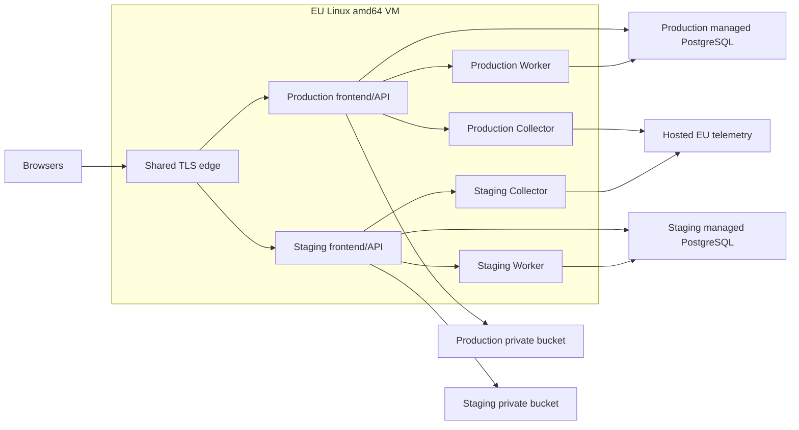

# Staging foundation

**Status: design and repo-only contract.** No provider account, checkout, infrastructure provisioning,
DNS change, deployment or system apply is included. Live eligibility and cost gates remain open.

This document records approved staging/prod shape from `artifacts/staging-foundation-plan.md`. It is
an operational boundary, not proof that staging or production exists.

## Decisions

| ID | Decision |
| --- | --- |
| D1 | Production and staging share one small EU Linux `amd64` VM initially. Shared host risk is accepted; it is not VM-level isolation. |
| D2 | Environments stay separate: Compose project, network, host directory, DB project, bucket, backup scope, secrets, OAuth apps, email sender/policy, telemetry credentials and deploy target per environment. |
| D3 | Production remains running. Staging is on-demand: an authorized operator or successful candidate build opens a bounded test window; staging stops after drain. No daily schedule. |
| D4 | Managed PostgreSQL remains separate per environment. Staging data and private objects persist across stop/start; no delete/recreate cycle is part of normal testing. |
| D5 | User-approved promotion path is `dev → staging → main`. Build once; promote tested immutable image digests without rebuild. |
| D6 | Budget target is approximately `€10/month`; combined hard ceiling is `€50/month`, including VAT, IPv4, account sharing and metered overages. No domain purchase. |
| D7 | Worker idle mode uses committed durable work, private wake hints, due timers and bounded recovery. Production DB sleep is forbidden until correctness and cost gates pass. |

## Target topology

Shared edge routes two stable, distinct HTTPS hostnames. Each hostname serves its own frontend/API
origin. Unknown hosts reject. Cookies are host-only; CORS uses exact origins; signing keys, OAuth
apps, sender policy, DB roles, bucket keys and telemetry credentials never cross environments.
Staging access controls remain server-side; crawler directives never substitute for authentication.

Host boundary: public TCP `80/443` only. SSH is key-only and source-restricted. API containers have
no public ports. DB, Collector, Worker wake socket/token, Docker socket and backup paths stay private.
Each environment has one supervised Worker. Resource limits must leave production headroom; the
initial `2 vCPU / 4 GB` VM is a candidate, not measured capacity.

See [`RUNTIME_CONTRACT.md`](RUNTIME_CONTRACT.md) for generic image/host requirements,
[`STAGING_ACCESS.md`](STAGING_ACCESS.md) for staging eligibility and
[`OWNER_SETUP.md`](OWNER_SETUP.md) for owner bootstrap.

## On-demand staging lifecycle

1. **Authorize.** Operator selects a bounded test window, or CI requests one after a successful
   staging candidate build. Public traffic and bots cannot wake staging.
2. **Wake.** Start the staging DB-backed services, then run Migrator to exit `0`, apply grants, start
   frontend/API plus exactly one Worker, and verify environment identity and readiness. A failed wake
   blocks the candidate; it never silently runs without staging.
3. **Test.** Keep Worker alive for auth, OAuth, email/webhook, CRUD, image, delayed-job, restart and
   release checks. Record quota usage, telemetry and release evidence against the candidate manifest.
4. **Drain.** At window expiry, stop new staging work, finish or safely defer in-flight work, and use
   only a bounded extension for an active migration, deployment or provider check. Failed drain or
   extension-budget exhaustion alerts and blocks release.
5. **Stop.** Stop every staging DB client, API/Worker and staging probe. Leave staging DB data and
   private objects persistent. Shared edge serves staging maintenance only; production stays up.
6. **Reopen.** A later authorized window restarts from durable DB state. Startup reconciliation
   restores schedules; it does not rely on process memory surviving the stop.

A normal window does not erase staging data, reset credentials or stop production. No claim of
month-long staging availability follows from on-demand mode. A continuous 72-hour window is a
separate release gate for correctness and cost; inactive time cannot prove webhook availability.

## Worker recovery contract

PostgreSQL remains durable work authority. Business mutation and outbox/schedule changes commit
before a private, payload-free wake hint. Failed hint delivery never rolls back or hides a committed
mutation. Hints are authenticated, environment-private, coalesced and rate-limited; they carry no
email body, user data, credentials or executable command.

Worker waits for earliest persisted deadline: notification availability or lease expiry, Event
reminder/lifecycle deadline, image expiry/deletion retry, daily maintenance or recovery sweep. Timer
wake never authorizes delivery: Worker re-queries, claims, checks eligibility/dedupe/lease state,
then invokes existing handlers. Cancellation, rescheduling, retry and provider-uncertainty state
remain durable. Restart performs reconciliation before idle.

Normal immediate work target is `≤5s` plus DB cold-start latency. Healthy missed-hint recovery is
at most one hour, with no deadline relaxation for normal user work. The one-hour interval is
conditionally approved only if W12 measures lower total operating cost than an equivalent
always-awake DB. No silent interval extension is allowed when savings are absent or unproven.

Known-idle Worker owns no DB connection, transaction, advisory lock or provider session. Idle health
reads local cached process state; it does not write DB heartbeats or scrape DB/S3 readiness. Deep
readiness remains available for deployment and explicit diagnosis. Existing polling mode stays the
rollback path, but restores higher DB cost. See [`WORKER_SCHEDULING.md`](WORKER_SCHEDULING.md) and
[`WORKER_IDLE.md`](WORKER_IDLE.md).

## Budget and quota gate

Planning values are conditional. They are not checkout quotes, invoice caps or provider guarantees.

| Service | Planning choice | Gate / condition |
| --- | --- | --- |
| EU VM | Hetzner CX23 candidate, Germany; €5.49/month plus €0.50 IPv4 before VAT | Confirm SKU availability, capacity, billing, VAT and resource headroom. |
| Managed DB | Neon Free, Frankfurt, PostgreSQL 17; 100 CU-hours/project/month; 0.5 GB storage | Confirm account eligibility, connection limits, extensions, grants, pooler mode and actual suspension. |
| Object storage | Cloudflare R2 Standard, EU jurisdiction | Confirm account limits, bucket/key separation and S3 checksum behavior. |
| Telemetry | Grafana Cloud Free, EU Germany region | Confirm account-wide metric/log/trace quota and no paid auto-upgrade. |
| Email | Brevo Free, dedicated staging sender; 300 emails/day after approval | Confirm sender verification, sending approval, recipient allowlist and webhook behavior without domain purchase. |
| Registry/CI | GHCR candidate | Confirm private package and Actions quotas; public-package pricing does not prove private allowance. |
| Hostnames/TLS | Free host-provided HTTPS hostname required | Confirm two stable distinct hostnames, TLS issuance/renewal, routing and OAuth callback acceptance. No domain purchase is authorized. |

Official references recorded in the implementation plan: [Hetzner price adjustment](https://docs.hetzner.com/general/infrastructure-and-availability/price-adjustment/),
[Hetzner primary IPs](https://docs.hetzner.com/cloud/servers/primary-ips/overview/),
[Neon pricing](https://neon.com/pricing), [Neon scale to zero](https://neon.com/docs/introduction/scale-to-zero),
[Neon regions](https://neon.com/docs/introduction/regions), [Neon compatibility](https://neon.com/docs/reference/compatibility),
[R2 pricing](https://developers.cloudflare.com/r2/pricing/), [R2 data location](https://developers.cloudflare.com/r2/reference/data-location/),
[Grafana pricing](https://grafana.com/pricing/), [Grafana regional availability](https://grafana.com/docs/grafana-cloud/security-and-account-management/regional-availability/),
[Brevo pricing](https://www.brevo.com/pricing/), [Google OAuth policies](https://developers.google.com/identity/protocols/oauth2/policies),
[Facebook app modes](https://developers.facebook.com/docs/development/build-and-test/app-modes/),
and [GitHub Packages billing](https://docs.github.com/en/billing/managing-billing-for-your-products/managing-billing-for-github-packages/about-billing-for-github-packages).

### Neon free-tier operating limit

The current design assumes `0.25 CU` while active. One 100 CU-hour project allows 400 active hours
before wake tails, storage, backups and other work. Staging reserves at least 20 CU-hours and
limits planned use to 80 CU-hours/month. A five-minute idle tail means request count is not enough:
active periods must be measured as the union of overlapping work, including Worker wake, API startup,
readiness probes, backups, telemetry and recovery sweeps. At the stated workload, isolated DB wakes
can exceed free quota; clustered traffic and measured idle-safe Worker behavior decide eligibility.

Illustrative planning only: `200` isolated requests/day × five idle minutes × `31` days × `0.25 CU`
≈ `129 CU-hours` before job work. Hourly recovery sweeps also add active tails. Free quota exhaustion
must block free-tier recommendation, not silently skip jobs or stop production work.

### Combined bill gate

Before any purchase or live enablement, record a checkout/account report covering both environments:
VM, IPv4, VAT/tax, DB compute/storage/history/network, object operations/storage, telemetry, email,
registry/CI and account sharing. Proceed only when the projected combined total is `≤€50/month`,
with no paid auto-upgrade and with remaining quota reserve. The `€8–11/month` target is a planning
estimate only; it assumes free quotas, eligible accounts, confirmed free hostnames and no unexpected
overages. Always-on DB fallback is estimated at approximately `€30–40/month` combined and must be
recosted if idle redesign or free-tier eligibility fails.

## Immutable promotion

1. **Feature → dev:** run normal checks; no environment secrets in untrusted CI.
2. **dev → staging:** freeze candidate source tree. Build five artifacts once for `linux/amd64`; record
   source SHA, image digest set, SBOM, checksums, scan results, provenance and config revision.
3. **Staging:** verify digest/signature policy, migrate before API/Worker, run full gate during bounded
   window, and attach runtime evidence to the same source/config/digest manifest.
4. **Staging → main:** promote only unchanged source tree and manifest after gate approval. Any source,
   conflict-resolution, image or relevant config change invalidates evidence and requires new build/gate.
5. **Main → production:** future production deployment consumes exact tested digests and injects only
   production config/secrets. Do not rebuild from merge SHA. Production approval remains separate.

Tags, mutable `latest`, local image IDs and a successful prior workflow run are not promotion proof.
A manifest must bind source SHA, image digests, environment/config revision and gate evidence. Registry
publication, signing trust, staging workflow and enforcement are future implementation tickets; this
document records required behavior only.

## Open gates and non-goals

- Free hostname stability, TLS ownership/renewal and Google/Facebook callback eligibility are **not
  confirmed**. Provider console/account checks must happen before choosing hostnames or buying anything.
- Combined checkout total, taxes, IPv4, account-sharing quotas, DB suspension and connection behavior
  are **not measured**. No €50 cap claim exists until checkout evidence is recorded.
- OAuth/email provider setup, sender verification, owner email delivery, hosted telemetry, DNS, live
  backups, RPO/RTO and production traffic are deferred.
- W12 requires a continuous 72-hour staging soak with clustered/sparse traffic, delayed work,
  restarts, provider uncertainty, duplicate protection, deadline evidence and active-hour cost
  comparison against equivalent always-awake DB operation.
- No Kubernetes, managed queue, public DB, public object bucket, Docker-socket mount, production data
  clone, infrastructure-as-code choice or system apply is introduced by this contract.

Passing local tests proves repository behavior only. It does not prove provider availability, invoice
limits, physical DB suspension, host isolation, OAuth callback eligibility or production readiness.
